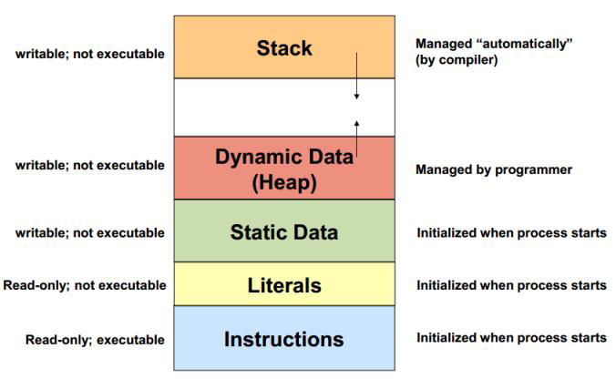

# Index

- [Index](#index)
- [Overview](#overview)
- [Object](#object)
- [String](#string)
- [Class](#class)
    - [Nested Class](#nested-class)
    - [Abstract Class](#abstract-class)
- [Data Type](#data-type)
  - [Variable](#variable)
  - [Interface](#interface)
    - [Functional Interface](#functional-interface)
  - [Enum](#enum)
    - [Normal Enum](#normal-enum)
    - [Advanced Enum](#advanced-enum)
- [Exception](#exception)
  - [Throw an Exception](#throw-an-exception)
  - [The Catch or Specify Requirement](#the-catch-or-specify-requirement)
    - [Catching and Handling Exceptions](#catching-and-handling-exceptions)
    - [Specifying the Exceptions Thrown by a Method](#specifying-the-exceptions-thrown-by-a-method)
  - [Customize an Exception](#customize-an-exception)
- [Core Concept](#core-concept)
  - [Lambdas](#lambdas)
  - [Garbage Collection](#garbage-collection)
- [How to](#how-to)
  - [Calculate time elapsed](#calculate-time-elapsed)
  - [Limit decimal digit](#limit-decimal-digit)

# Overview

- Java follows OOP (object-oriented programming) concepts such as inheritance, abstraction, polymorphism, and encapsulation.
  - However, a class **CANNOT** extend more than one parent class.
- Java offers Exception Handling along with Garbage Collector. 
- Java uses a just-in-time compiler inside the JVM to execute high-performance coding. 
- Unlike other languages, Java’s compiler produces bytecodes that are independent of the computer’s architecture.

**Java Language Specification**

- Java 8 - https://docs.oracle.com/javase/specs/jls/se8/html/index.html

**Java API Docs**

- Java 8 - https://docs.oracle.com/javase/8/docs/api/overview-summary.html
- Java 21 - https://docs.oracle.com/en/java/javase/21/docs/api/index.html

**JDK**

The OpenJDK project is just the source code. It provides a series of open-source reference implementations of the Java SE Platform, as specified by JSRs in the Java Community Process.

The reference implementations is not production-ready, which can be found in `https://jdk.java.net/java-se-ri/{VERSION}`.

Based on the OpenJDK project, vendors provide different JDK builds for production:

- Oracle OpenJDK builds - https://jdk.java.net/archive/
- Oracle JDK - https://www.oracle.com/java/technologies/downloads/archive/
- Adoptium’s Eclipse Temurin (formerly AdoptOpenJDK) - https://adoptium.net/temurin/releases/

GA means "General Availability" and signifies that it's the first version of a major release that we publish to the Support website. For example, `21.0.0` is GA and `21.0.1` would be a Subsequent Maintenance Release.

**Installation in Windows**

1. Download the zip file of JDK. Suppose it is in `C:\Program Files\Java\jdk-17.0.9`.
2. Go to system variable, set `JAVA_HOME` to be `C:\Program Files\Java\jdk-17.0.9`.
3. Go to system variable, add a new variable in `Path` : `%JAVA_HOME%\bin`.

Note that if you use installer (eg. oracle JDK) to install JDK, the java.exe is from `\system32`. It may override the JDK downloaded as zip.

**Version**

- [How to Switch Java Version in Windows - happycoders](https://www.happycoders.eu/java/how-to-switch-multiple-java-versions-windows/)
- [Java version history - Wiki](https://en.wikipedia.org/wiki/Java_version_history)
- [Language change - Oracle](https://docs.oracle.com/en/java/javase/20/language/java-language-changes.html)
- [Oracle Java SE Support Roadmap - Oracle](https://www.oracle.com/hk/java/technologies/java-se-support-roadmap.html)

Java is backwards compatible. For example, your Java 8 application can run with a Java 20 virtual machine. But, your Java 20 application cannot run with a Java 8 virtual machine.

Since Java 9, it only provides JDK for download. Do not need to download JRE seperately.

```sh
java -version
```

**Convention**

- https://www.oracle.com/java/technologies/javase/codeconventions-namingconventions.html

# Object

- [Object - Java 8](https://docs.oracle.com/javase/8/docs/api/java/lang/Object.html)

Class `Object` is the root of the class hierarchy. Every class has `Object` as a superclass. All objects, including arrays, implement the methods of this class.

**`boolean equals(Object obj)`**

- It indicates whether some other object is "equal to" this one.
- If `equals(Object)` is not overriden, the implementation by class `Object` will use `==` operator, so it just compares objects by their memory addresses.

Whenever this method is overridden, you need to override the `hashCode()` method, so as to maintain the general contract for the `hashCode()` method, which states that equal objects must have equal hash codes.

**`int hashCode()`**

- It returns an integer value, generated by a hashing algorithm.
- It is used by hash tables, such as `HashMap` and `HashSet`.
- If `hashCode()` is not overriden, the implementation by class `Object` will just convert the memory address of the object into an integer.

The general contract of `hashCode()`:

- It must consistently return the same result for the same object during an execution of a Java application.
- If two objects are equal according to the `equals(Object)` method, then their `hashCode()` method must produce the same result.
- If two objects are not equal according to the `equals(Object)` method, it is not necessary that their `hashCode()` method produce distinct result.

**Example**

```java
public class Person {

    private String firstName;
    private String lastName;

    public Person(String firstName, String lastName) {
        this.firstName = firstName;
        this.lastName = lastName;
    }

    @Override
    public boolean equals(Object o) {
        if (this == o) return true;
        if (o == null || getClass() != o.getClass()) return false;
        Person person = (Person) o;
        return Objects.equals(firstName, person.firstName) && Objects.equals(lastName, person.lastName);
    }

    @Override
    public int hashCode() {
        return Objects.hash(firstName, lastName);
    }
}
```

# String

- [String - Java 8](https://docs.oracle.com/javase/8/docs/api/java/lang/String.html)

**`int hashCode()`**

The hash code for a String object is computed as the following using int arithmetic, where `s[i]` is the *i*th character of the string, `n` is the length of the string. (The hash value of the empty string is zero.)

```java
s[0]*31^(n-1) + s[1]*31^(n-2) + ... + s[n-1]
```

**Create**

```java
String str = new String("ABC");  // create from the heap memory
String str2 = "ABC";             // create in the string pool
String str3 = "ABC";             // use the reference in the string pool

System.out.println(str.equals(str2));  // true
System.out.println(str == str2);       // false
System.out.println(str2 == str3);      // true
```

**Concatenate**

```java
// 1. Methods to concatenate strings
String str1 = "Hello";
String str2 = "World";

// 1.1 Using + operator (in fact using StringBuilder)
String result = str1 + " " + str2;     

// 1.2 Using the concat() method
String result = str1.concat(" ").concat(str2);

// 1.3 Using the StringBuilder class
StringBuilder sb = new StringBuilder();
sb.append(str1);
sb.append(" ");
sb.append(str2);
String result = sb.toString();

// 1.4 Using the join() method
String[] arr = {str1, str2};
String result = String.join(" ", arr);

// 1.5 Using the format() method
String result = String.format("%s %s", str1, str2);  // OK
String result = String.format("%s", str1, str2);     // OK
String result = String.format("%s %s", str1);        // runtime exception
```
- For mutability,
  - `String` is immutable, so it is thread-safe.
  - `StringBuffer` is mutable and thread-safe, so its methods are synchronized. Preferred to use in **multi-threaded** environment.
  - `StringBuilder` is mutable and not thread-safe. It is **faster** when working with single thread.
- For string concatenation,
  - in terms of performance, `StringBuilder` > `+` = `concat()` = `join()` > `format()`
  - in terms of null-safe, only `concat()` is **NOT** null-safe, so it is less commonly used. Other methods will print "null" for `null` value.


**StringUtils**

```java
System.out.println(StringUtils.isEmpty(null));        // true
System.out.println(StringUtils.isEmpty(""));          // true
System.out.println(StringUtils.isEmpty("   "));       // false
System.out.println(StringUtils.isEmpty("dd"));        // false

System.out.println(StringUtils.isBlank(null));        // true
System.out.println(StringUtils.isBlank(""));          // true
System.out.println(StringUtils.isBlank("   "));       // true
System.out.println(StringUtils.isBlank("dd"));        // false
```

# Class

A class is a collection of:

- Instance variables
- Static variables
- Instance methods
- Static methods

**Initialization Order**

- Class
- Static variables / blocks / static nested class - textual order
- Instance
- Instance variables / inner class

**Instance Variable Default Value:**
- For numbers, the default value is 0.
- For Booleans it is false.
- For object references it is null.

### Nested Class

- ref: https://docs.oracle.com/javase/tutorial/java/javaOO/nested.html

A nested class is a member of its enclosing class. The nested class can be declared `private`, `public`, `protected`, or package private. It is a way of logically grouping classes that are **only used in one place**.
- Non-static nested classes (inner classes) have access to other members of the enclosing class, even if they are declared private. 
- Static nested classes do not have access to other members of the enclosing class. 

```java
class OuterClass {
    ...
    class InnerClass {
        ...
    }
    static class StaticNestedClass {
        ...
    }
}
```

To instantiate an inner class, you must first instantiate the outer class. Then, create the inner object within the outer object with this syntax:
```java
OuterClass outerObject = new OuterClass();
OuterClass.InnerClass innerObject = outerObject.new InnerClass();
```

You can also instantiate an inner class within the outer class:
```java
class OuterClass {
  private InnerClass innerClass = new InnerClass();

  class InnerClass {
    ...
  }
}
```

You instantiate a static nested class the same way as a top-level class:
```java
StaticNestedClass staticNestedObject = new StaticNestedClass();
```

### Abstract Class

- ref: https://docs.oracle.com/javase/tutorial/java/IandI/abstract.html

An abstract class is a class that is declared `abstract`, it may or may not include abstract methods. Abstract classes cannot be instantiated, but they can be subclassed and contain constructor.

An abstract method is a method that is declared without an implementation (without braces, and followed by a semicolon), like this:
```java
abstract void moveTo(double deltaX, double deltaY);
```
If a class includes abstract methods, then the class itself must be declared `abstract`, as in:
```java
public abstract class GraphicObject {
   // declare fields
   // declare nonabstract methods
   abstract void draw();
}
```
When an abstract class is subclassed, the subclass usually provides implementations for all of the abstract methods in its parent class. However, **if it does not**, then the subclass must also be declared `abstract`.

# Data Type

## Variable

The Java programming language defines the following kinds of variables:

- **Instance Variables (Non-Static Fields)** Technically speaking, objects store their individual states in "non-static fields", that is, fields declared without the static keyword. Non-static fields are also known as instance variables because their values are unique to each instance of a class.
- **Class Variables (Static Fields)** A class variable is any field declared with the static modifier; this tells the compiler that there is exactly one copy of this variable in existence, regardless of how many times the class has been instantiated.
- **Local Variables** Similar to how an object stores its state in fields, a method will often store its temporary state in local variables.
- **Parameters**

**Default Value**

Fields (i.e. instance variables and class variables) that are declared but not initialized will be set to a reasonable default by the compiler.

However, the compiler never assigns a default value to an uninitialized local variable.

Category | Types | Size (bits) | Default
-------- | ----- | ----------- | -------
Integer        | byte    | 8  | 0
Integer        | short   | 16 | 0
Integer        | char    | 16 | '\u0000' (or 0)
Integer        | int     | 32 | 0
Integer        | long    | 64 | 0L
Floating-point | float   | 32 | 0.0f
Floating-point | double  | 64 | 0.0d
Other          | boolean | -  | false
Other          | void    | -  | 
Object         | String  | -  | null
Object         | Object  | -  | null

## Interface

With interfaces, all fields are automatically public, static, and final, and all methods that you declare or define (as default methods) are public.

### Functional Interface

An Interface that contains exactly one abstract method is known as functional interface. 
- It can have any number of default, static methods but can contain only one abstract method. 
- It can also declare methods of object class. 
- Functional Interface is also known as Single Abstract Method Interfaces or SAM Interfaces.
```java
// This is a functional interface whose functional method is accept(Object).
@FunctionalInterface
public interface Consumer<T> {

    void accept(T t);

    default Consumer<T> andThen(Consumer<? super T> after) {
        Objects.requireNonNull(after);
        return (T t) -> { accept(t); after.accept(t); };
    }
}

// This is another function interface whose functional method is run().
@FunctionalInterface
public interface Runnable {

    public abstract void run();
}
```

## Enum

- https://docs.oracle.com/javase/tutorial/java/javaOO/enum.html
- ref: https://www.baeldung.com/java-enum-values (multi fields, using hashmap inside enum)
- ref: https://www.baeldung.com/a-guide-to-java-enums (use `equal()` or `==`)
- https://stackoverflow.com/questions/7559645/java-enum-set-custom-ordinals

Enums come with many useful methods that we would otherwise need to write if we were using traditional `public static final` constants.

The names of an enum type's fields are in uppercase letters, just like constants.

Note that the index of the enum item (ordinal) is fixed by position. The initial item is always assigned an ordinal of zero.

### Normal Enum

```java
public enum Day {
    SUNDAY,
    MONDAY,
    TUESDAY,
    WEDNESDAY,
    THURSDAY,
    FRIDAY,
    SATURDAY
}

System.out.println(Day.MONDAY.name());     // "MONDAY"
System.out.println(Day.MONDAY.ordinal());  // 1
```

### Advanced Enum

In Java, you cannot do the following:

```java
public enum Day {
    DAY_ONE = 1,
    DAY_TWO = 2,
    DAY_THREE = 3
}
```

To have your own values in the enum:

```java
public enum Day {
    DAY_ONE(1),
    DAY_TWO(2),
    DAY_THREE(3);

    private final int number;

    private Day(int number)
    {
        this.number = number;
    }

    public int getNumber()
    {
        return number;
    }
}

System.out.println(Day.DAY_ONE.name());       // "DAY_ONE"
System.out.println(Day.DAY_ONE.ordinal());    // 0
System.out.println(Day.DAY_ONE.getNumber());  // 1
```

Although it's illegal to use the `new` operator for an enum, we can pass constructor arguments in the declaration list.

The following is the common practice with *lombok*:

```java
@Getter
@AllArgsConstructor
public enum Day {
    DAY_ONE(1),
    DAY_TWO(2),
    DAY_THREE(3);

    private final int number;
}
```

# Exception

- [Lesson: Exceptions - Oracle](https://docs.oracle.com/javase/tutorial/essential/exceptions/index.html)

When an error occurs within a method, the method *throws an exception*, which means it creates an exception and hands it off to the runtime system.

After a method throws an exception, the runtime system attempts to find an exception handler to *catch the exception*.

If the runtime system exhaustively searches all the methods on the call stack without finding an appropriate exception handler, the runtime system (and, consequently, the program) terminates.

## Throw an Exception

Before you can catch an exception, some code somewhere must throw one. Any code can throw an exception.

All methods use the `throw` statement to throw an exception. The `throw` statement requires a single argument: a `Throwable` object.

```java
if (size == 0) {
    throw new EmptyStackException();
}
```

## The Catch or Specify Requirement

Valid Java programming language code must honor the *Catch or Specify Requirement*. This means that code that might throw certain exceptions must be enclosed by either of the following:

- A `try` statement that catches the exception. The `try` must provide a handler for the exception.
- A method that specifies that it can throw the exception. The method must provide a `throws` clause that lists the exception.

Checked exceptions are subject to the Catch or Specify Requirement. All exceptions are checked exceptions, except for those indicated by `Error`, `RuntimeException`, and their subclasses.

Errors are not subject to the Catch or Specify Requirement. Errors are those exceptions indicated by `Error` and its subclasses.

Runtime exceptions are not subject to the Catch or Specify Requirement. Runtime exceptions are those indicated by `RuntimeException` and its subclasses.

Errors and runtime exceptions are collectively known as *unchecked exceptions*.

```
 Object
    |
Throwable
  |----------|
Error    Exception
  |          |------------|
 ...        ...     RuntimeException
```

### Catching and Handling Exceptions

The first step in constructing an exception handler is to enclose the code that might throw an exception within a `try` block.

After an exception occurs within the `try` block, if you want to catch and handle it, you can put one or more `catch` blocks after it.

```java
try {

} catch (ExceptionType name) {

} catch (ExceptionType name) {

}
```

Each `catch` block is an exception handler that handles the type of exception indicated by its argument. The argument type, `ExceptionType`, must inherit from the `Throwable` class.

The `catch` block contains code that is executed if and when the exception handler is invoked. The runtime system invokes the exception handler when the handler is the first one in the call stack whose `ExceptionType` matches the type of the exception thrown. The system considers it a match if the thrown object can legally be assigned to the exception handler's argument.

In Java SE 7 and later, a single catch block can handle more than one type of exception.

```java
catch (IOException|SQLException ex) {
    logger.log(ex);
}
```

After an exception occurs within the `try` block, or after excpetion handling within the `catch` block, if you want to ensure something is executed, you can put a `finally` block after it.

```java
try {

} catch (ExceptionType name) {

} finally {

}

// If you do not want to handle the exceptions, you can also remove the `catch` block
try {

} finally {

}
```

For resource variables that implement `java.lang.AutoCloseable`, you can put them in a  try-with-resources statement to ensure they are closed after an exception occurs within the `try` block.

```java
static String readFirstLineFromFile(String path) throws IOException {
    try (FileReader fr = new FileReader(path);
        BufferedReader br = new BufferedReader(fr)) {
        return br.readLine();
    }
}
```

A try-with-resources statement can have `catch` and `finally` blocks just like an ordinary `try` statement. In a try-with-resources statement, any `catch` or `finally` block is run after the resources declared have been closed.

### Specifying the Exceptions Thrown by a Method

Sometimes, it's appropriate for code to catch exceptions that can occur within it. In other cases, however, it's better to let a method further up the call stack handle the exception.

```java
public void writeList() throws IOException, IndexOutOfBoundsException { ... }
```

## Customize an Exception

- https://www.baeldung.com/java-new-custom-exception

```java
public class ApiErrorException extends Exception
{
	public ApiErrorException(String errorMessage)
	{
		super(errorMessage);
	}
}
```

# Core Concept

## Lambdas
```java
// Take a new Runnable as an example
// Before lambdas, you had to write an anonymous inner class
Runnable runnable = new Runnable(){
      @Override
      public void run(){
        System.out.println("Hello world !");
      }
    };

// With lambdas
Runnable runnable = () -> System.out.println("Hello world two!");
```
```java
// Can only have single abstract method for interface (No limitation for any functional interface)
public interface MyInterface {
    String doSomething(int param1, String param2);
}

class MyClass {
    public MyInterface myInterface = (p1, p2) -> { return p2 + p1; };
}
```

## Garbage Collection


Java objects are automatically managed by JVM in the heap. We need not explicitly allocate/deallocate memories for objects.

- If you no longer use an object, you should assign
`null` to its reference variable.
- Java 14 supports multiple implementations of garbage collectors to suit different needs
  - https://docs.oracle.com/en/java/javase/14/gctuning/available-collectors.html#GUID-45794DA6-AB96-4856-A96D-FDE5F7DEE498

# How to

## Calculate time elapsed

- Obviously not suitable for reactive method, as the time elapsed must = 0
```java
import java.time.Duration;
import java.time.Instant;

Instant start = Instant.now();
(some code)
Instant finish = Instant.now();
long timeElapsed = (Duration.between(start, finish).toMillis())/1000;
```

## Limit decimal digit

```java
// 1. Return string
private static final DecimalFormat dfSharp = new DecimalFormat("#.##");
dfSharp.format(123.4567) // 123.46
dfSharp.format(123.4)    // 123.4

// 2. Return value
double number1 = 10.123456;
double number2 = (int)(Math.round(number1 * 100))/100.0; // 10.12
```

