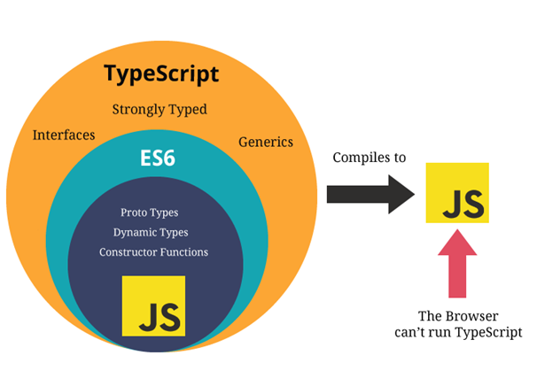

# Index

- [Index](#index)
- [Overview](#overview)
- [To Explore](#to-explore)
- [Variable (var, let, const)](#variable-var-let-const)
- [Data Types of JavaScript](#data-types-of-javascript)
  - [Primitive Type](#primitive-type)
    - [string](#string)
    - [boolean](#boolean)
    - [number](#number)
    - [null \& undefined](#null--undefined)
      - [Optional chaining](#optional-chaining)
      - [Nullish coalescing](#nullish-coalescing)
  - [Object](#object)
    - [Create and access object](#create-and-access-object)
    - [Basic Operation](#basic-operation)
    - [Use Object as Dictionary](#use-object-as-dictionary)
    - [JavaScript Object Notation (JSON)](#javascript-object-notation-json)
  - [Array](#array)
    - [Create and access an array](#create-and-access-an-array)
    - [Length](#length)
    - [Basic Operation](#basic-operation-1)
    - [Shallow Copy](#shallow-copy)
    - [Transformation](#transformation)
  - [Map](#map)
- [TypeScript and its data types](#typescript-and-its-data-types)
  - [Enums](#enums)
    - [Numeric Enums](#numeric-enums)
    - [String Enums](#string-enums)
  - [Interface](#interface)
  - [Type](#type)
  - [Extract Key Types](#extract-key-types)
  - [Extract method return type](#extract-method-return-type)
  - [Generics](#generics)
  - [Casting](#casting)
- [Function](#function)
  - [Create a Function](#create-a-function)
  - [Immediately-invoked Function Expressions (IIFE)](#immediately-invoked-function-expressions-iife)
  - [Return Value](#return-value)
- [Syntax](#syntax)
  - [Spread](#spread)
  - [Equal](#equal)
- [API](#api)
  - [setTimeout](#settimeout)
  - [setInterval](#setinterval)
- [Promises](#promises)
  - [Promise](#promise)
  - [Async functions](#async-functions)
  - [Await](#await)
  - [Common Usage](#common-usage)
    - [Sleep for a period](#sleep-for-a-period)
- [Export and Import](#export-and-import)
- [Event Handler / Listener](#event-handler--listener)
  - [Window event](#window-event)
- [Fetch](#fetch)
  - [Fetch with timeout](#fetch-with-timeout)
 
# Overview

- [JavaScript tutorial - JAVASCRIPT.INFO](https://javascript.info/)
- [JavaScript Versions - w3schools](https://www.w3schools.com/js/js_versions.asp)

JavaScript was invented by Brendan Eich in 1995, and became an ECMA standard in 1997. ECMAScript is the official name of the language.

ECMAScript versions have been abbreviated to ES1, ES2, ES3, ES5, and ES6. Since 2016, versions are named by year (ECMAScript 2016, 2017, 2018, ...).

# To Explore

what is {}, how to return, declare, parameter, difference between tuple (can recall generate csv blob)

what is Observable, flatmap (mergemap), rxjs, tap...

# Variable (var, let, const)

In ES6, there are only two scopes (global and block/function scope).

**`var` is global scoped or function scoped**
```js
// Global scoped
var a = 10;
function f() {console.log(a);}
f();                // output 10
console.log(a)      // output 10

// Function scoped
function g() {var b = 1; console.log(b);}
g();                // output 1
console.log(b);     // referenceError, b is not defined outside the function

// Can re-declare the variable
var a = 5;
var a = 7;
console.log(a);     // output 7
```

**`let` and `const` are block scoped**
```js  
let a = 10;
let b = 33;
{
  let a = 20;
  console.log(b);  // output 33
}
console.log(a)     // output 10

let a = 0;         // Uncaught SyntaxError, cannot re-declare a again
```

```js
// Cannot change the properties of the const variable
// But can change the value of its properties
const a = {
  prop_1: 10,
  prop_2: 19
}

a.prop_1 = 20;     // ok
a = 20;            // Uncaught SyntaxError
```

# Data Types of JavaScript

There are 8 basic data types in JavaScript.

Seven primitive data types:

- `number` for numbers of any kind: integer or floating-point, integers are limited by ±(2^53-1).
- `bigint` for integer numbers of arbitrary length.
- `string` for strings. A string may have zero or more characters, there’s no separate single-character type.
- `boolean` for `true`/`false`.
- `null` for unknown values – a standalone type that has a single value `null`.
- `undefined` for unassigned values – a standalone type that has a single value `undefined`.
- `symbol` for unique identifiers.

And one non-primitive data type `object`. The `object` data type can contain both built-in objects, and user defined objects.

Built-in object types can be:

- `object`
- `array`
- `date`
- `map`
- `set`
- `intarray`
- `floatarray`
- `promise`
- and more ...

## Primitive Type

There are 7 primitive types - `string`, `number`, `boolean`, `symbol`, `bigint`, `undefined` and `null`.

There are some **object wrappers** to provide different methods and properties of **primitives**, except `undefined` and `null`. For example, in the following code, a object wrapper `String` is created for the string primitive `str`, providing the method `toUpperCase()`, and then be destoryed:

```js
let str = "Hello";
alert( str.toUpperCase() ); // HELLO
```

### string

```js
let name = "Chris";
let greeting = `Hello, ${name}`; // "Hello, Chris"
```

**Convert a string to a number**

```js
var a = '1.12312983792385473498573498579857345983475958796870298402497987239487239847'
parseFloat(a) // 1.1231298379238548
parseInt(a)   // 1
Number(a)     // 1.1231298379238548

+a            // 1.1231298379238548
a-0           // 1.1231298379238548
a*1           // 1.1231298379238548
a/1           // 1.1231298379238548

var a = null  // 0
var a = ''    // 0

var a = '+1'  // 1
var a = '-1'  // -1

var a = '.1'  // 0.1
var a = '1.'  // 1

var a = '-0'  // -0
var a = '-.1' // -0.1
var a = '-1.' // -1
```

Other cases, including `undefined`, `+`, `-`, would return `NaN`.

**Copy a string**

Using `slice()`:

```js
const str = "Hello, World!";
str.slice(0, 3);   // Hel
str.slice(0, -3);  // Hello, Wor
```

Using `split()`:

```js
var a = '1.23'
a.split('.');  // ['1', '23']
```

**Regular Expression**

```js
const r = /^-?\d*\.?\d{0,5}$/g  // A decimal number, max 5 decimal digits

'123.34533'.match(r)  // ['123.34533']
'123.345333'.match(r) // null
```

In case you need to dynamically manipulate the decimal digits part:

```js
const r = new RegExp(`^-?\\d*\\.?\\d{0,${max}}$`, 'g')

'123.34533'.match(r)  // ['123.34533']
```

### boolean

```js
let x = true;
let y = false;
```

If an object `objA` is used in logical operators (`&&`, `||`, `!`), its boolean value equals to the following:

```js
var objA = "";  // false
var objA = "abc";  // true

var objA = 0;  // false
var objA = 1;  // true

var objA = [];  // true
var objA = null;  // false
var objA = undefined;  // false
```

### number

```js
let length = 16;
let weight = 7.5;
```

**Convert to String**

```js
num.toString();
num.toFixed(2);  // note that it may have extra 0, convert to number again
```

### null & undefined

- [undefined - MDN](https://developer.mozilla.org/en-US/docs/Web/JavaScript/Reference/Global_Objects/undefined)
- [null - MDN](https://developer.mozilla.org/en-US/docs/Web/JavaScript/Reference/Operators/null)

`undefined` can be found when:

- a variable has not been assigned a value
  ```js
  let a;
  console.log(a); // undefined
  ```
- a function does not return a value
  ```js
  const f = () => {};
  let a = f();
  console.log(a); // undefined
  ```

#### Optional chaining

The optional chaining operator (`?.`) lets you safely access properties of an object that could be `null` or `undefined`.
```js
var temp = [{"a": "b"}, {"a": "c"}]

temp[0]   // {a: 'b'}
temp[0].a // 'b'
temp[0].x // undefined

temp[2]    // undefined
temp[2].a  // Error: Cannot read properties of undefined
temp[2]?.a // undefined


/********* SUMMARY **********/
var temp = undefined  // same as null
temp[0]   // Error: Cannot read properties of undefined
temp?.[0] // undefined

temp.a    // Error: Cannot read properties of undefined
temp?.a   // undefined
```

#### Nullish coalescing

The nullish coalescing operator (`??`) returns the right-hand side only when the left side is `null` or `undefined`.
```js
return (
  <div>
    {user?.name ?? "Not loaded yet"}
  </div>
)
```
`??` works like the OR `||` operator, except that it doesn’t consider `0`, `''` or `false` to be falsy.

## Object

- [Object - mdn](https://developer.mozilla.org/en-US/docs/Web/JavaScript/Reference/Global_Objects/Object)

The `object` type represents one of JavaScript's data types. It is used to store various keyed collections and more complex entities. Objects can be created using the `Object()` constructor or the **object initializer (literal syntax)**.

Objects consist of properties, which are used to describe an object. The values of object properties can either contain primitive data types or other objects.

### Create and access object

- [Object initializer - mdn](https://developer.mozilla.org/en-US/docs/Web/JavaScript/Reference/Operators/Object_initializer)

You can use object initializer to create an object. It is a comma-delimited list of zero or more pairs of property names and associated values of an object, enclosed in curly braces (`{}`).

```js
const o = {
  foo: "bar",
  age: 42,
  baz: { myProp: 12 },
  1: "number literal property",
  "foo:bar": "string literal property",
}
```

Once you have created an object, you might want to read or change them. Object properties can be accessed by using the **dot notation** or the **bracket notation**.

```js
o.foo; // "bar"
o["age"]; // 42
o.baz; // {myProp: 12}
o.baz.myProp; //12
```

**Property definitions**

Oftentimes, there are variables in your code that you would like to put into an object. You will see code like this:

```js
const a = "foo";
const b = 42;
const c = {};

const o = {
  a: a,
  b: b,
  c: c,
};
```

There is a shorter notation available to achieve the same:

```js
const a = "foo";
const b = 42;
const c = {};

// Shorthand property names
const o = { a, b, c };
```

**Duplicate property names**

When using the same name for your properties, the second property will overwrite the first.

```js
const a = { x: 1, x: 2 };
console.log(a); // {x: 2}
```

**Computed property names**

The object initializer syntax also supports computed property names. That allows you to put an expression in square brackets `[]`, that will be computed and used as the property name.

```js
let i = 0;
const a = {
  [`foo${++i}`]: i,
  [`foo${++i}`]: i,
  [`foo${++i}`]: i,
};

console.log(a.foo1); // 1
console.log(a.foo2); // 2
console.log(a.foo3); // 3
```

**Spread properties**

```js
const obj1 = { foo: "bar", x: 42 };

const clonedObj = { ...obj1, y: 13 };
// { foo: "bar", x: 42, y: 13 }
```

### Basic Operation

**Looping the object**

```js
const object = { a: 1, b: 2, c: 3 };

for (const property in object) {
  console.log( property + ": " + object[property] );
}
// Expected output:
// "a: 1"
// "b: 2"
// "c: 3"
```

**Get keys as array**

```js
const object = { a: 1, b: 2, c: 3 };
console.log(Object.keys(object));  // ['a', 'b', 'c']

// When using numeric keys, the keys are returned in the keys' numerical order
const anObj = { 100: "a", 2: "b", 7: "c" };
console.log(Object.keys(anObj));  // ['2', '7', '100']
```

- `Objects.keys()` is O(n) / O(n log(n)) if the object contains many keys.

**Get values as array**

```js
const object1 = {
  a: 'somestring',
  b: 42,
  c: false,
};

console.log(Object.values(object1));  // ["somestring", 42, false]
```

**Get entries as array**

```js
const obj = { foo: "bar", baz: 42 };
console.log(Object.entries(obj)); // [ ['foo', 'bar'], ['baz', 42] ]
```

### Use Object as Dictionary

JavaScript does not include a native dictionary data type. You can only use `Object` to create a key-value pair.

**Convert array to dictionary**

Oftertimes we store a list of objects as an array, which stores the data in a linear order. However, if we want to access data using a unique key rather than an index, we have to use a dictionary.

For example, we can convert an array of `PriceAlertNode` to a dictionary with key as `priceAlertId` and value as the original object.

```js
interface PriceAlertNode {
  priceAlertId: number;
  alertType: PriceAlertType;
  alertValue: number;
  contract: string;
}

const priceAlertArray: PriceAlertNode[] = [{
        priceAlertId: 5,
        alertType: 0,
        alertValue: 0.65,
        contract: "USDCAD"
    }, {
        priceAlertId: 6,
        alertType: 1,
        alertValue: 0.75,
        contract: "USDCAD"
    }];
```

We can use `Array.prototype.reduce()`:

```js
const priceAlertDict: { [priceAlertId: number]: PriceAlertNode }
  = priceAlertArray.reduce((obj, priceAlert) => ({ ...obj, [priceAlert.priceAlertId]: priceAlert }), {});
```

Alternatively, we can use `Array.prototype.forEach()`:

```js
const priceAlertDict: { [priceAlertId: number]: PriceAlertNode } = {};

priceAlertArray.forEach((priceAlert) => priceAlertDict[priceAlert.priceAlertId] = priceAlert);
```

Finally, the dictionary becomes like this:

```js
console.log(priceAlertDict)
/*
{
    5: {
        priceAlertId: 5,
        alertType: 0,
        alertValue: 0.65,
        contract: "USDCAD"
    },
    6: {
        priceAlertId: 6,
        alertType: 1,
        alertValue: 0.75,
        contract: "USDCAD"
    }
}
*/
```

Note that if the key is of type number, the order of the data may be changed.

To convert the dictionary back to array again:

```js
const priceAlertArray: PriceAlertNode[] = Object.values(priceAlertDict);
```

### JavaScript Object Notation (JSON)

```json
// JSON object
{
    "name": "John Doe",
    "age": 30,
    "isStudent": false,
    "address": {
        "street": "123 Main St",
        "city": "New York"
    },
    "hobbies": ["reading", "traveling", "gaming"],
    "favoriteNumbers": [1, 3, 7]
}


// JSON array
["Ford", "BMW", "Fiat"]

[{
        "name": "John",
        "age": 30
    }, {
        "name": "Jane",
        "age": 25
    }, {
        "name": "Bob",
        "age": 40
    }
]

[
    [1, 2, 3],
    ["apple", "banana", "orange"]
]
```

JSON has the following syntax:

- JSON data is written as key-value pairs.
- *Keys* must be strings, written with double quotes.
- *Values* must be one of the following data types:
  - a string
  - a number
  - an object
  - an array
  - a boolean
  - null

Use the JavaScript function `JSON.parse()` to convert text into an `object`:

```jsx
const obj = JSON.parse('{"name":"John", "age":30, "city":"New York"}');
```

Use `JSON.stringify()` to convert a `object` into a JSON string:

```jsx
const obj = {name: "John", age: 30, city: "New York"};
const myJSON = JSON.stringify(obj);
```

- Very useful when logging an object.

## Array

- [Array and its methods - MDN](https://developer.mozilla.org/en-US/docs/Web/JavaScript/Reference/Global_Objects/Array)

In JavaScript, arrays aren't primitives but are instead `Array` objects with the following core characteristics:

- JavaScript arrays are resizable and can contain a mix of different data types.
- JavaScript arrays must be accessed using nonnegative integers (or their respective string form) as indexes.
- JavaScript arrays are zero-indexed.
- JavaScript array-copy operations create *shallow copies*, rather than *deep copies*.

### Create and access an array

```js
let arr = new Array();
let arr = new Array(item1, item2...);

let arr = [];
let arr = [item1, item2...];
```

Getting the elements:

```js
const arr = [5, 12, 8, 130, 44];

arr[0];     // 5

arr.at(2);  // 8
arr.at(-2); // 130, steps back from the end of the array if negative values
```

Getting the index of an element:

```js
// first index at which a given element can be found in the array, or -1 if it is not present.
const arr = ['ant', 'bison', 'camel', 'duck', 'bison'];

arr.indexOf('bison');   // 1
arr.indexOf('giraffe'); // -1
```

### Length

The length property automatically updates when we modify the array. To be precise, it is actually not the count of values in the array, but the greatest numeric index plus one.

For instance, a single element with a large index gives a big length:

```js
let fruits = [];

fruits[123] = "Apple";

fruits.length; // 124

fruits[0]; // undefined: the values do not return
```

- To check array out of bounds, do not use `undefined`. Directly check length.

Another interesting thing about the length property is that it’s writable.

If we increase it manually, nothing interesting happens. But if we decrease it, the array is truncated. The process is irreversible, here’s the example:

```js
let arr = [1, 2, 3, 4, 5];

arr.length = 2; // truncate to 2 elements
alert( arr ); // [1, 2]

arr.length = 5; // return length back
alert( arr[3] ); // undefined: the values do not return
```

- So, the simplest way to clear the array is: `arr.length = 0;`.
- To check if the array is empty: `arr.length === 0`.

### Basic Operation

**Adding or removing item from the array**

```js
arr.pop()             // Extracts the last element of the array and returns it.
arr.push(...items)    // Append the element to the end of the array.
arr.shift()           // Extracts the first element of the array and returns it.
arr.unshift(...items) // Add the element to the beginning of the array.
```

**Removing items from the array**

```js
// Method: arr.splice(start_index, number_of_removed_items, insert_item_1, insert_item_2, ...)
arr.splice(0,2) // Start at index 0, remove 2 items
```

- You may use `indexOf()` together with `splice(index, 1)` to remove a specific item.

**Looping the array**

```js
for (let i = 0; i < arr.length; i++) {
  alert( arr[i] );
}
```

```js
// iterates over array elements
for (let item of arr) {
  alert( item );
}
```

```js
arr.forEach((item, index, array) => {
  // ... do something with item
});
```

**Check whether an object is an array**

```js
Array.isArray([1, 3, 5]); // true
```

**Remove duplicate items from the array**

```js
const array = [1, 2, 3, 3, 4, 5, 5];
const uniqueArray = [...new Set(array)]; // [1, 2, 3, 4, 5]
```

**Check whether an array includes a certain value among its entries**

```js
[1, 2, 3].includes(2); // true
```

- `includes()` use `===` for comparison.
- For faster running time, you may try to use `new Set(array).has(...)`.

**Check whether at least one element in the array passes the condition test**

```js
[1, 2, 3, 4, 5].some((element) => element > 0); // true

[1, 2, 3, 4, 5].some((element) => element > 5); // false
```

**Check whether all elements in the array passes the condition test**

```js
[1, 2, 3, 4, 5].every((element) => element > 0); // true

[1, 2, 3, 4, 5].every((element) => element > 1); // false
```

**Sort the elements of an array**

```js
['March', 'Jan', 'Feb', 'Dec'].sort(); // ["Dec", "Feb", "Jan", "March"]

[1, 30, 4, 21, 100000].sort(); // [1, 100000, 21, 30, 4]

[1, 30, 4, 21, 100000].sort((a, b) => a - b); // [1, 4, 21, 30, 100000]
```

- The default sort order is ascending, built upon converting the elements into strings, then comparing their sequences of UTF-16 code units values.
- You can also provide a compare function `(a, b) => number`. It should return a number where:
  - A negative value indicates that `a` should come before `b`.
  - A positive value indicates that `a` should come after `b`.
  - Zero or `NaN` indicates that `a` and `b` are considered equal.

### Shallow Copy

- [Array.prototype.slice() - mdn](https://developer.mozilla.org/en-US/docs/Web/JavaScript/Reference/Global_Objects/Array/slice)

Shallow copy means that **if an object contains objects inside**, then its objects will exist in the new object by the same reference.

**Shallow copy using `slice()`:**

```js
slice(start?: number, end?: number): T[];
```

It returns a new array copying to it all items from index `start` to `end` (not including `end`).

```js
let arr = ["t", "e", "s", "t"];

arr.slice()     // t, e, s, t  Copy all items
arr.slice(1)    // e, s, t     Copy from index 1 to the end
arr.slice(1, 3) // e, s        Copy from index 1 to index 3, which means 2 items
arr.slice(-2)   // s, t        Copy from index 2 (4 minus 2) to the end, which means the last 2 items
arr.slice(-4)   // t, e, s, t  Copy from index 0 (4 minus 4) to the end, which means the last 4 items
```

No exception will be thrown. If no items is copied, such as invalid index, an empty array is returned.

```js
arr.slice(-10)  // t, e, s, t  Copy the last 10 items, which means all items
```

**Shallow copy using `...`:**

```js
let arr = ["t", "e", "s", "t"];

[...arr] // t, e, s, t  Copy all items
```

Shallow copy does not clone the whole array deeply:

```js
// This is not fine
nestedNumbers = [[1], [2]];
numbersCopy = [...nestedNumbers];

numbersCopy[0].push(300);
console.log(nestedNumbers, numbersCopy);
// [[1, 300], [2]]
// [[1, 300], [2]]
// They've both been changed because they share the same reference
```

### Transformation

**Reduce**

- [Array.prototype.reduce() - mdn](https://developer.mozilla.org/en-US/docs/Web/JavaScript/Reference/Global_Objects/Array/reduce)

```js
reduce(callbackfn: (previousValue: T, currentValue: T, currentIndex: number, array: T[]) => T, initialValue: T): T;
```

Find the sum of a number array:

```js
const array = [1, 2, 3, 4];

const sum = array.reduce((sum, currentValue) => sum + currentValue, 0);

console.log(sum);
// Expected output: 10
```

**Map and FlatMap**

- [Array.prototype.map() - mdn](https://developer.mozilla.org/en-US/docs/Web/JavaScript/Reference/Global_Objects/Array/map)
- [Array.prototype.flatMap() - mdn](https://developer.mozilla.org/en-US/docs/Web/JavaScript/Reference/Global_Objects/Array/flatMap)

```js
map<U>(callbackfn: (value: T, index: number, array: T[]) => U, thisArg?: any): U[];
```

```js
flatMap<U, This = undefined>(callback: (this: This, value: T, index: number, array: T[]) => U | ReadonlyArray<U>, thisArg?: This): U[];
```

The `map()` method is an iterative method. It calls a provided function once for each element in an array and constructs a new array from the results.

```js
const array = [1, 4, 9, 16];
const map = array.map((x) => x * 2);

console.log(map);
// Expected output: Array [2, 8, 18, 32]
```

The `flatMap()` method is identical to `map()` followed by `flat(1)` — for each element, it produces an array of new elements, and concatenates the resulting arrays together to form a new array. Therefore, one item in the original array can result in more than one items in the new array.

```js
const arr1 = [1, 2, 1];
const result = arr1.flatMap((num) => (num === 2 ? [2, 2] : 1));
console.log(result);
// Expected output: Array [1, 2, 2, 1]
```

**Filter**

- [Array.prototype.filter() - mdn](https://developer.mozilla.org/en-US/docs/Web/JavaScript/Reference/Global_Objects/Array/filter)

```js
const filtered = [12, 5, 8, 130, 44].filter((num) => num >= 10);
// filtered is [12, 130, 44]
```

**Convert to an Object**

```js
const arr = [
  ["0", "a"],
  ["1", "b"],
  ["2", "c"],
];
const obj = Object.fromEntries(arr);
console.log(obj); // { 0: "a", 1: "b", 2: "c" }
```

## Map

```js
let map1 = new Map<String, String>();

// Change map to array, then use .map()
[...myMap.keys()].map(k => (<div> myMap.get(k) </div>) )

Array.from(tableData).map(([key, value]) => {})

// Arrow function
forEach(() => { /* … */ } )
forEach((value) => { /* … */ } )
forEach((value, key) => { /* … */ } )
forEach((value, key, map) => { /* … */ } )
```

# TypeScript and its data types



- JavaScript is Typescript (`.js` can be renamed as `.ts`, but `.ts` cannot directly be renamed as `.js` as JavaScript cannot have type). However, typescript needs to be compiled into javascript before running in browsers. To do that, you need to  `npm install typescript` first.
- TypeScript is nothing but JavaScript and some additional features i.e. ES6 features. It may not be supported in your target browser but the TypeScript compiler can compile the .ts files into ES3, ES4, and ES5 also.
- TypeScript is known as an Object-oriented programming language whereas JavaScript is a prototype based language.
- TypeScript supports Interfaces but JavaScript does not.
- TypeScript supports `static/strong typing`. This means that type correctness can be checked at compile time (before running). This feature is not available in JavaScript (loosely typed language).
- TypeScript is a primary language for `Angular` application development.

## Enums

- [Enums - TypeScript](https://www.typescriptlang.org/docs/handbook/enums.html)

TypeScript provides both numeric and string-based enums. **Enums are real JavaScript objects that exist at runtime.**

Use PascalCase or CONSTANT_CASE for every property in the enum. I think CONSTANT_CASE is better.

### Numeric Enums

```js
enum Direction {
  UP,       // 0
  DOWN,     // 1
  LEFT,     // 2
  RIGHT     // 3
}

enum SecondDir {
  UP,       // 0
  DOWN,     // 1
  LEFT = 5, // 5
  RIGHT     // 6
}

console.log(Direction.Up)  // 0

// In TypeScript, it is false because they are two different types;
// however, in JavaScript runtime, it becomes true because 1 === 1.
console.log(Direction.Down === SecondDir.Down)
```

```js
// In runtime, Enums are real objects
console.log(typeof Direction)  // object

// It is equivalent to:
// type DirectionType = "UP" | "DOWN" | "LEFT" | "RIGHT"
type DirectionType = keyof typeof Direction
```

### String Enums
```js
// Very similar to numeric enums
enum Direction {
  UP = 'UP',
  DOWN = 'DOWN',
  LEFT = 'LEFT',
  RIGHT = 'RIGHT'
}

console.log(Direction.Up)  // UP
```

## Interface

You can explicitly describe this object’s *shape* using an `interface` declaration:
```js
interface User {
  name: string;
  id: number;
  email?: string;  // string | undefined
}

// Only these two structure are valid
const user: User = { name: 'Hayes', id: 0};
const user: User = { name: 'Hayes', id: 0, email: 'abc@example.com'};
```
- You can use `?:` to mark a property as optional (i.e. can be `undefined`).

You can use `interface` in **functions**:
```js
// Annotate return values
function getAdminUser(): User { ... }

// Annotate parameters
function deleteUser(user: User) { ... }
```

You can use `unions` to define more than one types:
```js
function deleteUser(user: User | User[]) { ... }
```

## Type

Although `type` aliases and `interfaces` are very similar, when defining type, you should prefer `interface`. Use `type` when you need specific features.
```js
type MyBool = true | false;
type WindowStates = 'open' | 'closed' | 'minimized' | undefined;
type User = typeof Peter;  // assume Peter is an User object
type UserKey = keyof User;
```
- Note that a `type` cannot be extended, but an `interface` can.

## Extract Key Types

```js
interface Person {
  name: string;
  age: number;
}

// type PersonKey = 'name' | 'age'
type PersonKey = keyof Person;

function printPersonProperty(person: Person, property: PersonKey) {
  console.log(`Printing person property ${property}: "${person[property]}"`);
}

let person = {
  name: "Max",
  age: 27
};

printPersonProperty(person, "name"); // Printing person property name: "Max"
printPersonProperty(person, "age"); // Printing person property age: "27"
```
- Since `property = 'name'`, you need to use `object[property]` to represent `object.name`

## Extract method return type

```ts
let timer: ReturnType<typeof setTimeout>;

timer = setTimeout(() => {...});
```

## Generics

Generics provide variables to types. A common example is an array. An array without generics could contain anything. An array with generics can describe the values that the array contains.

```js
type StringArray = Array<string>;
type NumberArray = Array<number>;
type ObjectWithNameArray = Array<{ name: string }>;
```

## Casting

```js
const x = getUserId() as number;

// you can also do this except in a .tsx file
const x = <number>getUserId();
```
TypeScript only allows type assertions which convert to a more specific or less specific version of a type.
```js
const x = 'hello' as number;  // error

// But you can do this
const x = ('hello' as any) as number
const x = ('hello' as unknown) as number
```

# Function

- [Functions - MDN](https://developer.mozilla.org/en-US/docs/Web/JavaScript/Guide/Functions)
- [More on Functions - TypeScript](https://www.typescriptlang.org/docs/handbook/2/functions.html)

## Create a Function

Function is a special value in JavaScript. When it is created, it can be stored in a variable. Function can be created by:

- *Function Declaration*
- *Function Expression*

Note that a *function expression* is created when the execution reaches it and is usable only from that moment. However, a *function deeclaration* can be called earlier than it is defined.

**Function Declaration**

```js
function add(x, y) {
  return x + y;
}
```

TypeScript:

```ts
function add(x: number, y: number): number {
  return x + y;
}
```

To demonstrate that function is a special value:

```js
console.log(add);

// ƒ add(x, y) {
//   return x + y;
// }
```

**Function Expression**

*Function expression* creates an anonymous function.

```js
let myAdd = function (x, y) {
  return x + y;
};
```

TypeScript:

```ts
let myAdd = function (x: number, y: number): number {
  return x + y;
};
```

**ES6 introduced arrow function expressions that provide a shorthand for declaring anonymous functions.**

```js
let myAdd = (x, y) => {
  return x + y;
};

```

TypeScript:

```ts
let myAdd = (x: number, y: number) => {
  return x + y;
};
```

Arrow functions also have implicit return, meaning that if there is only one expression in the function, you can omit the curly braces and return keyword:

```ts
let myAdd = (x: number, y: number) => x + y;
```

## Immediately-invoked Function Expressions (IIFE)

- ref: https://flaviocopes.com/javascript-iife/

You can call a function immediately after it is created:

```js
(function() {
  /* */
})()
```

IIFEs can be defined with arrow functions as well:

```js
(() => {
  /* */
})()
```

## Return Value

A function with an empty `return` or without it returns `undefined`:

```js
function doNothing() { /* empty */ }
alert( doNothing() === undefined ); // true

function doNothing() { return; }
alert( doNothing() === undefined ); // true
```

# Syntax

## Spread

- [Spread syntax (...) - MDN](https://developer.mozilla.org/en-US/docs/Web/JavaScript/Reference/Operators/Spread_syntax) 

Spread syntax can be used when all elements from an object or array

- need to be included in a new array or object, or
- should be applied one-by-one in a function call's arguments list.

Using `...` in function arguments list:

- `(myFunction(a, ...iterableObj, b))`


Using `...` in array literals:

- `([1, ...iterableObj, '4', 'five', 6])`
- Only iterable values, like `Array` and `String`, can be spread in array literals

```js
const parts = ["shoulders", "knees"];
const lyrics = ["head", ...parts, "and", "toes"];
//  ["head", "shoulders", "knees", "and", "toes"]
```

Using `...` in object literals:

- `({ ...obj, key: 'value' })`

## Equal

- `==` converts the variable values to the same type before performing comparison
- `===` does not do any type conversion (coercion) and **returns true only if both values and types are identical** for the two variables being compared
- both do not apply to array, because **array variable = memory address**
- use `Object.is(2, '2');`

# API

## setTimeout

- [setTimeout - MDN](https://developer.mozilla.org/en-US/docs/Web/API/setTimeout)

```js
const timeoutID = setTimeout(functionRef, delay)
```

Parameters | Description
---------- | -----------
`functionRef` | A function to be executed after the timer expires.
`delay` | The time, in milliseconds that the timer should wait before the specified function or code is executed.

Return value | Description
------------ | -----------
`timeoutID` | A positive integer value which identifies the timer created by the call to `setTimeout()`. This value can be passed to `clearTimeout()` to cancel the timeout.

## setInterval

- [setInterval - MDN](https://developer.mozilla.org/en-US/docs/Web/API/setInterval)

```js
const intervalID = setInterval(func, delay)
```

# Promises

## Promise

- [Promise - MDN](https://developer.mozilla.org/en-US/docs/Web/JavaScript/Reference/Global_Objects/Promise)
- [Tutorial](https://javascript.info/promise-basics)

The `Promise` object represents the eventual completion (or failure) of an asynchronous operation and its resulting value.

The function passed to `new Promise` is called the *executor*. When `new Promise` is created, the executor runs automatically and attempts to perform a job which may take some time. When it is finished with the attempt, it calls `resolve` if it was successful or `reject` if there was an error.

The `promise` object returned by the `new Promise` constructor has these internal properties:

- `state` — initially `"pending"`, then changes to either `"fulfilled"` when `resolve` is called or `"rejected"` when `reject` is called.
- `result` — initially `undefined`, then changes to `value` when `resolve`(value) is called or `error` when `reject(error)` is called.

```js
let promise = new Promise(function(resolve, reject) {
  // the function is executed automatically when the promise is constructed

  // after 10 seconds signal that the job is done with the result "done"
  setTimeout(() => resolve("done"), 10000);
});

// Access the object after 1 second
promise // Promise {<pending>}

// Access the object after 10 seconds
promise // Promise {<fulfilled>: 'done'}
```

To consume the `promise` object, the most fundamental method is `.then`. If the executor is not finished, the consumer chain will keep waiting the `promise` object, but the event loop will not be blocked.

The first argument of `.then` is a function that runs when the promise is resolved and receives the result.

The second argument of `.then` is a function that runs when the promise is rejected and receives the error.

```js
let promise = new Promise(function(resolve, reject) {
  setTimeout(() => resolve("done!"), 1000);
});

promise.then(
  result => console.log(result),
  error => alert(error)
).then(() => console.log("bye"));

console.log("hi");

// Result
hi
       //--- one second later
done!
bye
```

## Async functions

The word `async` before a function means one simple thing: a function always returns a `Promise`. Other values are wrapped in a resolved `Promise` automatically.

```js
async function f() {
  return 1;
}

f(); // Promise {<fulfilled>: 1}

async function f() {
  return Promise.resolve(1);
}

f(); // Promise {<fulfilled>: 1}
```

## Await

The keyword `await` makes JavaScript wait until that promise settles and returns its result.

```js
async function f() {

  let promise = new Promise((resolve, reject) => {
    setTimeout(() => resolve("done!"), 1000)
  });

  console.log("hi");

  let result = await promise;
  // The following code will wait until the promise resolves

  console.log("ok");
  console.log(result);
  console.log("bye");
}

f();

// Result
hi
       //--- one second later
ok
done!
bye
```
`await` literally suspends the function execution until the `promise` settles, and then resumes it with the promise result. That doesn’t cost any CPU resources, because the JavaScript engine can do other jobs in the meantime: execute other scripts, handle events, etc.

It’s just a more elegant syntax of getting the promise result than `promise.then`. And, it’s easier to read and write.

## Common Usage

### Sleep for a period

```js
const demo = async () => {
  // Do something ...

  // Sleep for 100 ms
  await new Promise((resolve) => setTimeout(resolve, 100));

  // Continue ...
}
```

# Export and Import

ref: https://javascript.info/import-export

The `export` declaration is used to export values from a JavaScript module. Exported values can then be imported into other programs with the `import` declaration or dynamic import.

Method | Export | Import
------ | ------ | ------
Named export | `export class User {...}`   | `import { User } from ...`
Default export | `export default class User {...}` | `import User from ...`

- A file can only have one `export default`; no need use curly bracket to import default value.
- You cannot use `export default const`.

Add a nickname for import.

```js
import { changeUserNickname as changeUserNicknameUserApi } from "./api/userApi";
```

# Event Handler / Listener
```js
// Normal
export default function Button() {
  function handleClick() {
    alert('You clicked me!');
  }

  return (
    <div>
      // Normal function
      <button onClick={handleClick} />

      // Inline
      <button onClick={function() { alert('You clicked me!') }} />

      // Arrow function
      <button onClick={() => alert('You clicked me!')} />
    </div>
  );
}
```
Functions passed to *event handlers* must be **passed**, not called.
- Passing a function: `<button onClick={handleClick}>`, the function will be fired when clicking the button
- Calling a function (not correct): `<button onClick={handleClick()}>`, the function will be fired immediately during rendering

Simiarly for arrow function:
- Passing a function: `<button onClick={() => alert('...')}>`
- Calling function: `<button onClick={alert('...')}>`

## Window event

```js
window.addEventListener("beforeunload", (ev) => {
  ev.preventDefault();
  // ... action before close window
});
```

# Fetch

Ref: https://developer.mozilla.org/en-US/docs/Web/API/Fetch_API/Using_Fetch

```js
declare function fetch(input: RequestInfo, init?: RequestInit): Promise<Response>;
```

The `fetch()` method returns a `Promise` that resolves with a `Response` object. Add `await` to get the `Response` object.

The `Response` object, in turn, does not directly contain the actual JSON response body but is instead a representation of the entire HTTP response. 
- So, to extract the JSON body content from the `Response` object, we use the `json()` method, which returns a second promise that resolves with the result of parsing the response body text as JSON. Add `await` to get the JSON object.
- Also, to extract the text from the `Response` object, we use the `text()` method, which also returns a promise that resolves with a text representation of the response body. Add `await` to get the string.
```js
export const getUserInfo = async () => {
  
  // This is the basic fetch.
  const response = await fetch("http://example.com/movies");
  const status = resposne.status;
  const result = await response.json();

  // THIS IS THE SAME.
  const result = await fetch("http://example.com/movie").then((response) =>
    response.json()
  );

  return result;
};
```
- Remember to add `http://`.
- Ref of `Response`: https://developer.mozilla.org/en-US/docs/Web/API/Response

The `fetch()` method can optionally accept a second parameter, an `init` object that allows you to control a number of different settings:
```js
// Example POST method implementation:
async function postData(url = "", data = {}) {
  // Default options are marked with *
  const response = await fetch(url, {
    method: "POST", // *GET, POST, PUT, DELETE, etc.
    mode: "cors", // no-cors, *cors, same-origin
    cache: "no-cache", // *default, no-cache, reload, force-cache, only-if-cached
    credentials: "same-origin", // include, *same-origin, omit
    headers: {
      "Content-Type": "application/json",
      // 'Content-Type': 'application/x-www-form-urlencoded',
    },
    redirect: "follow", // manual, *follow, error
    referrerPolicy: "no-referrer", // no-referrer, *no-referrer-when-downgrade, origin, origin-when-cross-origin, same-origin, strict-origin, strict-origin-when-cross-origin, unsafe-url
    body: JSON.stringify(data), // body data type must match "Content-Type" header
  });
  return response.json(); // parses JSON response into native JavaScript objects
}

postData("https://example.com/answer", { answer: 42 }).then((data) => {
  console.log(data); // JSON data parsed by `data.json()` call
});
```

## Fetch with timeout

- [Aborting a fetch - MDN](https://developer.mozilla.org/en-US/docs/Web/API/Fetch_API/Using_Fetch#aborting_a_fetch)

```js
export async function fetchWithTimeout(url: RequestInfo, option: RequestInit = {}, timeout = 5000) {
  const controller = new AbortController();
  const timeoutId = setTimeout(() => controller.abort(), timeout);
  const requestOptions = {
    ...option,
    signal: controller.signal,
  };
  const response = await fetch(url, requestOptions);
  clearTimeout(timeoutId);
  return response;
}
```