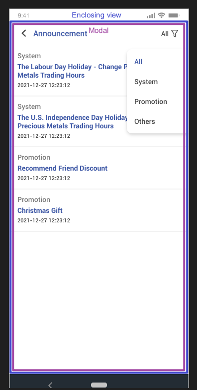
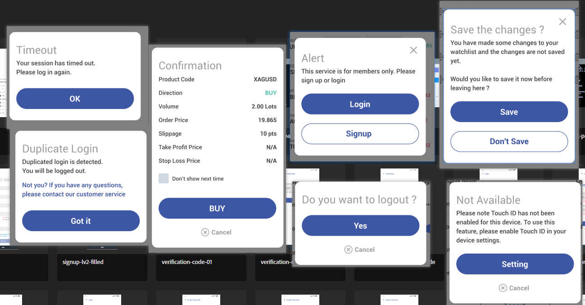
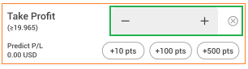
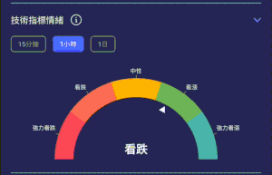

# Index

- [Index](#index)
- [Overview](#overview)
  - [The architecture](#the-architecture)
- [Start](#start)
  - [iOS](#ios)
  - [Hello World](#hello-world)
  - [Real Example](#real-example)
- [Navigation](#navigation)
  - [Overview](#overview-1)
  - [Navigation Container](#navigation-container)
    - [Ref](#ref)
    - [Navigation State](#navigation-state)
    - [Deep Linking](#deep-linking)
  - [Navigators](#navigators)
    - [Native Stack](#native-stack)
    - [Bottom Tab](#bottom-tab)
    - [Material Top Tab](#material-top-tab)
  - [Moving Between Screens](#moving-between-screens)
    - [Navigating to a Screen](#navigating-to-a-screen)
      - [Common Functions](#common-functions)
      - [Stack Navigator Functions](#stack-navigator-functions)
      - [Passing Parameters to a Screen](#passing-parameters-to-a-screen)
    - [Lifecycle and Events](#lifecycle-and-events)
      - [useFocusEffect](#usefocuseffect)
      - [useIsFocused](#useisfocused)
  - [Back Press (Android)](#back-press-android)
- [Core Component](#core-component)
  - [View](#view)
  - [ScrollView](#scrollview)
  - [VirtualizedList](#virtualizedlist)
  - [FlatList](#flatlist)
    - [Infinite Scroll Loading](#infinite-scroll-loading)
    - [Horizontal Image Slider](#horizontal-image-slider)
  - [Modal](#modal)
  - [Safe Area View](#safe-area-view)
  - [Keyboard View](#keyboard-view)
  - [WebView](#webview)
  - [List](#list)
  - [Bottom Sheet](#bottom-sheet)
  - [Dialog/Backdrop](#dialogbackdrop)
  - [Image](#image)
  - [SVG Icon](#svg-icon)
- [Third Party Components](#third-party-components)
  - [HTML](#html)
- [Customized Components](#customized-components)
  - [Message dialog](#message-dialog)
  - [Minus-plus input box](#minus-plus-input-box)
- [User Interface](#user-interface)
  - [Style](#style)
    - [Flex Style](#flex-style)
    - [View Style](#view-style)
    - [Transforms Style](#transforms-style)
    - [Text Style](#text-style)
    - [Coding Practice](#coding-practice)
  - [Animation](#animation)
    - [Example](#example)
  - [Screen Size](#screen-size)
  - [Theme](#theme)
    - [useColorScheme](#usecolorscheme)
    - [Chaning Theme](#chaning-theme)
  - [Font](#font)
- [Enhancement Features for Mobile App](#enhancement-features-for-mobile-app)
  - [Overview](#overview-2)
  - [Push notification](#push-notification)
  - [Splash Screen](#splash-screen)
  - [Code Push](#code-push)
  - [Network](#network)
    - [Check Network Connection](#check-network-connection)

# Overview

React Native is a framework that allows you to create native mobile apps using JavaScript and React. It was developed by Facebook and is now maintained by a community of developers. You can use React Native to create cross-platform apps that run on both Android and iOS devices with a single codebase. 

React Native leverages the concepts and principles of React, such as component-based architecture and declarative syntax, to enable the development of native-like mobile applications using JavaScript. React Native is like React, but it uses native components like `<View>`, `<Text>` or `<Image>`, instead of web components like `<div>` or `<span>`, as building blocks.

Note that while React Native provides a cross-platform development solution, there may be cases where platform-specific customization or access to specialized device features requires writing platform-specific code (known as "bridging") in Objective-C/Swift for iOS or Java/Kotlin for Android.

## The architecture

- [How does React Native work? Understanding the architecture Nov 11, 2022 - Medium](https://medium.com/front-end-weekly/how-does-react-native-work-understanding-the-architecture-d9d714e402e0)
- [React Native Series #1 — The Architecture Wars. An Introduction to The New Architecture Jan 18, 2024 - Medium](https://medium.com/@mihai24031999/react-native-series-1-the-architecture-wars-an-introduction-to-the-new-architecture-d594e1bc7d17)
- [About the New Architecture - React Native](https://reactnative.dev/docs/the-new-architecture/landing-page)

The idea behind React Native is to combine JavaScript code and native code and make them work together.

**Build time**

During build time, native code written in Java or Objective-C will be compiled into Java and C++ binary files and JavaScript code will be bundled using the Metro bundler.

Binaries and JavaScript bundle will eventually be packed inside an executable file `.apk` for Android or `.ipa` for iOS.

> Note that iOS devices have a built-in JavaScript engine called JavaScriptCore written in C++, which will compile and execute the JavaScript code. Android devices don’t have a built-in JS engine, so JavaScriptCore will be brought along with the React Native framework.

**Threads**

When a user runs an application, the device will start three main threads, as well as additional background threads if needed.

- Main Thread (a.k.a UI Thread) — this is the main native thread on which the application will be running. It is responsible for user interactions and rendering UI on the screen of a device. It is the same thread that is running in every fully natively built application.
- JavaScript Thread — this is where the business logic of the application will be executed (i.e., JavaScript and React code).
- Shadow Thread — this thread will be launched along the JavaScript thread. Its responsibility is to compute the positions of the views and construct a tree of layout coded in the JavaScript thread. React Native utilizes a layout engine called *Yoga* which converts flexbox-based layout into a layout system that a native host can understand.
- Native Modules Thread — when the application needs access to a platform API, like, for example, the device’s storage, this thread will handle it.

**Runtime**

At runtime, the JavaScript code will run on the JavaScript VM, and native code will run directly on the device. These two realms communicate by a bridge, which transfers serialized JSON messages. These messages will then be deserialized and processed.

For example:

1. A native "touch" event occurs.
2. The serialized message is sent from the native side through the bridge with all the necessary data.
3. The JavaScript side receives the message, deserializes it and decides what to do next. In this case, changing an icon.
4. The serialized message is sent from the JavaScript side through the bridge with information about the requested action.
5. The native side receives the message, deserializes it and updates the view.

**The problem with the bridge**

1. The bridge is asynchronous and single-threaded. Users may see intermediate states or visual jumps if the native side cannot receive message from the JavaScript side immediately.
2. Serializing and deserializing message is time-consuming.

**The new architecture**

Starting from version 0.68, a new architecture is available which drops the Bridge mechanism. It is built on three main pillars:

- JavaScript Interface (JSI) — a unified, lightweight API that allows JavaScript to directly call native code synchronously and vice versa. This eliminates the need for serialization and deserialization.
- TurboModules — a new system for defining native modules in React Native. Unlike the old native modules, TurboModules are lazily initialized.
- Fabric — a new UI layer in React Native that aims to improve the performance of complex views. It allows for concurrent rendering, which can lead to smoother animations and transitions.

# Start

- [Get Started with React Native - React Native](https://reactnative.dev/docs/environment-setup)

> You need to install Node.js before doing anything.

**Blank Project**

Assume you are in a folder `/work`, create a new project in `/work/AwesomeProject`.

```sh
npx @react-native-community/cli@latest init AwesomeProject
```

**Existing Project**

Under the project directory, install all dependencies.

```sh
npm install
```

**Working in Android**

> You need to install Android Studio. Please refer to the official guide to configure the Android SDK setting and path setting. Also, you need to prepare a android device. Please refer to the official guide to setup the Android Debug Bridge.

Run `adb devices` to check if the device is connected.

Run `adb reverse tcp:8081 tcp:8081` to setup the development server in the mobile phone.

If the device is `unauthorized` after running `adb devices` / `This adb server's $ADB_VENDOR_KEYS is not set` after running `adb reverse tcp:8081 tcp:8081`, try to unplug the device, turn off the USB debugging, and revoke USB debugging authorisations, and then replug the device.

Under the project directory, start the Metro development server.

```sh
npm start
```

In another terminal under the project directory, builds the debug apk and installs it to the device

```sh
npm run android
```

Entry point of the entire app should be `index.js`. Start editing in `App.tsx`.

## iOS

```
under root folder, yarn install
go to /ios, pod install
open xcode by clicking xcworkspace
change build setting -> info.plist File name
build to simulator

go to apple developer, create an identifier for the app, and set the bundle ID
go to xcode, set the bundle ID, then can try to build the app and run

To build for other testing:
go to appstoreconnect, create an app
go to xcode, product-> archive
  - note that if build to a simulator, we add "arm64" to excluded arch. If we want to build archive, we need to remove it
after build success, go to Archives, then validate and distribute the app
go to appstoreconnect, you should see a new version appears on testflight, then invite other people to test the app
```

## Hello World

- [Learn the basics - React Native](https://reactnative.dev/docs/tutorial)

```js
// index.js

import {AppRegistry} from 'react-native';
import App from './App';
import {name as appName} from './app.json';

AppRegistry.registerComponent(appName, () => App);
```

```jsx
// App.tsx

import React from 'react';
import {Text, View} from 'react-native';

const App = () => {

  // Do something ...

  return (
    <View style={{flex: 1, justifyContent: 'center', alignItems: 'center'}}>
      <Text>Hello, world!</Text>
    </View>
  );
};
export default App;
```

## Real Example

```js
// index.js

import {AppRegistry} from 'react-native';
import App from './App';
import {name as appName} from './app.json';

AppRegistry.registerComponent(appName, () => App);
```

```jsx
// App.tsx

const App = () => {

  // Do something ...

  return (
    <Provider store={store} >
      <PersistGate loading={null} persistor={persistor} >
        {
          someStatus === true ?
            <WebSocketProvider>
              <AppContainer />
            </WebSocketProvider> :
            <></>
        }
      </PersistGate>
    </Provider >
  );
}

const AppContainer = () => {
  
  // Do something ...
  
  return (
    <NavigationContainer>
      <Stack.Navigator initialRouteName="Home">
        <Stack.Screen name="TabDirectory" component={TabDirectory} />
        <Stack.Screen name="Profile" component={ProfileScreen} />
      </Stack.Navigator>
    </NavigationContainer>
  );
}
```

# Navigation

- [Navigating Between Screens - React Native](https://reactnative.dev/docs/navigation)
- [Hello React Navigation - React Navigation](https://reactnavigation.org/docs/hello-react-navigation)

## Overview

```jsx
// App.tsx

// import ...
import { NavigationContainer } from '@react-navigation/native';
import { createNativeStackNavigator } from '@react-navigation/native-stack';

const Stack = createNativeStackNavigator();

function App() {
  return (
    <NavigationContainer>
      <Stack.Navigator>
        <Stack.Screen name="Home" component={HomeScreen} />
      </Stack.Navigator>
    </NavigationContainer>
  );
}

export default App;
```

```jsx
// HomeScreen.tsx

// import ...

function HomeScreen() {
  return (
    <View style={{ flex: 1, alignItems: 'center', justifyContent: 'center' }}>
      <Text>Home Screen</Text>
    </View>
  );
}

export default HomeScreen
```

Usually, the `App` component (or the root of the app) uses a `NavigationContainer` component to wrap a stack *navigator*. Then, the stack *navigator* wraps all screens, including the screen with a tab *navigator*.

There are a few types of *navigators*:

- Native Stack
- Drawer
- Bottom Tabs


Note that in the official document, `route` means screen.

## Navigation Container

- [NavigationContainer - React Navigation](https://reactnavigation.org/docs/navigation-container)

`NavigationContainer` is a component which manages our navigation tree and contains the navigation state. Normally only one container is needed at the root of the app. It wraps the *navigators*.

```jsx
import { NavigationContainer } from '@react-navigation/native';
import { createNativeStackNavigator } from '@react-navigation/native-stack';

const Stack = createNativeStackNavigator();

export default function App() {
  return (
    <NavigationContainer>
      <Stack.Navigator>{/* ... */}</Stack.Navigator>
    </NavigationContainer>
  );
}
```

### Ref

It's also possible to attach a `ref` to the container to get access to various helper methods, for example, dispatch navigation actions. This should be used in rare cases when you don't have access to the `navigation` prop, such as a Redux middleware or in `App.tsx`.

```jsx
import {
  NavigationContainer,
  useNavigationContainerRef,
} from '@react-navigation/native';

function App() {
  const navigationRef = useNavigationContainerRef(); // You can also use a regular ref with `React.useRef()`

  return (
    <View style={{ flex: 1 }}>
      <Button onPress={() => navigationRef.navigate('Home')}>Go home</Button>
      <NavigationContainer
        ref={navigationRef}
      >
          {/* ... */}
      </NavigationContainer>
    </View>
  );
}
```

### Navigation State

- https://reactnavigation.org/docs/navigation-state/

The navigation state is the state where React Navigation stores the navigation structure and history of the app.

It's a JavaScript object which looks like this:

```js
{
    "stale": false,
    "type": "stack",
    "key": "stack-oBS48iKs0-ObS4rhX_j7t",
    "index": 2,

    // All screens
    "routeNames": ["TabDirectory", "MeAnnouncement", "MeAnnouncementDetail"],
    "routes": [
        {
            "key": "TabDirectory-9zBrmcRLqmDh3poxKtS6f",
            "name": "TabDirectory"
        }, {
            "key": "MeAnnouncement-0ls0npQ7xi6-SECRRISbC",
            "name": "MeAnnouncement"
        }, {
            "key": "MeAnnouncementDetail-n1TctYbelU3cJMPWysVkR",
            "name": "MeAnnouncementDetail",
            "params": {
                "announcement": {
                    "content": "test",
                    "notificationId": 369,
                    "notificationTypeId": 1,
                    "publishTime": 1714384620000,
                    "title": "test"
                }
            }
        }
    ]
}
```

There are few properties present in every navigation state object:

Property | Description
-------- | -----------
`type` | Type of the navigator that the state belongs to, e.g. `stack`, `tab`, `drawer`.
`routeNames` | Name of the screens defined in the navigator. This is an unique array containing strings for each screen.
`routes` | List of screens which are rendered in the navigator. It also represents the history in a stack navigator. There should be at least one item present in this array.

Each route object in a `routes` array may contain the following properties:

Property | Description
-------- | -----------
`key` | Unique key of the screen. Created automatically or added while navigating to this screen.
`name` | Name of the screen. Defined in navigator component hierarchy.
`params` | An optional object containing params which is defined while navigating e.g. `navigate('Home', { sortBy: 'latest' })`.
`state` | An optional object containing the navigation state of a child navigator nested inside this screen.

In the `NavigationContainer`, there is a function that gets called every time navigation state changes. It receives the new navigation state as the argument.

```jsx
<NavigationContainer
  onStateChange={(state) => console.log('New state is', state)}
>
  {/* ... */}
</NavigationContainer>
```

### Deep Linking

- https://reactnavigation.org/docs/configuring-links/

Deep links are a type of link that send users directly to an app instead of a website or a store. They are used to send users straight to specific in-app locations, saving users the time and energy locating a particular page themselves – significantly improving the user experience.

Deep linking does this by specifying a custom URL scheme (iOS Universal Links) or an intent URL (Android App Links) that opens your app if it’s already installed.

You can configure React Navigation to handle deep links.

```jsx
const linking = {
  prefixes: [
    /* Specify your custom schemes */
    "mychat://app", "https://mychat.com"
  ],
  config: {
    screens: {
      /* <Screen Name>: <Path>, the screen name must exist in the navigator. */
      Notification: "notification"  // mychat://app/notification will go to the Notification screen
      Login: "login"  // mychat://app/login will go to the Login screen
    }
  },
  getStateFromPath: (path, options) => {
    // For some cases, you might want to parse the URL into a state object.
    // For example, when opening mychat://app/notification, if user is logged in, 
    // directly open the Notification screen. If the user is not logged in, open 
    // the Login screen first, then go to the Notification screen.
    
    // Return a state object here, which is used to updated the original state, 
    // e.g. append new route in the `routes` property.
    // You can also reuse the default logic by importing `getStateFromPath` from 
    // `@react-navigation/native`
    if (path === "/notification") {
      if (isNotLogin) {
        SetPageAfterLogin("Notification");  // A custom function for redirect after login
        return { routes: [{ name: "Login" }] };  // The navigation state object
      }
    }
    return getStateFromPath(path, config);  // Using default mapping config
  },
};


<NavigationContainer
  linking={linking}
>
  <Stack.Navigator>
    <Stack.Screen name="Login" component={LoginScreen} />
    <Stack.Screen name="Notification" component={NotificationScreen} />
  </Stack.Navigator>
</NavigationContainer>
```


## Navigators

### Native Stack

- [Native Stack API definition](https://reactnavigation.org/docs/native-stack-navigator#api-definition)

It enables transition between screens where each new screen is placed on top of a stack.

This navigator uses the native APIs `UINavigationController` on iOS and `Fragment` on Android so that it will behave exactly the same and have the same performance characteristics as apps built natively on top of those APIs, such as gestures and animations.

```jsx
// App.tsx
import * as React from 'react';
import { NavigationContainer } from '@react-navigation/native';
import { createNativeStackNavigator } from '@react-navigation/native-stack';

const Stack = createNativeStackNavigator();

const App = () => {
  return (
    <NavigationContainer>
      <Stack.Navigator screenOptions={{ animation: "none" }}>
        <Stack.Screen name="TabDirectory" component={TabDirectory} options={{ animation: "none" }} />
        <Stack.Screen name="SuccessOrder" component={SuccessOrder} />
      </Stack.Navigator>
    </NavigationContainer>
  );
};
```

The first screen appeared under `<Stack.Navigator>` will be the first screen in the stack.

Some useful `options` for each `<Stack.Screen>`:

`options` | Description
--------- | -----------
`animation` | | If you do not set, it will use the platform default animation, which may create some unexpected white flash during navigation. Set `none` if you do not want any animation and just change the screen directly. You can also set other animations, like `slide_from_right`, to prevent white flash.
`gestureEnabled` | `iOS` Whether user can swipe left/right to dismiss the screen.

If you want to set default `options` for all screens, use `screenOptions` inside `<Stack.Navigator>`.

### Bottom Tab

- [Bottom Tabs API definition](https://reactnavigation.org/docs/bottom-tab-navigator#api-definition)

```jsx
// TabDirectory.tsx
import * as React from 'react';
import { createBottomTabNavigator } from '@react-navigation/bottom-tabs';

const Tab = createBottomTabNavigator();

const TabDirectory = ( ... ) => {
  return (
    <Tab.Navigator screenOptions={{}}>
      <Tab.Screen name="Home" component={HomeScreen} />
      <Tab.Screen name="Settings" component={SettingsScreen} />
    </Tab.Navigator>
  )
}
```

Some useful `options` for each `<Tab.Screen>`:

`options` | Description
--------- | -----------

### Material Top Tab

- [Material Top Tabs API definition](https://reactnavigation.org/docs/material-top-tab-navigator#api-definition)

Some useful `options` for each `<Tab.Screen>`:

`options` | Description
--------- | -----------
`swipeEnabled` | Boolean indicating whether to enable swipe gestures. Swipe gestures are enabled by default.

If you want to set default `options` for all tabs, use `screenOptions` inside `<Tab.Navigator>`.

## Moving Between Screens

### Navigating to a Screen

- [Common navigation actions](https://reactnavigation.org/docs/navigation-actions)
- [Stack navigation actions](https://reactnavigation.org/docs/stack-actions)

#### Common Functions

`navigation.navigate("...")`

If the screen is already present in the stack's history, it'll go back to that screen and remove any screens after that. If the screen is not present, it'll push a new screen.

```
C
B  -->  navigation.navigate("B")  -->  B
A                                      A

                                       C
B  -->  navigation.navigate("C")  -->  B
A                                      A
```

`navigation.goBack()`

It allows to go back to the previous route in history.

```
C
B  -->  navigation.goBack()  -->  B
A                                 A
```

#### Stack Navigator Functions

`navigation.push("...")`

It always adds a route on top of the stack and navigates forward to it.

```
                                   B
B  -->  navigation.push("B")  -->  B
A                                  A
```

`navigation.pop(n)`

It takes you back to a previous screen in the stack by `n`.

```
C
B  -->  navigation.pop(1)  -->  B
A                               A

C
B  -->  navigation.pop(2)  -->
A                               A
```

`navigation.popToTop()`

It takes you back to the first screen in the stack.

```
C
B  -->  navigation.popToTop()  -->
A                                   A
```

`navigation.replace("...")`

The replace action allows to replace a route in the navigation state.

```
C                                     D
B  -->  navigation.repalce("D")  -->  B
A                                     A
```

#### Passing Parameters to a Screen

- [Passing parameters to routes](https://reactnavigation.org/docs/params)

It is extremely useful when you want to define the next screen after navigating to a screen.

There are two pieces to this:

1. Pass params to a route by putting them in an object as a second parameter to the `navigation` function, for example: `navigation.navigate('RouteName', { /* params go here */ })`
2. Read the params in your screen component: `route.params`.

Suppose we want to navigate to a screen called `Details`, we can pass the parameter like the following:

```jsx
navigation.navigate("Details", { 
  itemId: 86, 
  otherParam: 'anything you want here', 
});  
```

Then, in the screen `Details`, we can read the parameter like the following:

```jsx
const Details = ({ route, navigation }) => {
  const { itemId, otherParam } = route.params;

  // ...
}
```

Of course, if we use TypeScript, we want to add type to the parameter of different screens:

```jsx
// src/routes/route.tsx
import { StackNavigationProp } from "@react-navigation/stack";
import { RouteProp } from "@react-navigation/core";

// Here define the type of parameters:
export type RootStackParamList = {
    Details: { itemId: number; otherParam?: string };
}

export type ScreenNavigationProp<T extends keyof RootStackParamList> = StackNavigationProp<RootStackParamList, T>;

export type ScreenRouteProp<T extends keyof RootStackParamList> = RouteProp<RootStackParamList, T>;

export type Props<T extends keyof RootStackParamList> = {
  navigation: ScreenNavigationProp<T>;
  route: ScreenRouteProp<T>;
};
```

```jsx
const Details: React.FC<Props<"Details">> = ({ route, navigation }) => {
  const { itemId, otherParam } = route.params;

  // ...
}
```

### Lifecycle and Events

- [Navigation lifecycle](https://reactnavigation.org/docs/navigation-lifecycle)

Consider a stack navigator with screens A and B. After navigating to A, its `componentDidMount` is called. When pushing B, its `componentDidMount` is also called, but A remains mounted on the stack and its `componentWillUnmount` is therefore not called.

When going back from B to A, `componentWillUnmount` of B is called, but `componentDidMount` of A is not because A remained mounted the whole time.

Note that for tab navigator, each tab will remain mounted even if another tab is switched to.

React Navigation emits events to screen components that subscribe to them. 

- When a screen comes into focus, it emits a `focus` event.
- When a screen goes out of focus, it emits a `blur` event.

```jsx
import * as React from 'react';
import { Button } from 'react-native';
import { useNavigation } from '@react-navigation/native';

function MyBackButton() {
  const navigation = useNavigation();

  React.useEffect(() => {
    const unsubscribe = navigation.addListener('focus', () => {
      // The screen is focused
      // Call any action
    });

    // Return the function to unsubscribe from the event so it gets removed on unmount
    return unsubscribe;
  }, [navigation]);

  return <View />;
}
```

#### useFocusEffect

- [Call a function when focused screen changes](https://reactnavigation.org/docs/function-after-focusing-screen)

Instead of adding event listeners manually, we can use the `useFocusEffect` hook to perform side effects. It runs effect in a focused screen, similar to `useEffect` (i.e. run after render).

This is particularly handy when we are trying to stop something when the page is unfocused, like stopping a video or audio file from playing, or stopping the tracking of a user's location.

```jsx
import { useFocusEffect } from '@react-navigation/native';

function Profile() {
  useFocusEffect(
    useCallback(() => {
      // Do something when the screen is focused

      return () => {
        // Do something when the screen blurs
        // Useful for cleanup functions
      };
    }, [])
  );

  return <ProfileContent />;
}
```

Note that in `useFocusEffect`, a function object is needed without calling it. Unlike `useEffect`, however, **it does not include dependencies**. To add dependencies, use `useCallback` to wrap the function object.

The effect will run whenever the dependencies passed to `useCallback` change, i.e. it'll run on initial render (if the screen is focused) as well as on subsequent renders if the dependencies have changed. If you don't wrap your effect in `useCallback`, the effect will run every render if the screen is focused.

#### useIsFocused

- [useIsFocused](https://reactnavigation.org/docs/use-is-focused/)

We can also use the `useIsFocused` hook to render different content based on the focus state of the screen.

```jsx
import { useIsFocused } from '@react-navigation/native';

// ...

function Profile() {
  const isFocused = useIsFocused();

  return <Text>{isFocused ? 'focused' : 'unfocused'}</Text>;
}
```

- Note that `useIsFocused` triggers a re-render for the component when the screen changes focus. This might cause lags during the animation if your component is heavy. For example, when navigating from screen A to screen B, screen A will re-render once right after screen B is mounted. Also, when using `isFocused === true` to render content, it might also cause some unexpected values if `isFocused === false` is not handled.
- The `useIsFocused` hook is the same as the method `navigation.isFocused()`.

One example of the problem of unexpected value: 

In the screen of watchlist, the `bid` is updated when the screen is focused, hence the component re-renders and updates `changePrice`. However, when the screen changes as unfocused, `useIsFocused` still trigger a re-render of the component. The `bid` become `undefined`, and the `changePrice` become `NaN`.

```jsx
const isFocused = useIsFocused();

const bid = useSelector((state: State) => {
  if (isFocused && state.trading.prices?.[contract]?.Bid) return state.trading.prices[contract].Bid;
});

const changePrice = (close !== 0 ? bid - close : 0).toFixed(symbolDigit);

return <Text>{changePrice}</Text>
```

To solve this problem, use a `ref` to store the latest bid. When `isFocused === false`, return the `ref`.

## Back Press (Android)

```jsx
import { BackHandler, NativeEventSubscription } from "react-native";

const backHandlerSubscriptionRef = useRef<NativeEventSubscription | null>(null);

useEffect(() => {
  
  // Add handler
  backHandlerSubscriptionRef.current = BackHandler.addEventListener("hardwareBackPress", () => {
    // ...
    return true;
  });

  // Remove handler
  return () => {
    backHandlerSubscriptionRef.current?.remove();
    backHandlerSubscriptionRef.current = null;
  };
}, []);
```

If you want to disable the back press button, just `return true` in the event listener.

`BackHandler` can also exit the app. However, this does not kill or stop the app, which is still running in the background.

```jsx
BackHandler.exitApp();
```

# Core Component

- [Core Components and APIs - React Native](https://reactnative.dev/docs/components-and-apis)
- [Core Components and Native Components - React Native](https://reactnative.dev/docs/intro-react-native-components#core-components)

React Native provides a number of built-in Core Components ready for you to use in your app.

For buttons:

- Pressable - it can handle all kinds of press events, including press in, press out, etc.
- TouchableOpacity - it can handle press down event with decreasing the opacity of the wrapped view.
- Switch

For text:

- Text
- TextInput - Style `flex:1, textAlign: 'center'` to make the trigger area of start input cursor larger.

## View

- [View - React Native](https://reactnative.dev/docs/view)

The most fundamental component for building a UI, `View` is a container that supports layout with flexbox, style, some touch handling, and accessibility controls.

`View` maps directly to the native view equivalent on whatever platform React Native is running on, whether that is a `UIView`, `<div>`, `android.view`, etc.

Props | Description
----- | -----------
`onLayout`* | It is called on mount and layout changes, such as size and position inside the parent component. Note that it is called after `useEffect` / `useLayoutEffect`.

*: This props requires an event handler of type `(event: NativeSyntheticEvent<{ layout: LayoutRectangle }>) => void`. To get the `LayoutEvent`, you need to access the `event.nativeEvent`.

## ScrollView

- [ScrollView - React Native](https://reactnative.dev/docs/scrollview)

`ScrollView` renders all its react child components at once.

Keep in mind that `ScrollView` must have a bounded height in order to work, since it contain unbounded-height children into a bounded container (via a scroll interaction). **Therefore, make sure it has at least one parent, and all parent views have bounded height**, such as setting `{ flex: 1 }`.

```jsx
return (
  <View style={{ flex: 1 }}>
    <ScrollView>
      ...
    </ScrollView>
  </View>
)
```

By default, the height of the `ScrollView` is specified by the children. If you want the `ScrollView` to glow to **fill up the full height of the parent container**, add props `contentContainerStyle={{ flexGrow: 1 }}`.

For some Android devices, at the end of the `ScrollView` there is a very tiny border. To make it disappear, add props `contentContainerStyle={{ borderWidth: 0.1, borderColor: "transparent" }}`.

**Props**

Props | Description
----- | -----------
`contentContainerStyle` | It specifies the style of the scroll view content container, which wraps all of the child views.
`horizontal` | When `true`, the scroll view's children are arranged horizontally in a row instead of vertically in a column.
`showsHorizontalScrollIndicator` | When `true`, shows the horizontal scroll indicator.
`pagingEnabled` | When `true`, the scroll view stops on multiples of the scroll view's size when scrolling. **This can be used for horizontal pagination.**
`decelerationRate` | A floating-point number that determines how quickly the scroll view decelerates after the user lifts their finger. `0` means stops immediately.
`bounces` `iOS` | When `true`, the scroll view will bounce if the user over scroll it.
`overScrollMode` `Android` | Allow the user to over scroll the scroll view or not.

**Event Props**

Event Props | Description
----- | -----------
`onScroll` | It is called while the `ScrollView` is being scrolled, at most once per frame.
`onScrollEndDrag`#^ | It is called when the user stops dragging the scroll view and it either stops (after dragging slowly) or begins to glide (after dragging quickly).
`onMomentumScrollEnd`# | It is called when the scroll view stops scrolling (gliding) completely.

Note that the event props requires an event handler of type `(event: NativeSyntheticEvent<NativeScrollEvent>) => void`. To get the `NativeScrollEvent`, you need to access the `event.nativeEvent`.

#: This props will not be triggered by `scrollTo()`, `scrollToEnd()`, `FlatList.scrollToIndex()`.

^: This props will not be triggered by the scroll from `pagingEnabled`.

**Scroll Method**

Method | Description
------- | -----------
`scrollTo()` | Scroll to a specific offset of the `ScrollView`.
`scrollToEnd()` | Scroll to the end of the `ScrollView`.

## VirtualizedList

- [Virtualized List Props - React Native](https://reactnative.dev/docs/virtualizedlist#props)

Extends `ScrollView`.

**Event Props**

Props | Description
----- | -----------
`onEndReached` | It is called when the user scrolls to the *logical end position* of the list. Note that the list must be scrollable.
`onEndReachedThreshold` | Determine the *logical end position* of the list. A value of `0.1` will trigger the event when `0.1` * `LIST_VISIBLE_LENGTH` above the end of the list is reached.

## FlatList

- [FlatList Props - React Native](https://reactnative.dev/docs/flatlist)

Extends `VirtualizedList`, extends `ScrollView`.

`FlatList` renders items lazily, when they are about to appear, and removes items that scroll way off screen to save memory and processing time.

It renders a list with many similar items. The list can only be scrollable if it has already filled the full height of the parent container.

**Props**

Props | Description
----- | -----------
`renderItem` | A function that takes an item from `data` and renders it into the list.
`data` | An array of items to render.
`keyExtractor` | A function that return a key, which is used for caching.
`ItemSeparatorComponent` | A component that is rendered in between each item, but not at the top or bottom.
`ListFooterComponent` | A component that is rendered at the end of the list. Note that the presence of this component may affect the trigger of `onEndReached`.

**Scroll Method**

Method | Description
------- | -----------
`scrollToIndex` | Scroll to the item based on the given index.

### Infinite Scroll Loading

A list view where additional items are loaded as the user scrolls down the list.


```jsx
const [data, setData] = useState<MessageType[]>([]);
const [page, setPage] = useState<number>(1);

const handleLoadMore = () => {
  setPage((prevPage) => prevPage + 1);
}

const renderItem = (listRenderItem: ListRenderItemInfo<MessageType>) => {
  let message: MessageType = listRenderItem.item;
  return (
    // ...
  )
}

const renderItemSeparatorComponent = () => {
  return <View style={{borderBottomColor: "#FFFFFF", borderBottomWidth: 1}} />;
}

const keyExtractor = (item: MessageType) => item.messageId?.toString()

// Fetch data when first load, or when need to load one more page
useEffect(() => {
  let data : MessageType[] = await fetchData();
  // ...

  if (page === 1)
    setData(data);
  else
    setData([...data, ...newData]);

}, [page])

return (
  <FlatList
    data={data}                                            // required
    renderItem={renderItem}                                // required
    onEndReached={handleLoadMore}                          // required
    onEndReachedThreshold={0.1}                            // required
    keyExtractor={keyExtractor}                            // required, for caching
    ItemSeparatorComponent={renderItemSeparatorComponent}  // optional
  />
)
```

Improvement: Good UI/UX should include the following:

- When the user has scrolled to the end of the list, show it is loading more data.
- When no more data can be loaded, show that are loaded.
- When scroll up at the top of the list, show refresh.

### Horizontal Image Slider

For auto scrolling image, mainly make use of `FlatList.scrollToIndex()` with `setInterval()`.

For manual scrolling image, mainly make use of `ScrollView` props `padingEnabled`. For more customization, such as threshold of scrolling to next / previous page (default half of the scroll view's size), use `ScrollView` props `onMomentumScrollEnd`.

Improvement: Good UI/UX should include the following:

- When the user drags the image slider, disable auto scrolling.
- After the user drags the image slider, reset the timeout.
- A row of dot to indicate which page now the slider is in.

```jsx
const flatListRef = useRef(null);

const [currentSliderPage, setCurrentSliderPage] = useState<number>(0);

// Update current page (for auto scrolling) after user manual scrolling image
const handleFlatListMomentumScrollEnd = (event: NativeSyntheticEvent<NativeScrollEvent>) => {
  const currentListPosition = event.nativeEvent.contentOffset.x;
  const currentPage = Math.round(currentListPosition / props.imageWidth);
  setCurrentSliderPage(currentPage);
};

// For images auto sliding after a period of time, counter will be reset after manual scrolling
useEffect(() => {
  if (props.data?.length > 1) {
    const imageAutoSlidingInterval = setInterval(() => {
      if (isFocused) {
        const newSliderPage = (currentSliderPage + 1) % props.data.length;
        flatListRef.current.scrollToIndex({ index: newSliderPage, animated: true });
        setCurrentSliderPage(newSliderPage);
      }
    }, props.slideDuration);

    return () => {
      clearInterval(imageAutoSlidingInterval);
    };
  }
}, [props, isFocused, currentSliderPage]);

return (
  <FlatList
    {/* ... */}
    ref={flatListRef}
    horizontal={true}
    pagingEnabled={true}
    onMomentumScrollEnd={handleFlatListMomentumScrollEnd}
    bounces={false}
    overScrollMode={"never"}
  />
)
```

## Modal

- [Modal - React Native](https://reactnative.dev/docs/modal)

It can present content above an enclosing view. The `Modal` is full screen, but you can control whether its background is transparent or not.

For example, we can use `Modal` to implement a pop up menu, while the announcement list is the enclosing view. Area out of the menu could be transparent and pressable for closing the menu.



```jsx
const App = () => {
  const [modalVisible, setModalVisible] = useState<boolean>(false);

  const filterMenuItems: { displayName: string; onPress: () => void; isHighlight: boolean }[] = [
    { displayName: "All", onPress: ... , isHighlight: ... },
    { displayName: "System", onPress: ... , isHighlight: ... },
    { displayName: "Promotion", onPress: ... , isHighlight: ... },
    { displayName: "Others", onPress: ... , isHighlight: ... },
  ];

  return (
    <View>
      <Modal transparent={true} visible={modalVisible} onRequestClose={() => setModalVisible(false)}>
        <Pressable onPress={() => setModalVisible(false)}>
          <View style={{ height: 50 }} />
          <View
            style={{
              alignSelf: "flex-end",
              backgroundColor: '#ffffff',
              paddingLeft: 15,
              paddingRight: 45,
              borderRadius: 10,
              shadowOffset: {
                width: 0,
                height: 2,
              },
              shadowColor: "#000000",
              shadowOpacity: 0.29,
              shadowRadius: 3,
              elevation: 6,
            }}
          >
            {filterMenuItems.map((menuItem) => {
              return (
                <Pressable
                  onPress={() => {
                    menuItem.onPress();
                    setModalVisible(false);
                  }}
                >
                  <View style={{ paddingVertical: 10 }}>
                    <Text>{menuItem.displayName}</Text>
                  </View>
                </Pressable>
              );
            })}
          </View>
          <View style={{ height: "100%" }} />
        </Pressable>
      </Modal>
    </View>
  );
};
```

## Safe Area View

[iOS SafeAreaView - React Native](https://reactnative.dev/docs/safeareaview)

The purpose of `SafeAreaView` is to render content within the safe area boundaries of a device. It is currently only applicable to iOS devices with iOS version 11 or later.

Safe Area's paddings reflect the physical limitation of the screen, such as rounded corners or camera notches (i.e. the sensor housing area on iPhone 13).

[SafeAreaView - react-native-safe-area-context](https://github.com/th3rdwave/react-native-safe-area-context)

While React Native exports a `SafeAreaView` component, this component only supports iOS 10+ with no support for older iOS versions or Android. In addition, it also has some issues, i.e. if a screen containing safe area is animating, it causes jumpy behavior. So it is recommended to use the `useSafeAreaInsets` hook from the `react-native-safe-area-context` library to handle safe areas in a more reliable way.

Note: The `react-native-safe-area-context` library also exports a `SafeAreaView` component. While it works on Android, it also has the same issues related to jumpy behavior when animating. So we recommend always using the `useSafeAreaInsets` hook instead and avoid using the `SafeAreaView` component.

## Keyboard View

[KeyboardAvoidingView - React Native](https://reactnative.dev/docs/keyboardavoidingview)

This component will automatically adjust its height, position, or bottom padding based on the keyboard height to remain visible while the virtual keyboard is displayed.

Since the height of this component decreases if the virtual keyboard is displayed, normally we can use a `ScrollView` inside the `KeyboardAvoidingView`.

```jsx
const headerHeight = useHeaderHeight();

return (
  <KeyboardAvoidingView
    behavior={Platform.OS === "ios" ? "padding" : "height"}
    keyboardVerticalOffset={headerHeight}
    style={{ flex: 1 }}
  >
    <ScrollView>
      ...
    </ScrollView>
  </KeyboardAvoidingView>
)
```

Props | Description
----- | -----------
`behaviour` : `height` | Adjust the height of the `KeyboardAvoidingView` while the virtual keyboard is displayed. The new height would be SCREEN_HEIGHT - KEYBOARD_HEIGHT.
`behaviour` : `position` | 
`behaviour` : `padding`
`keyboardVerticalOffset` | Decrease the height of the `KeyboardAvoidingView` by an offset value. <br/><br/> When `behaviour` is set to `height`, the `KeyboardAvoidingView` may not be fully shown while the virtual keyboard is displayed, usually becasue the screen height also includes the height of the navigation header or the safe area. Use this props to adjust the height of the `KeyboardAvoidingView`.

- Note that in iOS, normal `<View>` component can already adjust its height while showing the virtual keyboard. Therefore, this component can work on iOS seamlessly. However, make sure you test across multiple Android devices to ensure the desired behavior.

[KeyboardAwareScrollView - react-native-keyboard-aware-scroll-view](https://github.com/APSL/react-native-keyboard-aware-scroll-view)

- Ensure the keyboard will not hide the input box

## WebView

- [WebView - react-native-webview
](https://github.com/react-native-webview/react-native-webview)
- [Debug web view in Safari / Chrome](https://github.com/react-native-webview/react-native-webview/blob/master/docs/Debugging.md)

## List

[SectionList - React Native](https://reactnative.dev/docs/sectionlist)

[DraggableFlatList - computerjazz](https://github.com/computerjazz/react-native-draggable-flatlist)

## Bottom Sheet

- [BottomSheet - gorhom](https://github.com/gorhom/react-native-bottom-sheet)

The bottom selection sheet.

```jsx
import BottomSheet, { BottomSheetScrollView, BottomSheetView } from "@gorhom/bottom-sheet";

// All content scrollable
<BottomSheet>
  <BottomSheetScrollView>
    ...
  </BottomSheetScrollView>
</BottomSheet>

// Fixed title and scrollable selection list
<BottomSheet>
  <BottomSheetView>
    <Text>...</Text>
    <ScrollView>...</ScrollView>
  </BottomSheetView>
</BottomSheet>
```

Props | Description
----- | -----------
`snapPoints` | Different height of the bottom sheet, depends on the gesture of panning up. For example, `['25%', '50%']`, it means the bottom sheet will first appear with height `25%`, and then `50%` if user pans it up.
`index` | Initial snap index, which is the index of `snapPoints` starting from `0`. You also could provide `-1` to initiate bottom sheet in closed state.
`backdropComponent` | Sheet backdrop, i.e. the darker area in the screen after the bottom sheet is open, can use the default implementation `BottomSheetBackdrop`.
`onChange` | Callback function when the snap index changed.
`enableDynamicSizing` | Note that it only measures the height of `BottomSheet*` component, e.g. `BottomSheetScrollView`, among the children of `<BottomSheet> ... </BottomSheet>`.
`maxDynamicContentSize` | Set the max height of the `BottomSheet` if using dynamic sizing.

This component can be reused in different screens. The related state property for reference:

- Determine whether the bottom list is open or closed.
- Determine which item is selected.

## Dialog/Backdrop

[Dialog - React Native Elements](https://reactnativeelements.com/docs/components/dialog)

Note that in iOS, you cannot overlay a dialog by another dialog. Only one dialog can be displayed at the same time.

You may also use dialog for the purpose of backdrop. For example, when loading animation is showing, use a backdrop such that user cannot press other places. To do that, adjust the overlay style.

```jsx
<Dialog 
  isVisible={isDialogShown}
  overlayStyle={[styles.overlayStyle]}
  onBackdropPress={handlePressCancel}
>
```

## Image

- [Images - React Native](https://reactnative.dev/docs/images)
- [Image component - React Native](https://reactnative.dev/docs/image)

You can use the `@2x` and `@3x` suffixes to provide images for different screen densities. If you have the following file structure:

```
.
├── button.js
└── img
    ├── check.png
    ├── check@2x.png
    └── check@3x.png
```

...and `button.js` code contains:

```jsx
<Image source={require('./img/check.png')} />
```

...the bundler will bundle and serve the image corresponding to device's screen density. For example, `check@2x.png`, will be used on an iPhone 7, while `check@3x.png` will be used on an iPhone 7 Plus or a Nexus 5. If there is no image matching the screen density, the closest best option will be selected.

Image Suffix | Android
------------ | -------
`check.png` | `drawable-mdpi`
`check@2x.png` | `drawable-xhdpi`
`check@3x.png` | `drawable-xxhdpi`

On Windows, you might need to restart the bundler if you add new images to your project.

## SVG Icon

- https://react-svgr.com/playground/?icon=true&native=true&typescript=true
- The color of a SVG icon can be changed in `<path fill={color}>`.

```jsx
import * as React from "react";
import Svg, { Defs, ClipPath, Path, G } from "react-native-svg";
import { IconInterface } from "./Types";

export interface IconInterface {
  backgroundColor?: ColorValue;
  color?: ColorValue;
  style?: ViewStyle;
  width?: NumberProp;
  height?: NumberProp;
}

function ArrowLineUp(config: IconInterface) {
  const { color, backgroundColor } = config;
  return (
    <Svg xmlns="http://www.w3.org/2000/svg" width={20} height={20} viewBox="0 0 20 20">
      <Defs>
        <ClipPath id="a">
          <Path
            data-name="Rectangle 1774"
            transform="translate(290 357)"
            fill="#fff"
            stroke="#707070"
            strokeWidth={1}
            d="M0 0H20V20H0z"
          />
        </ClipPath>
      </Defs>
      <G transform="translate(-290 -357)" clipPath="url(#a)">
        <G data-name="Group 3184" transform="translate(2.842 159.689)" fill={color}>
          <Path data-name="Path 8526" d="M290.159 207.311l7-8 7 8z" />
          <Path data-name="Rectangle 1902" transform="translate(294.158 205.679)" d="M0 0H6V9.632H0z" />
        </G>
      </G>
    </Svg>
  );
}

export default ArrowLineUp;
```

Usage:

```jsx
(
  <View style={{ flexDirection: "row" }}>
    <ArrowLineUp color={colors.same_style.font_value_up[upDownColor]} />
  </View>
)
```

# Third Party Components

## HTML

- https://www.npmjs.com/package/react-native-render-html

An iOS/Android pure javascript react-native component that renders your HTML into 100% native views.

Use cases:

- Display Markdown text by converting it to HTML.

Remember to:

- Set `contentWidth`.

# Customized Components

For similar style components that are repeatedly used in the application, try to create a customized component to reduce duplicate code.

Example components:

- Button
  - Toggle Text Button
  - Long Button
- Form input
  - Checkbox
  - Plus-minus box
  - Drop-down list
- Top bar
- Bottom selection pop up list (similar user experience to drop-down list)
- Message dialog
- Toast dialog (will disappear after a few seconds automatically)
- Expandable list (click to expand or collapse)
- StackView (input a `spacing` props. then can show a list of items)

Normally, similar style components means following the same theme. However, there may be some exception cases. Hence, the `props` also needs to accept style as optional parameter.

Do not fix the width / height of the customized components. Their size may vary in different screens, and should be restricted by a `<View>` component.

## Message dialog



For this message dialog, consider the following props:

```jsx
import { StyleProp, StyleSheet, Text, TextStyle, ViewStyle } from "react-native";

interface MessageDialogProps {
  isDialogShown: boolean;
  title?: string;
  titleStyle?: StyleProp<TextStyle>;  // in case you want some special style for a specific dialog
  message?: string;
  messageStyle?: StyleProp<TextStyle>;
  detailComponent?: ReactElement<any>;  // in case you want something other than one line of message
  firstButton?: ReactElement<any>;
  secondButton?: ReactElement<any>;
  isTopRightCancelShown?: boolean;
  isBottomCancelShown?: boolean;
}
```

When do implementation of the customized component, to conditional render the optional component, consider:

```jsx
{firstButton && <View>{firstButton}</View>}
```

## Minus-plus input box



The parent component stores the state variable for form submission. `minusPlusInputBox` stores the state variable for display.

- User types `0`, the display value is `0` and real value is `0`.
- User types `0.`, the display value is `0.` and real value is `0`.
- User types `.1`, the display value is `.1` and real value is `0.1`.
- When the display value changes, the real value may not change.

Use a value to decide whether the change of real value need to trigger re-render.

- When the real value changes, the input box (display value) may not re-render.
  - Text change from `19.02` to `19.0`.
  - Display value change from `19.02` to `19.0`.
  - Real value change from `19.02` to `19`.
  - You don't want the display value change from `19.0` to `19`.

```jsx
interface MinusPlusBoxProps {
  value: number; // real value for form submission
  isValueUpdated: boolean; // in case the display value needs to update becasue of value change outside this component
  handleValueChange: (value: number) => void; // update the real value
  valuePerStep: number; // value update when press +/-
  initialValue: number; // value to when press +/- if the display is empty
  maxDigit: number;
  isError: boolean;
  allowNegative: boolean;
  isCancelButtonShown: boolean;
  style?: ViewStyle;
  textStyle?: TextStyle;
}

const [displayText, SetDisplayText] = useState<string>("");

useEffect(() => {
  if (props.value !== 0) {
    SetDisplayText(props.value.toString());
  }
}, [props.isValueUpdated]);

const handlePlusPress = () => {
  if (displayText === "") {
    handleTextChange(props.initialValue.toString());
  } else {
    handleTextChange((Number(displayText) + props.valuePerStep).toFixed(props.maxDigit));
  }
};

const handleMinusPress = () => {
  if (displayText === "") {
    handleTextChange(props.initialValue.toString());
  } else {
    handleTextChange((Number(displayText) - props.valuePerStep).toFixed(props.maxDigit));
  }
};

const handleTextChange = (newValue: string) => {
  const r = new RegExp(`^${props.allowNegative ? "-?" : ""}\\d*\\.?\\d{0,${props.maxDigit}}$`, "g");
  if (newValue.match(r)) {
    SetDisplayText(newValue); // Accept "", ".", ".0", "0."
    const numValue = Number(newValue);
    if (!Number.isNaN(numValue)) {
      props.handleValueChange(numValue);
    }
  }
};

// Plus
onPress={handlePlusPress}

// Minus
onPress={handleMinusPress}

// TextInput
onChangeText={(newText) => handleTextChange(newText)}

// Cancel
onPress={() => handleTextChange("")}
```

# User Interface

## Style

All of the core components accept a prop named `style` (instead of `className` in React).

| Core Component | Style Prop                                                           |
|----------------|----------------------------------------------------------------------|
| `View`         | `ViewStyle` extends `FlexStyle`, `ShadowStyleIOS`, `TransformsStyle` |
| `Text`         | `TextStyle` extends `TextStyleIOS`, `TextStyleAndroid`, `ViewStyle`  |

The `style` prop can be a plain old JavaScript object.

```jsx
<View style={{ height: 20 }} />
```

You can also pass an array of styles - the last style in the array has precedence, so you can use this to inherit styles. It is useful when customize reuseable components.

```jsx
// Finally the height will be 20
<View style={[{ height: 10, width: 10 }, { height: 20 }]} />
```

Some key differences with CSS:

- React Native uses the flexbox layout API, instead of the CSS box model for layout.
- The style names are written using camel casing, e.g. `backgroundColor` rather than `background-color`.
- Animations are defined using JavaScript animation APIs instead of CSS transitions and animations. We can also use the React Native Reanimated package to write performant animations.
- There are no `:hover` or `:active` pseudo-classes. We can use the `Pressable` component from React Native to handle styles for hover and active state.

React Native uses unitless numbers for dimension properties like `width`, `height`, `borderRadius`, `padding`, `fontSize`, etc. No need type `px`, `dp`, `sp`, etc. The dimension represent density-independent pixels, which does not equal to the screen resolution of the mobile phone.

### Flex Style

- [Layout Props - React Native](https://reactnative.dev/docs/layout-props)
- [Layout with Flexbox - React Native](https://reactnative.dev/docs/flexbox)

**Props**

Props | Default | Description
----- | ------- | -----------
`display` | `flex`
`flexDirection` | `"column"` | It controls which direction children of a container go. `"row"` goes left to right, `"column"` goes top to bottom.
`flex` | | Note that `flex: <positive number>` equates to `flexGrow: <positive number>, flexShrink: 1, flexBasis: 0`. <br><br> Therefore, a container will distribute **the entire space** among its children weighted by the children's `flex` values. For example, a child with `flex` set to 2 will take twice the space as a child with `flex` set to 1. <br><br> Set in children style.
`flexGrow` | `0` | After laying out its children, a container will distribute **any remaining space** among its children weighted by the children's `flexGrow` values. <br><br> Set in children style.
`flexShrink` | | It describes how to shrink children along the main axis in the case in which the total size of the children overflows the size of the container on the main axis. A container will shrink its children weighted by the children’s `flexShrink` values. <br><br> Set in children style.
`width` | | It works similarly to width in CSS, but in React Native you must use points or percentages.
`height`
`justifyContent` | `flex-start` | Aligns children in the main direction (`flexDirection`). For example, if children are flowing vertically, this controls how they align vertically. <br><br> Use `space-between` to align children, one in start and one in end.<br><br>https://developer.mozilla.org/en-US/docs/Web/CSS/justify-content#values
`alignItems` | `stretch` | Aligns children in the cross direction. For example, if children are flowing vertically, this controls how they align horizontally.
`alignSelf` | | As a child, align itself in the cross direction. It overrides any option set by the parent with `alignItems`.
`alignContent` | | Defines the distribution of lines along the cross-axis. This only has effect when items are wrapped to multiple lines using `flexWrap`.

**Props that are related to positioning**

Props | Description
----- | -----------
`position` | If a child has `relative` position, it occupies a space within its parent. When you set the `top`, `right`, `bottom`, and `left` props of the child, it moves from the original position, and other children will not fill its original space.<br><br>If a child has `absolute` position, it **does not occupy a space within its parent and other children can overlap with it**. When you set the `top`, `right`, `bottom`, and `left` props of the child, it **moves from the parent**.
`top` | The number of logical pixels to offset the top edge of this component.
`bottom` | The number of logical pixels to offset the bottom edge of this component.
`left` | The number of logical pixels to offset the left edge of this component.
`right` | The number of logical pixels to offset the right edge of this component.

Note that if both `top` and `bottom` are set, probably `bottom` will be ignored. (https://stackoverflow.com/questions/24926629/css-position-absolute-with-top-and-bottom-both)

### View Style

- [View Style Props - React Native](https://reactnative.dev/docs/view-style-props)

**Props**

Props | Description
----- | -----------
`borderWidth` | 
`borderColor` | 
`borderRadius` | 

Note that for border radius, by default Android accepts radius that is greater than half of the width / height but iOS does not accept. Therefore, in iOS, you may need to add `overflow: 'hidden'` as well.

### Transforms Style

- [Transforms - React Native](https://reactnative.dev/docs/transforms)

```js
<View
  style={{
    height: 100,
    width: 100,
    borderRadius: 5,
    // Other styles ...
    transform: [
      { scale: 2},
      { translateX: 20 },
      { rotate: "90deg" },
    ],
  }}
/>
```

| Property      | Type       | Description |
|---------------|------------|-------------|
| `perspective` | `number`   |
| `rotate`      | `string`   |
| `rotateX`     | `string`   | Rotate from centre.
| `rotateY`     | `string`   |
| `rotateZ`     | `string`   |
| `scale`       | `number`   |
| `scaleX`      | `number`   |
| `scaleY`      | `number`   |
| `translateX`  | `number`   |
| `translateY`  | `number`   |
| `skewX`       | `string`   |
| `skewY`       | `string`   |
| `matrix`      | `number[]` |

All transformation starts from a fixed point, as known as *transform origin*. It defaults to the center of the component. It will not change during transformations.

Note that the transformation starts from the end of the array.

### Text Style

- [Props](https://reactnative.dev/docs/text-style-props)

Most commonly used `props` (most of them is the same as CSS):

Props | Default | Description
----- | ------- | -----------
`color`
`fontFamily`
`fontSize`
`fontStyle` | | Normal or italic.
`fontWeight` | `normal` | Normal or bold.
`textAlign` | `auto`

### Coding Practice

If a style is always used in one component, use `StyleSheet.create` to define it in one place.

```jsx
import React from 'react';
import {StyleSheet, Text, View} from 'react-native';

const ExampleComponent = () => {
  const { colors } = useTheme();  // refer to Changing Theme
  const globalStyles = makeGlobalStyles(colors);  // refer to the next code
  const styles = makeStyles(colors);

  return (
    <View style={styles.container}>
      <Text style={styles.red}>just red</Text>
      <Text style={styles.red}>red again</Text>
    </View>
  );
};

const makeStyles = (colors: THEME_TYPE) =>
  StyleSheet.create({
    container: {
      marginTop: 50,
    },
    red: {
      color: colors.content_bg,
    },
  });

export default LotsOfStyles;
```

If a style is always shared in different components, such as container style, define a `styles.tsx` and export them.

```jsx
// styles.tsx
import { StyleSheet } from "react-native";
import { THEME_TYPE } from "../types/types";

export const LAYOUT_PADDING_HORIZONTAL = 16;

export const makeGlobalStyles = (colors: THEME_TYPE) => StyleSheet.create({
  container: {
    flex: 1,
  },
  bottomContainer: {
    flex: 1,
    justifyContent: "flex-end",
    marginBottom: 10,
  },
  contentContainer: {
    paddingHorizontal: LAYOUT_PADDING_HORIZONTAL,
    flex: 1,
  },
  inputPadding: {
    padding: 10,
  },
});
```

## Animation

- [Animations - React Native](https://reactnative.dev/docs/animations)
- [The Animated library - React Native](https://reactnative.dev/docs/animated)

### Example



```jsx
const needleAnimRef = useRef(new Animated.Value(0));

useEffect(() => {
  Animated.timing(needleAnimRef.current, {
    toValue: props.currentIndex,
    duration: 500,
    useNativeDriver: true,
  }).start();
}, [props.currentIndex]);

const needleRotate = needleAnimRef.current.interpolate({
  inputRange: [0, props.labels.length - 1],
  outputRange: [`${-90 + 180 / 2 / props.labels.length}deg`, `${90 - 180 / 2 / props.labels.length}deg`],
});

return (
  <Animated.View
    style={{
      position: "absolute",
      height: smallCircleRadius * 2,
      transform: [
        { translateX: largeCircleRadius - 8 },
        { translateY: largeCircleRadius - smallCircleRadius },
        { rotate: needleRotate },
      ],
    }}
  >
    <ArrowHeadSolidUp color={colors.main_font} />
  </Animated.View>
)
```

## Screen Size

- https://reactnative.dev/docs/dimensions#example
- [useWindowDimensions - React Native](https://reactnative.dev/docs/usewindowdimensions)

```jsx
import { useWindowDimensions } from "react-native";

const { height, width } = useWindowDimensions();
```

## Theme

### useColorScheme

- [Document - React Native](https://reactnative.dev/docs/usecolorscheme)

It returns the system theme, either `"light"`, `"dark"` or `null`.

### Chaning Theme

```jsx
// index.d.ts
import '@react-navigation/native';
import { THEME_TYPE } from '../src/types/types'

// Override the theme in react native navigation to accept our custom theme props.
declare module '@react-navigation/native' {
  export type ExtendedTheme = {
    dark: boolean;
    colors: THEME_TYPE
  };
  export function useTheme(): ExtendedTheme;
}
```

```jsx
// theme.tsx
export const LightTheme: ExtendedTheme = {
  header_bg: Color.HEX3651A4,
  header_font: Color.HEXFCFCFC,
  ...
}

export const DarkTheme: ExtendedTheme = {
  header_bg: Color.HEX5368E5,
  header_font: Color.HEXFCFCFC,
  ...
}
```

```jsx
// App.tsx
const theme = useSelector((state: State) => state.state.setting?.Theme);

<NavigationContainer
  theme={theme === "dark" ? DarkTheme : LightTheme}
>
  <Stack.Navigator screenOptions={{ header: () => null }}>
    <Stack.Screen name="TabDirectoryWebView" component={TabDirectoryWebView} />
    ...
  </Stack.Navigator>
</NavigationContainer>
```

```jsx
import { useTheme } from "@react-navigation/native";

const { colors } = useTheme();
```

## Font

- [Add fonts - Medium](https://mehrankhandev.medium.com/ultimate-guide-to-use-custom-fonts-in-react-native-77fcdf859cf4)
- [Roboto - Google](https://fonts.google.com/specimen/Roboto)

By default, React Native uses San Francisco font on iOS and Roboto on Android:

# Enhancement Features for Mobile App

## Overview

- Inactive logout
- Biometrics
- Accessibility (VoiceOver, talkback, etc.)

## Push notification

- https://pushy.me/docs/additional-platforms/react-native

The notification SDK should contain the event listener when the user taps the notifications. One of the methods to navigate users into different screens after clicking the notification is using **deep link**.

Note that Pushy can push a JSON object to users.

## Splash Screen

- https://github.com/crazycodeboy/react-native-splash-screen

If the app does not have splash screen in native code, it will be a blank page after being launched, since the React Native screen is not yet rendered.

To avoid that blank page, use splash screen.

## Code Push

- For source code changes of react native, not native, you can do code push to update the app automatically. If related to android setting, then need to update the app manually in app store. It is a azure feature.
- https://appcenter.ms/apps
- https://www.npmjs.com/package/appcenter-cli

## Network

### Check Network Connection

After the `App` component is rendered, you can check the network connection.

```jsx
const App = () => {
  ...

  const checkNetwork = async () => {
    const response = await NetInfo.fetch();
    if (!response.isConnected) {
      Alert.alert("Error", "No Network", [{ text: "Retry", onPress: () => checkNetwork() }]);
    } else {
      ...
    }
  }

  useEffect(() => {
    checkNetwork();
  })

  return (
    ...
  )
}
```