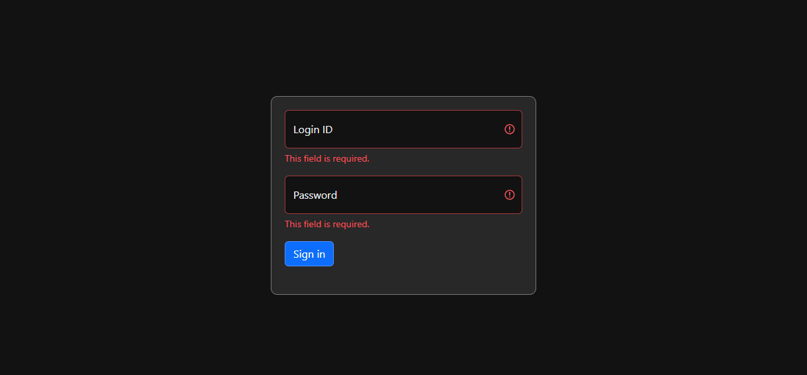
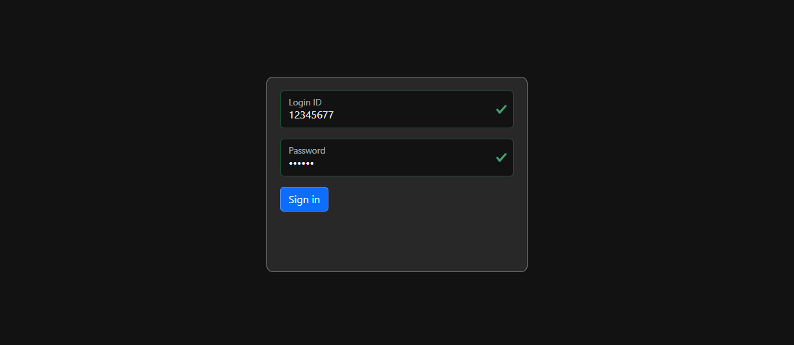

# Index

- [Index](#index)
- [Overview](#overview)
  - [JSX](#jsx)
  - [Start](#start)
  - [Folder Structure](#folder-structure)
  - [Naming Convention](#naming-convention)
- [Components](#components)
  - [Class Component Lifecycle](#class-component-lifecycle)
  - [Function Component Lifecycle](#function-component-lifecycle)
  - [Props](#props)
  - [Context](#context)
  - [Conditional Rendering](#conditional-rendering)
- [Redux](#redux)
  - [Concept](#concept)
  - [Plain JavaScript Example](#plain-javascript-example)
- [Redux (React)](#redux-react)
  - [Using the latest `configureStore`](#using-the-latest-configurestore)
  - [React Example Using `createStore`](#react-example-using-createstore)
    - [Development](#development)
    - [Debug / Trace](#debug--trace)
  - [Practice](#practice)
  - [useSelector](#useselector)
    - [Use Memoizing Selectors](#use-memoizing-selectors)
    - [Without Re-render](#without-re-render)
- [Hooks](#hooks)
  - [useState](#usestate)
    - [State Batch Update](#state-batch-update)
  - [useRef](#useref)
  - [memo](#memo)
  - [useMemo](#usememo)
  - [useCallback](#usecallback)
  - [useEffect](#useeffect)
    - [Using setState inside useEffect](#using-setstate-inside-useeffect)
    - [Return a cleanup function](#return-a-cleanup-function)
    - [Using async inside useEffect](#using-async-inside-useeffect)
  - [useLayoutEffect](#uselayouteffect)
  - [Custom Hook](#custom-hook)
- [UI](#ui)
  - [General](#general)
  - [Style](#style)
  - [CSS](#css)
- [Form](#form)
- [Router](#router)
- [Translation](#translation)
- [How to](#how-to)
  - [Add environment variables](#add-environment-variables)
  - [Add image](#add-image)
  - [Add select dropdown list](#add-select-dropdown-list)
  - [Add toast](#add-toast)
  - [Add style](#add-style)
  - [Render list](#render-list)
  - [Input Validation Message](#input-validation-message)
  - [Inactive timeout](#inactive-timeout)
- [UI Library](#ui-library)
  - [Prime React](#prime-react)
  - [React Bootstrap](#react-bootstrap)
      - [Login Page](#login-page)
- [Troubleshoot](#troubleshoot)

# Overview

React is an open-source **JavaScript library** used for building interactive user interfaces (UIs) for web applications. It was developed by Facebook and is now maintained by Facebook and a community of individual contributors.

React follows a component-based architecture, where the UI is divided into small components, each responsible for its own logic and rendering.

Key features of React ([What are the features of ReactJS?](https://www.geeksforgeeks.org/what-are-the-features-of-reactjs/)):

- Virtual DOM
- Unidirectional data flow
- Reactive updates
- JSX

To use React, all you have to do is to integrate React library in the HTML page in the `<script>` tag. Then, you can create your own components.

At the end, React renders HTML-like components with tags like `<p>`, `<div>`, ``.

## JSX

React uses JSX (JavaScript XML), an extension of JavaScript that allows developers to write HTML-like syntax within JavaScript code.

Behind the scenes, there is a special compiler named *Babel* working to convert JSX into React API calls.

For JavaScript, you can use JSX inside both `.js` and `.jsx` files. Whereas for TypeScript, you can only use JSX inside `.tsx` files.

The example below shows JSX syntax, which is not a standard JavaScript.

```jsx
const name = 'Josh Perez';
const element = <h1>Hello, {name}</h1>;
```

```jsx
const BigButton = () => {
  // ...

  return (                                  <-- add parentheses
    <>                                      <-- add a wrapper
      <div>The following is a button:</div>
      <button>Press me</button>
    </>
  )
}
```

**Note:**

- If the markup (tags) that return are more than one lines, you must wrap it in a pair of parentheses.
- A component cannot return multiple JSX tags. You have to wrap them into a shared parent, like a `<div>...</div>` or an empty `<>...</>` wrapper.

**Using Dot Notation for JSX Type**

You can also refer to a React component using dot-notation from within JSX. This is convenient if you have a single module that exports many React components. For example, if `MyComponents.DatePicker` is a component, you can use it directly from JSX with:

```js
import React from 'react';

const MyComponents = {
  DatePicker: function DatePicker(props) {
    return <div>Imagine a {props.color} datepicker here.</div>;
  }
}

function BlueDatePicker() {
  return <MyComponents.DatePicker color="blue" />;  // here
}
```

## Start

- Install Node.js.
- Go to the project directory,
  - If it is a existing project, there should be a `package.json`. Run `npm install`.
  - If it is a new project, you can bootstrap it without any framework using [Create React App](https://github.com/facebook/create-react-app). You can also bootstrap it with [Next.js](https://nextjs.org/).
- Under the project directory, run `npm start` / `npm run dev`.
- Entry point should be `Index.tsx`.

**Note:**

- You need to install Node.js for local development so you can access the website through localhost and install react component package through `npm`. You can also choose to use Node.js in production, but you don't have to. Many React frameworks support export to a static HTML/CSS/JS folder so you can put them in a web server, such as tomcat. To do this, run `npm run build`.
- In every component `JSX` file, add `import React from "react";`. `React` provides the necessary functions and objects required to create and manage components. By importing `React`, we're telling our code to make use of these functions and objects, allowing us to build our components.

## Folder Structure

```
my-app
├── README.md
├── node_modules
├── package.json
├── .gitignore
├── public
│   ├── index.html
│   └── manifest.json
└── src
    ├── api                 // For calling web API, here should call fetch()
    ├── assets
    ├── components          // Some repeatedly used components
    │   ├── button
    │   ├── modal
    │   │   └── ModalLogout.tsx
    │   ├── AlertMessage.tsx
    │   └── Navbar.tsx
    ├── constants
    │   ├── constants.tsx
    │   ├── enums.tsx
    │   └── types.tsx
    ├── locales             // For translation (i18next)
    │   ├── en.json
    │   ├── sc.json
    │   └── tc.json
    ├── pages               // You can also call this `views`, meaning different screens
    │   └── LoginPage.tsx
    ├── state
    │   ├── user            // For example, a redux state called 'user'
    │   │   ├── user.action.tsx
    │   │   ├── user.actionCreator.tsx
    │   │   ├── user.reducer.tsx
    │   │   └── user.types.tsx
    │   ├── root-reducer.tsx
    │   └── sotre.tsx
    ├── types
    │   └── responseType.ts // Add other type categories as needed
    ├── utils               // Put functions that are shared in different components
    │   └── accountUtils.ts
    ├── App.scss
    ├── App.tsx             // Start editing here; add route to first page and directory
    ├── directory.tsx       // Add all routes here
    ├── index.scss
    ├── index.tsx           // Entry point
    └── routePaths.tsx      // List all route paths as a const RoutePaths
```
- Pages / components are capitalized.
- To make typescript interface from API JSON response, use https://transform.tools/json-to-typescript

## Naming Convention

- [React JS Naming convention - Kristiyan Velkov](https://www.linkedin.com/pulse/react-js-naming-convention-kristiyan-velkov)

Event and event handlers - Use `on` as a prefix for event; use `handle` as a prefix for event handlers.

```jsx
<SomeComponent
  onNameChange={handleNameChange}
  onFormReset={handleFormReset}
/>
```

CSS classes - Use lowercase letters and hyphens for CSS class names.

```jsx
<div className="example-container">
  ...
</div>
```

State variables - Prefix state variables with `is`, `has`, or `should` to denote boolean values.

```jsx
const ExampleComponent: React.FC = () => {
  const [isActive, setIsActive] = useState(false);
  const [hasError, setHasError] = useState(false);
  const [shouldRender, setShouldRender] = useState(false);
}
```

Component and file name - Name your files using PascalCase, matching the component name. For example, if you have a component named `UserCard`, the file should be named `UserCard.tsx`.

# Components

- React apps are made out of components. A component is a piece of the UI (user interface) that has its own logic and appearance. It can be as small as a button, or as large as an entire page.
- **User-Defined Components Must Be Capitalized**, otherwise it will be refered to an HTML tag. (e.g. `<Select>` vs `<select>`)
  - `const Select = () => {...}`

## Class Component Lifecycle

Each class component in React has a lifecycle which you can monitor and manipulate during its three main phases.

The three phases are: 
- Mounting - that is inserting elements into the DOM.
- Updating - involves methods for updating components in the DOM.
- Unmounting - that is removing a component from the DOM.

**Mounting**

React has four built-in methods that gets called, in this order, when mounting a component:

1. `constructor()`
2. `getDerivedStateFromProps()`
3. `render()` - outputs the HTML to the DOM.
4. `componentDidMount()` - runs after the component is mounted and rendered to the DOM

The `render()` method is required and will always be called, the others are optional and will be called if you define them.


**Updating**

A component is updated whenever there is a change in the component's `state` or `props`. React has five built-in methods that gets called, in this order, when a component is updated:

1. `getDerivedStateFromProps()`
2. `shouldComponentUpdate()`
3. `render()` - when a component gets updated, it has to re-render the HTML to the DOM, with the new changes.
4. `getSnapshotBeforeUpdate()`
5. `componentDidUpdate()` - runs after the component is updated in the DOM

The `render()` method is required and will always be called, the others are optional and will be called if you define them.

**Unmounting**

React has only one built-in method that gets called when a component is unmounted:

1. `componentWillUnmount()`

## Function Component Lifecycle

When React renders a function component, the process is similar to rendering a class component.

**Mounting**

1. Function Execution: The function component is executed, and any code inside the component's body is run. This includes defining variables, setting up event handlers, and performing other logic.
2. Render: The function component returns JSX (React elements) representing the component's UI. The component is then added to the DOM.

**Updating** (Triggered by `props` changes or `state` updates, using `Object.is` to compare):

1. Function Execution: The function component is executed again, re-running any code inside the component's body.
2. Render: The function component returns updated JSX, which is then used to update the DOM.

**Unmounting**

1. Cleanup: If necessary, any cleanup logic can be performed manually within the function component. Then, the component is removed from the DOM.

It's important to note that function components don't have lifecycle methods like class components do. However, you can achieve similar functionality using React Hooks, such as `useState`, `useEffect`, and others. Hooks allow you to manage state, perform side effects, and control the component's behavior in a function component.

## Props

Every parent component can pass some information to its child components by giving them *props*.

```jsx
export default MyApp = () => {
  
  const myName = "Peter"
  const handleClose = () => { ... }
  
  return (
    <div>
      <MyComponent msg="hello" name={myName} handleClose={handleClose}/>
    </div>
  );
}
```

```jsx
// functional component
interface MyComponentProps {
  name: string;
  handleClose: () => void;
}

const MyComponent = (props: MyComponentProps) => {
  return (
    <button onClick={() => props.handleClose()}>
      My name is {props.name}  
    </button>
  );
}
```

Note that, receiving different *props* will trigger the re-render of the child component. Do not try to change *props* inside the child component.

To make *props* more readable, use destructuring:

```jsx
const MyComponent = ({ name, handleClose }: MyComponentProps) => {
  ...
}
```

## Context

- [useContext - React](https://react.dev/reference/react/useContext)

Background:

Usually, you will pass information from a parent component to a child component via *props*. But passing *props* can become verbose and inconvenient if you have to pass them through many components in the middle, or if many components in your app need the same information. *Context* lets the parent component make some information available to any component in the tree below it—no matter how deep—without passing it explicitly through *props*.

Common use cases:

- Theming: If your app lets the user change its appearance (e.g. dark mode), you can put a context provider at the top of your app, and use that context in components that need to adjust their visual look.
- Current account: Many components might need to know the currently logged in user. Putting it in context makes it convenient to read it anywhere in the tree. Some apps also let you operate multiple accounts at the same time (e.g. to leave a comment as a different user). In those cases, it can be convenient to wrap a part of the UI into a nested provider with a different current account value.
- Routing: Most routing solutions use context internally to hold the current route. This is how every link “knows” whether it’s active or not. If you build your own router, you might want to do it too.
- Managing state: As your app grows, you might end up with a lot of state closer to the top of your app. Many distant components below may want to change it. It is common to use a reducer together with context to manage complex state and pass it down to distant components without too much hassle.

Context VS Redux:

- Context is a form of Dependency Injection while Redux is a state management tool.
- The context value should not be updated frequently over time, and the update logic should not be complex.

Important notes:

- When the nearest context provider above the component updates, `useContext` will always trigger a re-render with the latest context value passed to that context provider.

To pass context:

- Create and export it with `export const MyContext = createContext(defaultValue)`.
- Pass it to the `useContext(MyContext)` hook to read it in any child component, no matter how deep.
- Wrap children into `<MyContext.Provider value={...}>` to provide it from a parent.

```jsx
// LevelContext.js
import { createContext } from 'react';

export const LevelContext = createContext(1);
```

```jsx
// Section.jsx
import { LevelContext } from './LevelContext.js';

export default function Section({ level, children }) {
  return (
    <section className="section">
      <LevelContext.Provider value={level}>
        {children}
      </LevelContext.Provider>
    </section>
  );
}
```

```jsx
// Heading.jsx
import { LevelContext } from './LevelContext.js';

export default function Heading({ children }) {
  const level = useContext(LevelContext);
  // ...
}
```

```jsx
import Heading from './Heading.js';
import Section from './Section.js';

export default function Page() {
  return (
    <Section level={1}>
      <Heading>Title</Heading>
      <Section level={2}>
        <Heading>Heading</Heading>
        <Heading>Heading</Heading>
        <Heading>Heading</Heading>
        <Section level={3}>
          <Heading>Sub-heading</Heading>
          <Heading>Sub-heading</Heading>
          <Heading>Sub-heading</Heading>
          <Section level={4}>
            <Heading>Sub-sub-heading</Heading>
            <Heading>Sub-sub-heading</Heading>
            <Heading>Sub-sub-heading</Heading>
          </Section>
        </Section>
      </Section>
    </Section>
  );
}
```

## Conditional Rendering

- [Convert the conditional to a boolean to avoid leaked value](https://dev.to/maafaishal/avoid-operator-for-conditional-rendering-in-react-2de)

Note that `if-else` statement does not work inside JSX tag.

If both true and false condition would render something, use `?` operator:

```js
<div>
  {isLoggedIn ? (
    <AdminPanel />
  ) : (
    <LoginForm />
  )}
</div>
```

If you expect only true condition would render something, use `&&` operator or `?` operator:

```js
<div>
  {isLoggedIn && <AdminPanel />}
</div>

<div>
  {isLoggedIn ? <AdminPanel /> : null}
</div>
```

- Note that if using `&&` operator, the condition must be a boolean, avoid using number, string, etc. as a falsy condition.

# Redux

Background:

Normally when you want to pass data from one component to another component, you can use *props* or Context. However, *props* and Conext are mainly used in passing data **from parent to child components**. For the same level components (e.g. `Search` and `MovieList`), they need to make use of a global variable store to exchange data (otherwise they need to use the *props* of the top-level component `App`).


Use cases:

- You have larger amounts of application state that are needed in many places in the app.
- The app state is updated frequently over time.
- The logic to update that state may be complex.
- The app has a medium or large-sized codebase, and might be worked on by many people.
- You want to be able to understand when, why, and how the state in your application has updated, and visualize the changes to your state over time.
- You need more powerful capabilities for managing side effects, persistence, and data serialization.

## Concept

Redux lets the components read data from a Redux store, and dispatch actions to the store to update state.


- Store - contain globalized `state`
- Reducer - modify the `state` based on the Action, one reducer = one state
- Action - specify what you want to do to the `state`
- Dispatch - send the Action to the Reducer

## Plain JavaScript Example

**This is for concept only!!!**
```js
import { createStore } from 'redux'

/**
 * This is a reducer - a function that takes a current state value and an
 * action object describing "what happened", and returns a new state value.
 * A reducer's function signature is: (state, action) => newState
 *
 * The Redux state should contain only plain JS objects, arrays, and primitives.
 * The root state value is usually an object. It's important that you should
 * not mutate the state object, but return a new object if the state changes.
 * The state parameter is mainly for initialization of the state.
 */
function counterReducer(state = { value: 0 }, action) {
  switch (action.type) {
    case 'increment':
      return { value: state.value + 1 }
    case 'incrementByAmount':
      return { value: state.value + action.payload}
    default:
      return state
  }
}

// Create a Redux store holding the state of your app.
// Its API is { subscribe, dispatch, getState }.
let store = createStore(counterReducer)

// Create some functions to return an action object.
// Normally each action object contain type and payload, which is used by 
// reducer to decide the new state value.
function increment() {
  return {
    type: 'increment'
  }
}

function incrementByAmount(amount) {
  return {
    type: 'incrementByAmount',
    payload: amount
  }
}

// You can use subscribe() to update the UI in response to state changes.
// Normally you'd use a view binding library (e.g. React Redux) rather than subscribe() directly.
// There may be additional use cases where it's helpful to subscribe as well.
store.subscribe(() => console.log(store.getState()))

// The only way to mutate the internal state is to dispatch an action.
// The actions can be serialized, logged or stored and later replayed.
store.dispatch(increment())           // {value: 1}
store.dispatch(incrementByAmount(5))  // {value: 6}
```

# Redux (React)

## Using the latest `configureStore`

- ref: https://react-redux.js.org/tutorials/quick-start
- typescript ref: https://react-redux.js.org/tutorials/typescript-quick-start
- persist store (will persist after refresh) tutorial: https://blog.logrocket.com/persist-state-redux-persist-redux-toolkit-react/

```
src
├── App.tsx
├── hooks.ts
├── index.tsx
└── redux
     ├── userSlice.ts
     └── store.ts
```

Below is `hooks.ts`
```ts
import { TypedUseSelectorHook, useDispatch, useSelector } from "react-redux";
import type { RootState, AppDispatch } from "./redux/store";

// Use throughout your app instead of plain `useDispatch` and `useSelector`
export const useAppDispatch: () => AppDispatch = useDispatch;
export const useAppSelector: TypedUseSelectorHook<RootState> = useSelector;
```

Below is `index.tsx`
```jsx
import ...
import { Provider } from "react-redux";
import store from "./redux/store";

...

root.render(
  <React.StrictMode>
    <Provider store={store}>
      <App />
    </Provider>
  </React.StrictMode>
);
```

Below is `userSlice.ts` (Each slice = a global state in the store)
```ts
import { PayloadAction, createSlice } from "@reduxjs/toolkit";

interface UserState {
  login: string;
  password: string;
  level: number;
}

const initialState: UserState = {
  login: "",
  password: "",
  level: 0,
};

// Here are 4 types of parameter in reducer, either return object or mutate state
export const userSlice = createSlice({
  name: "user",
  initialState: initialState,
  reducers: {
    setUserLoginPassword: (state, action: PayloadAction<Partial<UserState>>) => {
      return { ...state, ...action.payload };
    },
    resetUser: (state) => {
      return { ...initialState };
    },
    updateUser: (state, action: PayloadAction<UserState>) => {
      return { ...action.payload };
    },
    updateUserLevel: (state, action: PayloadAction<number>) => {
      state.level = action.payload;
    },
  },
});

export const { setUserLoginPassword, resetUser, updateUser, updateUserLevel } = userSlice.actions;

export default userSlice.reducer;
```

Below is `store.ts`
```ts
import { combineReducers, configureStore } from "@reduxjs/toolkit";
import userReducer from "./userSlice";
import { persistReducer, persistStore } from "redux-persist";
import storage from "redux-persist/es/storage";
import thunk from "redux-thunk";

const persistConfig = {
  key: "root",
  storage,  // will store in the local storage
};
const reducers = combineReducers({
  user: userReducer,
});
const persistedReducer = persistReducer(persistConfig, reducers);

const store = configureStore({
  reducer: persistedReducer,
  middleware: [thunk],
});

export type RootState = ReturnType<typeof store.getState>;
export type AppDispatch = typeof store.dispatch;
export const persistor = persistStore(store);
export default store;
```

Below is `App.tsx` (really use the redux state)
```jsx
import { useAppDispatch, useAppSelector } from "../hooks";
import {
  resetUser,
  setUserLoginPassword,
  updateUser,
} from "../redux/userSlice";

const App = () => {
  const user = useAppSelector((state) => state.user);
  const dispatch = useAppDispatch();

  const setUser = () => {
    dispatch(
      setUserLoginPassword({
        login: "user001",
        password: "abc123",
      })
    );
  }

  const reset = () => {
    dispatch(resetUser());
  };

  const update = () => {
    dispatch(
      updateUserLevel({
        level: 1,
      })
    );
  };

  ...
}
```

## React Example Using `createStore`

### Development

This exmaple is for the login flow.

```
src
├── App.tsx
└── state                     // Or "redux"
    ├── user
    │   ├── user.action.tsx
    │   ├── user.actionCreator.tsx
    │   ├── user.reducer.tsx
    │   └── user.types.tsx
    ├── root-reducer.tsx
    └── store.tsx
```

`src\state\user.types.tsx`:

```jsx
import { CMSPermissionData } from "../../config/types";

// Define the object types used in the process of updating the state.
export type USER_STATE = {
    accID?: string,
    username?: string,
    accessToken?: string,
    permission?: CMSPermissionData[];
    currentEntityId?: string;
}

// Define the name of action types
enum UserActionTypes {
    SET_USER_INFO = 'SET_USER_INFO',
    RESET_USER_STATE = 'RESET_USER_STATE'
}

export default UserActionTypes;

// Define the action object structure (type + payload)
interface SetUserInfoInterface {
    type: UserActionTypes.SET_USER_INFO,
    payload: USER_STATE
}

interface ResetUserInterface {
    type: UserActionTypes.RESET_USER_STATE,
}

// Define the type of the action object, including all different structures
export type UserAction = SetUserInfoInterface | ResetUserInterface;
```


`src\state\user\user.action.tsx`:

```ts
import { UserActionTypes, USER_STATE } from "./user.types";
import { Dispatch } from "redux";

// Return action object
export const SetUserInfo = (value: USER_STATE) => {
    return (dispatch: Dispatch<UserAction>) => {
        dispatch({
            type: UserActionTypes.SET_USER_INFO,
            payload: value
        })
    }
};

export const ResetUserInfo = () => {
    return (dispatch: Dispatch<UserAction>) => {
        dispatch({
            type: UserActionTypes.RESET_USER_STATE,
        })
    }
}
```

`src\state\user\user.actionCreator.tsx`:

```ts
// Create a action creator
import * as userActionCreator from './user.action';
export default userActionCreator;
```

`src\state\user\user.reducer.tsx`:

```js
import { UserActionTypes, UserAction, USER_STATE } from "./user.types";

// Create the initial state
export const INITIAL_STATE: USER_STATE = {
    accID: '',
    username: '',
    accessToken: '',
    permission: null,
    currentEntityId: ''
}

// Create a reducer to receive action object
// Define how to update the state according to the action type
const UserReducer = (state: USER_STATE = INITIAL_STATE, action: UserAction) => {
    switch (action.type) {
        case UserActionTypes.SET_USER_INFO:
            return {
                ...state,
                ...action.payload,
            }
        case UserActionTypes.RESET_USER_STATE:
            return INITIAL_STATE;
        default:
            return state;
    }
}

export type UserReducerType = ReturnType<typeof UserReducer>;

export default UserReducer;
```

`src\state\root-reducer.tsx`:

```js
import { combineReducers } from "redux";
import ConfigReducer from "./config/config.reducer";
import StateReducer from "./state/state.reducer";
import MessageModalReducer from "./modal/modal.reducer";
import UserReducer from "./user/user.reducer";

// Combine all reducers created into a root reducer
// Ensure no name of action types duplicate
const reducers = combineReducers({
    config: ConfigReducer,
    state: StateReducer,
    messageModal: MessageModalReducer,
    user: UserReducer,    // From previous step
});

export type State = ReturnType<typeof reducers>;

export default reducers;
```

`src\state\store.tsx`:

```js
import { createStore, applyMiddleware } from 'redux';
import thunk from 'redux-thunk';
import { persistStore, persistReducer } from 'redux-persist';
import storage from 'redux-persist/lib/storage';
import reducers from './root-reducer';  // From previous step

// Use rootReducer to create store
const persistConfig = {
    key: 'cryptopayAdminPortal',
    storage: storage,
    whiteList: ['config','state', 'messageModal', 'user']
};

const persistedReducer = persistReducer<any, any>(persistConfig, reducers);

export const store = createStore(
    persistedReducer,
    {},
    applyMiddleware(thunk)
);

export const persistor = persistStore(store);
```

`src\index.tsx`:

```js
import React from 'react';
import ReactDOM from 'react-dom';
import './index.css';
import App from './App';
import reportWebVitals from './reportWebVitals';

import { BrowserRouter } from 'react-router-dom';
import { Provider } from 'react-redux';
import { persistor, store } from './state/store';
import { PersistGate } from 'redux-persist/integration/react';

// Provide the store to React
ReactDOM.render(
  <React.StrictMode>
    <Provider store={store}>  // Add this
      <PersistGate loading={null} persistor={persistor}>  // Add this
        <BrowserRouter>
          <App />
        </BrowserRouter>
      </PersistGate>
    </Provider>
  </React.StrictMode>,
  document.getElementById('root')
);
```

`src\pages\login.tsx`: Finally, use redux state in component UI.

```ts
import { bindActionCreators } from 'redux';
import userActionCreator from '../state/user/user.actionCreator';
import { useDispatch, useSelector } from 'react-redux';
import { State } from '../state/root-reducer';

const LoginPage = () => {
    const dispatch = useDispatch();
    
    // Maybe you want to update the user state
    // bindActionCreators is just a convenience method, noramlly need to use dispatch(SetUserInfo(...))
    const { SetUserInfo } = bindActionCreators(userActionCreator, dispatch);

    // Maybe you want to get the info in the user state
    const userToken = useSelector((state: State) => state.user.accessToken);

    const onSubmit = async (e: React.FormEvent<HTMLFormElement>) => {
        var data = await LoginCMSCognito(account.username, account.password, captchaSessionID, account.captcha)

        if (data.status === 0) {
            SetUserInfo({
                accID: account.username,
                username: account.username,
                accessToken: data.accessToken,
                permission: ,
                currentEntityId: 
            });
        }
        // ...
    }

    return (
      // ...
    )
}

export default LoginPage;
```

### Debug / Trace

```jsx
// For example, you want to know where does the `accessToken` be set
const userToken = useSelector((state: State) => state.user.accessToken);
```

1. Trace to the reducer `user`.
2. See which action type will update the property `accessToken`.
3. Trace to the `action.tsx`, see which function return the action object.
4. Trace the reference (call hierarchy) of this function.

## Practice

- [Style guide - Redux](https://redux.js.org/style-guide/)
- [Hooks - React Redux](https://react-redux.js.org/api/hooks)

In real practice, the Redux state can be used to:

- Control the presence of a root component, such as
  - a dialog,
  - a loading animation,
  - a selection list, and save different selected options for different selection categories.
- Decide if a web socket connection is connected.

## useSelector

- [useSelector() - React Redux](https://react-redux.js.org/api/hooks#useselector)

```jsx
const ... = useSelector(selector_function);
```

`useSelector()` allows you to extract data from the Redux store state for use in this function component, using a *selector function*.

A *selector function* is any function that accepts the entire Redux store state as the only argument, and returns some extracted or derived data.

```jsx
const accessToken = useSelector((state: State) => state.user.accessToken);
```

Note that:

- `useSelector()` will run the *selector function* whenever the function component renders.
- `useSelector()` will run the *selector function* whenever any action is dispatched to the store state.
- Whenever the *selector* is run, `useSelector()` will do a reference comparison of the previous selector result value and the current result value. If they are different, the component will be forced to re-render. If they are the same, the component will not re-render.

You may call `useSelector()` multiple times within a single function component. Each call to `useSelector()` creates an individual subscription to the Redux store. Because of the React update batching behavior used in React Redux v7, a dispatched action that causes multiple `useSelector()`s in the same component to return new values **should only result in a single re-render**.

### Use Memoizing Selectors

Consider the following `useSelector()`:

```jsx
const TodoPage = () => {
  const completedTodos = useSelector((state) => state.todos.filter((todo) => todo.completed));
  ...
}
```

Whenever the Redux store state is updated (i.e. whenever any action is dispatched to the store state), `useSelector()` will run the *selector function*.

| `state` Change | `todos` Change | Run selector func | Trigger Re-render |
|----------------|----------------|-------------------|-------------------|
| True           | False          | True              | False             |
| True           | True           | True              | True              |

If the *selector function* is quite expensive, we might want to memoize its result **unless the specific subset of the state that we care is updated**.

To achieve this, we can use a *memoizing selector*, such as `createSelector()` from Reselect or Redux-toolkit. In this case, 

```jsx
import { createSelector } from "@reduxjs/toolkit";

const selectCompletedTodos = createSelector(
  (state) => state.todos,
  (todos) => todos.filter((todo) => todo.completed),
)

const TodoPage = () => {
  const completedTodos = useSelector(selectCompletedTodos);
  
  ...
}
```

| `state` Change | `todos` Change | Run selector func | Trigger Re-render |
|----------------|----------------|-------------------|-------------------|
| True           | False          | **False**         | False             |
| True           | True           | True              | True              |

Note that *memoizing selectors* have internal state, and therefore they must not be recreated after re-rendering. **Ensure they are declared outside of the function component.**

The *selector function* can depend on the props of the function component:

```jsx
import { createSelector } from "@reduxjs/toolkit";

const selectCompletedTodos = createSelector(
  (state) => state.todos,
  (_, category) => category,
  (todos, category) => todos.filter((todo) => todo.completed && todo.category === category),
)

const TodoPage = ({ category }) => {
  const completedTodos = useSelector((state) => selectCompletedTodos(state, category));
  
  ...
}
```

Note that *memoizing selectors* with props will only ever be used in a single instance of a single component because of the internal state. Therefore, components that will be created multiple times, such as items rendered in a list, cannot add props to the *memoizing selector*.

### Without Re-render

If you want to use a Redux state in a function component, without triggerring re-render:

```jsx
import { State } from "../../redux/root-reducer";
import { store } from "../../redux/store";

const xxxFunction = () => {
  const state: State = store.getState();
  const isOpen = state.selection.selection.isOpen;
}
```

# Hooks

- [Document - React](https://react.dev/reference/react/hooks)

Hooks are functions that let you “hook into” React state and lifecycle features from function components. Hooks don’t work inside classes — they let you use React without classes. 

Hooks are more restrictive than regular functions. Do not call Hooks inside loops, conditions, or nested functions. **You can only call Hooks at the top level of your components (or other Hooks)**. If you want to use hooks in a condition or a loop, extract a new component and put it there.

## useState

- [useState - React](https://react.dev/reference/react/useState)
- [React Hooks | 既生 useState 何生 useReducer ?](https://medium.com/%E6%89%8B%E5%AF%AB%E7%AD%86%E8%A8%98/react-hooks-usestate-vs-usereducer-b14966ad37dd)

`useState` lets you add a state variable to your component. The value of the state variable would not be changed between re-renders, unless you call the set function and trigger a re-render.

```jsx
import React, { useState } from 'react';

const Example = () => {
  const [count, setCount] = useState<number>(0);

  return (
    <div>
      <p>You clicked {count} times</p>
      <button onClick={() => setCount(count + 1)}>
        Click me
      </button>
    </div>
  );
}
```

You will get two things from `useState`:

- The current state `count`. During the first render, it will be initialized to the initial state `0` that you have passed.
- The set function `setCount` that lets you update the state to a different value and trigger a re-render.

In the set function, you can pass the next state directly, or a function that calculates it from the previous state:

```jsx
const [name, setName] = useState('Edward');
const [age, setAge] = useState(28);

function handleClick() {
  setName('Taylor');
  setAge(a => a + 1);
}
```

After calling the set function, React will store the updated state, **render your component again with the new values**, and update the UI.

React will bail out on a re-render if the updated state passed is the same as the previous state. React uses `Object.is` algorithm to compare the state. If the state is an object, pass in a new object reference to trigger re-render.

Initialize the state like-with-like: If the state will hold a string, initialize with a string. If it’s a number, init with a number. And so on.

```js
const [user, setUser] = useState('');    // if expect is a string, initialize it as empty string
const [items, setItems] = useState([]);  // if expect is an array, initialize it as empty array
const [map, setMap] = useState(new Map());  // if expect is a map, initialize it as empty map
```
- Initializing state actually does run before the first render, and leaving it uninitialized leads to errors like `Cannot read property 'map' of undefined'` when the component tries to render before the data is ready.

### State Batch Update

- [React batches state updates - React](https://react.dev/learn/queueing-a-series-of-state-updates#react-batches-state-updates)
- [New Feature: Automatic Batching - React](https://react.dev/blog/2022/03/29/react-v18#new-feature-automatic-batching)
- [Multiple calls to state updater from useState in component causes multiple re-renders - stackoverflow](https://stackoverflow.com/questions/53574614/multiple-calls-to-state-updater-from-usestate-in-component-causes-multiple-re-re)
- [Does React keep the order for state updates? - stackoverflow](https://stackoverflow.com/questions/48563650/does-react-keep-the-order-for-state-updates/48610973#48610973)
- [React State Batch Update - medium](https://medium.com/swlh/react-state-batch-update-b1b61bd28cd2)

```jsx
const Component = () => {
  const [contractSortState, setContractSortState] = useState(0);
  const [priceSortState, setPriceSortState] = useState(0);

  // event handler
  const handlePressSortChange = () => {
    setSortChangeStatus(0);
    setSortContractStatus(0);
  };
}
```

In this event handler, two `setState()` functions are called. However, only a single re-render is triggered at the end of the event. It is because React waits until all code in the event handler has run before processing the state updates and re-render.

This behavior, also known as batching, makes your React app run much faster. It also avoids dealing with confusing “half-finished” renders where only some of the variables have been updated.

In React 17 and earlier, only updates inside React event handlers are batched by default.

**Starting from React 18, React batches all updates by default.** Note that React will never batch updates from two different intentional events (like clicks or typing) so, for example, two different button clicks will never get batched. In the rare cases that batching is not desirable, you can use flushSync.

The order of updates is always respected in the same order as `setState()` functions are called.

## useRef

- [useRef - React Native](https://react.dev/reference/react/useRef)

When you want a component to remember a state variable, **but you hope that changing that state would not trigger a re-render**, you can use a *ref*.

```js
const ref = useRef(initialValue);
```

`useRef` returns a mutable *ref* object whose `.current` property is initialized to the passed argument (`initialValue`). The returned object will persist for the full lifetime of the component.

You can mutate the `ref.current` property. When you change the `ref.current` property, React does not re-render your component. React is not aware of when you change it because a *ref* is a plain JavaScript object. Therefore, you can always get the latest value of a *ref* even inside a function object.

```js
import { useRef } from 'react';

export default function Counter() {
  let countRef = useRef(0);

  function handleClick() {
    // This doesn't re-render the component!
    // countRef.current is updated immediately, no need exit the function
    countRef.current = countRef.current + 1;
  }
  
  useEffect(() => {
    doSomething(countRef.current);
  });
}
```

Use cases:

- Avoid unexpected value when a re-render is triggered by `useIsFocused`. (react-navigation/native):
  ```jsx
  const latestProfitRef = useRef<number>(0);

  const positionProfit = useSelector((state: State) => {
    if (isFocused && state.trading.profits[parseInt(ticketId)]) {
      latestProfitRef.current = state.trading.profits[parseInt(ticketId)];
    }
    return latestProfitRef.current;
  });
  ```
- To call the function of a component outside the component.

## memo

- [memo - React Native](https://react.dev/reference/react/memo)

`memo` lets you skip re-rendering a component when its *props* are unchanged. By default, React will compare each *prop* with `Object.is`.

By default, React will re-run the entire body of your component every time that it re-renders. Hence, if a component re-renders, all its child components will also re-render. Using `memo` can optimize performance if there is no change to the *props* of a child component.

```jsx
import React, {useState, memo} from 'react';

export function App(props) {
  const [count, setCount] = useState(0);

  const handleClick = () => {
    setCount(count+1);
  }

  return (
    <div className='App'>
      <button onClick={handleClick}>click</button>
      <MyComponent word='hihi' />
    </div>
  );
}

const MyComponent = memo((props) => {
  console.log('render mycomponent');
  return <p>Hi this is a word {props.word}</p>
})
```

In the above example, when the button is clicked, the state `count` is updated and the `App` component re-renders. By default, it would also re-render `MyComponent`. But you can see that the *props* of the component is always the same (`hihi`), hence the component always return the same output. Therefore, to skip the re-render of `MyComponent`, wrap it in `memo`.

Common use cases:

- Small components, such as button.

## useMemo

- [useMemo - React](https://react.dev/reference/react/useMemo)
- [React 性能優化那件大事，使用 memo、useCallback、useMemo - Medium](https://medium.com/%E6%89%8B%E5%AF%AB%E7%AD%86%E8%A8%98/react-optimize-performance-using-memo-usecallback-usememo-a76b6b272df3)

```js
import { useMemo } from 'react';

const cachedValue = useMemo(calculateFunction, dependencies)
```

`useMemo` caches the result of a calculation function between re-renders until its dependencies change. The calculation function should take no arguments, and should return a value of any type, such as a `number`, a `string`, or a component.

```js
const cachedValue = useMemo(() => { return ... })          // Re-run the calculation every time (same as no `useMemo`)
const cachedValue = useMemo(() => { return ... }, [count]) // Re-run the calculation if `count` is changed after last render
const cachedValue = useMemo(() => { return ... }, [])      // The calculation is run only once on mounting
```

On the initial render, `useMemo` returns the result of calling `calculateFunction` with no arguments. On next renders, React will return the same value again if the dependencies have not changed since the last render. Otherwise, it will call calculateValue, return its result, and store it so it can be reused later.

**Skipping expensive recalculations**

By default, React will re-run the entire body of your component every time that it re-renders.

```jsx
const TodoList = ({ todos, tab, theme }) => {

  const visibleTodos = filterTodos(todos, tab);
  // ...
}

export default TodoList;
```

In the above example, when the component re-renders, the `filterTodos` function will also re-run.

Usually, this isn’t a problem because most calculations are very fast. However, if you’re filtering or transforming a large array, or doing some expensive computation, you might want to skip doing it again if data hasn’t changed.

If both `todos` and `tab` are the same as they were during the last render, wrapping the calculation in `useMemo` lets you reuse `visibleTodos` you’ve already calculated before:

```jsx
import { useMemo } from 'react';

const TodoList = ({ todos, tab, theme }) => {

  const visibleTodos = useMemo(() => {
    return filterTodos(todos, tab)
  }, [todos, tab]);
  // ...
}

export default TodoList;
```

On every subsequent render, React will compare the dependencies with the dependencies you passed during the last render. If none of the dependencies have changed (compared with `Object.is`), `useMemo` will return the value you already calculated before. Otherwise, React will re-run your calculation and return the new value.

**Skipping re-rendering of components**

By default, when a component re-renders, React re-renders all of its children recursively, even though the `props` of its children is not changed.

```jsx
const App = () => {
  const [count, setCount] = useState(0);
  const [title, setTitle] = useState("");

  const handleCountClick = () => {
    setCount((c) => c + 1);
  }
  const handleChangeTitleClick = () => {
    setTitle((t) => t + "!");
  }

  return (
    <div>
      <h2>{title}</h2>
      <button onClick={handleChangeTitleClick}>Change Title</button>
      <button onClick={handleCountClick}>{count}</button>
    </div>
  );
}
```

Here, when the `count` state has changed, it will trigger a re-render. However, the title component has not changed. Hence, we can skip the re-rendering of this component by wrapping the JSX node inside a `useMemo`:

```jsx
const App = () => {
  const [count, setCount] = useState(0);
  const [title, setTitle] = useState("");

  const handleCountClick = () => {
    setCount((c) => c + 1);
  }
  const handleChangeTitleClick = () => {
    setTitle((t) => t + "!");
  }

  const titleComponent = useMemo(() => <h2>{title}</h2>, [title]);

  return (
    <div>
      {titleComponent}
      <button onClick={handleChangeTitleClick}>Change Title</button>
      <button onClick={handleClick}>{count}</button>
    </div>
  );
}
```

The title component will be cached until the `title` state has changed.

Note that manually wrapping JSX nodes into `useMemo` is not convenient. For example, you can’t do this conditionally. This is usually why you would wrap components with `memo` instead.

## useCallback

- [useCallback - React](https://react.dev/reference/react/useCallback)

`useCallback` caches a function definition between re-renders until its dependencies change. The function can take any arguments and return any values. 

On the initial render, `useCallback` returns the function back directly. On next renders, React will give you the same function again if the dependencies have not changed since the last render. Otherwise, it will give you the function that you have passed during the current render, and store it in case it can be reused later. 

React will not call your function. The function is returned to you so you can decide when and whether to call it.

```jsx
import { useCallback } from 'react';

const cachedFn = useCallback(fn, dependencies)
```

## useEffect

- [useEffect - React](https://react.dev/reference/react/useEffect)
- [A Complete Guide to useEffect - Overreacted](https://overreacted.io/a-complete-guide-to-useeffect/)

```js
useEffect(setupFunction, dependencies?)
```

`useEffect` tells the component to do something after render. React will store the function you passed (i.e. *setup function*), and call it later after performing the DOM updates.

`useEffect` calls the *setup function* after the first render of the component (mounting). By default, `useEffect` also calls the *setup function* after every re-render (updating). To optimize performance, you can customize when to skip calling the *setup function* if certain values have not changed after re-render. To do so, pass an array as an optional second argument to `useEffect`.

```js
export default function Counter() {
  const [count, setCount] = useState(0);

  useEffect(() => {
    document.title = `You clicked ${count} times`;
  }, [count]);                  // Only re-run the effect if "count" changes after re-render

  useEffect(() => { ... });     // re-run the effect after every re-render
  useEffect(() => { ... }, []); // do not re-run the effect after re-render

  return (
    <div>
      <p>You clicked {count} times</p>
      <button onClick={() => setCount(count + 1)}>
        Click me
      </button>
    </div>
  );
}
```

Use cases:

- Running once on mount: fetch API data
- Running on state change: live filtering / sorting (since you need to fetch the data again)
- Running on state change: trigger animation on new array value

Note that:

- Function can also be in the dependency array.
- For multiple `useEffect`, React will apply every effect used by the component, in the order they were specified. ([doc](https://legacy.reactjs.org/docs/hooks-effect.html#tip-use-multiple-effects-to-separate-concerns))

### Using setState inside useEffect

Generally speaking, using `setState` inside `useEffect` may create an infinite loop that most likely you don't want to cause. `useEffect` is called after each render and when `setState` is used inside of it, it will cause the component to re-render which will call `useEffect` and so on and so on.

```js
const [address, setAddress] = useState({ country: '', city: '' })

// objects/arrays are different on re-renders
const obj = { country: 'Chile', city: 'Santiago' }

useEffect(() => {
  setAddress(obj)
}, [obj])
```

In the above code, `useEffect` will be triggered depending on `obj`. However, object/array is compared by reference in JavaScript, and a new `obj` will be created after each render.

1. First time render -> `useEffect`
2. `setAddress` -> re-render -> new `obj` -> `useEffect`
3. Keep repeating step 2.

To avoid infinite chain, you can:

- empty the dependency array: `useEffect(() => {...}, [])`
- put properties of the `obj` in the dependency array: `useEffect(() => {...}, [obj.country])`
- use `useMemo()` to create the `obj`: `const obj = useMemo(() => { return {country: 'Chile', city: 'Santiago'}}, [])`

### Return a cleanup function

```js
useEffect(() => {
  const timer = setInterval(... , 500);

  return () => clearInterval(timer);
}, []);

useEffect(() => {
  const timeout = setTimeout(... , 500);

  return () => clearTimeout(timeout);
}, []);
```

Your **setup function** may also optionally return a **cleanup function**. When your component is added to the DOM, React will run your setup function. After every re-render with changed dependencies, React will first run the **cleanup function** (if you provided it) with the old values of the dependencies, and then run your setup function with the new values. After your component is removed from the DOM, React will also run your **cleanup function**.

### Using async inside useEffect

You cannot do this:

```jsx
useEffect(async () => {
  const response = await fetch(ENDPOINT);
  const json = await response.json();

  setTemperature(json.temperature);
}, []);
```

`useEffect` must not return anything besides a function, which is used for clean-up. However, writing `useEffect(async () => …)` will return a `Promise`.

To use `async`, create an async function and immediately call it:

```jsx
useEffect(() => {
  async function runEffect() {
    const response = await fetch(ENDPOINT);
    const json = await response.json();

    setTemperature(json.temperature);
  }

  runEffect();
}, []);
```

## useLayoutEffect

```js
useLayoutEffect(setup, dependencies?)
```

`useLayoutEffect` is a version of `useEffect` that fires before the browser repaints the screen. Avoid the screen refresh a few times.

```jsx
import { useEffect, useLayoutEffect, useState } from "react";

export default function App() {
  const [count, setCount] = useState(0);

  useEffect(() => {
    if (count === 0) {
      const randomNum = 1 + Math.random() * 1000;
      setCount(randomNum);
    }
  }, [count]);

  return <div onClick={() => setCount(0)}>{count}</div>;
}
```

If using `useEffect`,

1. Render `<div>`.
2. Browser repaints the screen.
3. Run `useEffect`.
4. Render `<div>`.
5. Browser repaints the screen again, causing a flashing.

If using `useLayoutEffect`,

1. Render `<div>`.
2. Run `useLayoutEffect`. (block repaint)
3. Render `<div>`.
4. Browser repaints the screen.

However, rendering in two passes and blocking the browser hurts performance. Try to avoid this when you can.

## Custom Hook

You need `useContext`, `useState`.

```jsx
const { from, to, offset, dateOption, setHistoricalFilter, resetFilter, setOffset } = useHistoryQueryFilter();
```

```jsx
export type FilterContextType = {
  symbol: string[];
  from: Date;
  to: Date;
  offset: number;
  dateOption: string;
  setSymbolFilter: (newSymbol: string[]) => void;
  setHistoricalFilter: (
    newSymbol: string[],
    newFrom: Date,
    newTo: Date,
    offset: number,
    dateOption: string,
    callback?: (params) => void
  ) => void;
  resetFilter: () => void;
  setOffset: (offset: number) => void;
};

const FilterContext = createContext<FilterContextType | undefined>(undefined);

export const HistoryQueryFilterProvider = ({ children }) => {
  const defaultFrom = new Date(new Date().getFullYear(), new Date().getMonth(), new Date().getDate() - 30);
  const defaultTo = new Date();

  const [symbol, setSymbol] = useState([defaultSymbolOption]);
  const [from, setFrom] = useState(defaultFrom);
  const [to, setTo] = useState(defaultTo);
  const [offset, setOffset] = useState<number>(0);

  const [dateOption, setDateOption] = useState<string>(defaultDateOption);

  const setSymbolFilter = (newSymbol: string[]) => {
    setSymbol(newSymbol);
  };

  const setHistoricalFilter = ...

  const resetFilter = ...

  const values = {
    symbol,
    from,
    to,
    offset,
    dateOption,
    setSymbolFilter,
    setHistoricalFilter,
    resetFilter,
    setOffset,
  };

  return <FilterContext.Provider value={values}>{children}</FilterContext.Provider>;
};

// Create a custom hook for using the context
export const useHistoryQueryFilter = () => {
  const context = useContext(FilterContext);
  if (!context) {
    throw new Error("useFilter must be used within a FilterProvider");
  }
  return context;
};
```

# UI

## General

- Modal - A modal (also called a modal window or lightbox) is a web page element that **displays in front of and deactivates all other page content**. To return to the main content, the user must engage with the modal by completing an action or by closing it. Modals are often used to direct users’ attention to an important action or piece of information on a website or application.
- You can mount anything (e.g. modal) to the DOM, but control it appear or not using `state` + `css` / `state` + `&&`. For example, if you click logout in the header bar, a confirmation window will pop up. Actually this modal is inserted into the parent component even it is not shown, but its css is `display: none` instead of `display:block`. This css behaviour is controlled by a `state`.
  ```jsx
  const showLogoutMessageModal = useSelector((state: State) => state.messageModal.showLogoutMessageModal);

  return (
    <div className={`modal fade ${showLogoutMessageModal ? 'show' : ''}`} id="modal-logout">
  )
  ```
  ```jsx
  {loadingTableData && (
    <div className="loading-spinner-wrapper">
      <Spinner animation="border" variant="dark" role="status">
        <span className="visually-hidden">
          {t("common.loading")}...
        </span>
      </Spinner>
    </div>
  )}
  ```
- The style class override is determined by the import order in code. Most css are imported in `App.tsx`.
- You can use CSS variable in style: `color: var(--text-color);`
- Icon: https://fontawesome.com/v4/

## Style

Use `className` rather than `class` (plain HTML) if we want to apply the `CSS` classes in React.

*The only reason is that the `class` is a reserved keyword in JavaScript and since we use JSX in React which itself is the extension of JavaScript, so we have to use `className` instead of `class` attribute. But nothing has changed with it, the semantic meaning of both `className` and `class` is the same, when JSX is rendered, the `className` attribute is automatically rendered as a `class` attribute.*

You can also use inline style by passing a `style` property, like HTML. The `style` property can be a plain old JavaScript object. Use an empty object for conditional styling.

The style names are written using camel casing, e.g. `backgroundColor` rather than `background-color`.

```jsx
const divStyle = {
  color: 'blue',
  backgroundImage: 'url(' + imgUrl + ')',
};

<div className="mt-3" style={some_boolean ? divStyle : {}}>
  ...
</div>
```

React will automatically append a “px” suffix to certain numeric inline style properties. If you want to use units other than “px”, specify the value as a string with the desired unit. For example:

```jsx
// Result style: '10px'
<div style={{ height: 10 }}>
  Hello World!
</div>

// Result style: '10%'
<div style={{ height: '10%' }}>
  Hello World!
</div>
```

## CSS

- The children in element `<div>` are vertically aligned. To make them horizontally, use `<div style={{display: "flex"}}>`
- `padding: 1rem 2rem` includes `padding-top: 1rem`, `padding-bottom: 1rem` and `padding-left: 2rem`, `padding-right: 2rem`
- CSS length unit
  - Use `px` if need hardcode
  - Use `em / rem` if based on font size
    - `1 em / rem = 1 font size`, default font size = 16px
    - `rem` inherit HTML root size, `em` inherit parent element size
  - Use `vh / vw` if need responsive design (view height / view width)

# Form

Form flow in each page:
- call API to get data
- put the data into a form (state)
- modify value in the form (update the state)
- use the updated form (state) to call API

**state Object in ReactJS Form**
```ts
const [formData, setFormData] = useState<formType>({
  name: '',
  email: '',
  phone: '',
  message: '',
  rating: '',
})
```
```html
<input value={formData.name} onChange={handleChangeInput}>
```
```js
const handleChangeInput = (e) => {
  const { name, value } = e.target

  setFormData({ ...formData, [name]: value })
}
```

# Router

Tutorial: https://www.w3schools.com/react/react_router.asp

`React Router` creates a single page application, which changes the content of current page with JavaScript. Navigation to the new page happens without a page refresh and loss of state.

```jsx
import "bootstrap/dist/css/bootstrap.min.css";
import "./App.css";
import { BrowserRouter, Navigate, Route, Routes } from "react-router-dom";
import LoginPage from "./pages/LoginPage";
import DashboardPage from "./pages/DashboardPage";
import { useAppSelector } from "./hooks";
import routePaths from "./route";

const App = () => {
  const isLogin = useAppSelector((state) => state.user.isLogin);

  return (
    <BrowserRouter>
      <Routes>
        <Route path={routePaths.login} element={<LoginPage />} />
        <Route
          path={routePaths.home}
          element={
            isLogin ? (
              <DashboardPage />
            ) : (
              <Navigate replace to={routePaths.login} />
            )
          }
        />
      </Routes>
    </BrowserRouter>
  );
};

export default App;


const routePaths = {
  home: "/home",
  login: "/login",
};

export default routePaths;
```

# Translation

- [Quick Start - react-i18next](https://react.i18next.com/guides/quick-start)
- https://translate.i18next.com/

```jsx
import React from 'react';

// the hook
import { useTranslation } from 'react-i18next';

function MyComponent () {
  const { t, i18n } = useTranslation();
  return <h1>{t('Welcome to React')}</h1>
}
```

- You can use string format for some customized string, eg. insert company name in a sentence.

# How to

## Add environment variables
ref: https://create-react-app.dev/docs/adding-custom-environment-variables/
- Create environment file under the root folder. (same level as `/src`)
  - `.env.development` is only for `npm start`
  - `.env.production` is only for `npm run build`
- If you have other evnironment file, such as `.env.qa`, add a `"scripts"` in `package.json`:
  - `"build:qa": "env-cmd -f .env.qa react-scripts build"`
  - Run `npm install -g env-cmd`.
  - Then, `npm run build:qa`.
- Note that the environment variables must start with `REACT_APP_`.
```
REACT_APP_SERVER_URL="https://algotrader.m-finance.net:5000"
```
- Note that, after `npm run build`, the environment variables will be bundled into the `.js` file. If you need to set the environment variables outside the `.js` file, consider putting the config file in the `/public`. (https://stackoverflow.com/questions/50369477/create-react-app-configuration-file-after-build-app)

## Add image
```jsx
import EmpLoginLogo from '../assets/logo_login.png';

return (
  

  // convert base64 string to image, e.g. captcha
  
)
```

## Add select dropdown list
`npm i --save react-select`
```jsx
import React from 'react'
import Select from 'react-select'

type stype = {label: string, value: string};

const options = [
  { value: 'chocolate', label: 'Chocolate' },
  { value: 'strawberry', label: 'Strawberry' },
  { value: 'vanilla', label: 'Vanilla' }
]
  
const list = ['apple', 'banana'];

const onChangeEntitySelectList = (option: stype | null) => {
    if (option) {
        console.log(option.label);
    }
}

const MyComponent = () => (
  <Select options={options} placeholder={entityId} isSearchable={false} onChange={onChangeEntitySelectList}/>
  <Select options={list.map(t => ({value: t, label: t}))} />
)
```
- doc: https://react-select.com/home

`<Form.Select>`

## Add toast
`npm i react-hot-toast`
- doc: https://react-hot-toast.com/

## Add style
```js
<td className="text-center" style={{width: '8rem'}} />

<td style={showPasswordValidation === null ? {} : {paddingRight: '1.5rem'}} />
```

## Render list
- ref: https://react.dev/learn/rendering-lists#rules-of-keys
- Arrays: If you have a fixed number of form elements or if the elements have a sequential order, you can use an array to represent the form.
- Maps: If you have a dynamic set of form elements or if the elements have unique identifiers, you can use a map to represent the form.
```jsx
// Primitive type arrays
const [names, setNames] = useState<string[]>([]);

const handleChange = (event: React.ChangeEvent<HTMLInputElement>, index: number) => {
  const updatedNames = [...names];
  updatedNames[index] = event.target.value;
  setNames(updatedNames);
};

const handleSubmit = (event) => {
  event.preventDefault();
  // Submit the form data
};

return (
  <form onSubmit={handleSubmit}>
    {names
      .filter((name) => name !== "Peter")
      .map((name, index) => (
        <input
          key={index}
          type="text"
          value={name}
          onChange={(event) => handleChange(event, index)}
        />
      ))}
    <button type="submit">Submit</button>
  </form>
);
```

## Input Validation Message

```jsx
const [passwordError, setPasswordError] = useState<{ isShow: boolean; message: string }>({
  isShow: false,
  message: "",
});

setPasswordError({ isShow: false, message: "" });
```

## Inactive timeout

```jsx
import { useEffect } from "react";
import stateActionCreator from "../state/state/state.actionCreator";
import cmsUserActionCreator from "../state/cmsUser/cmsUser.actionCreator";
import { bindActionCreators } from "redux";
import { useDispatch } from "react-redux";

const events = ["load", "mousemove", "mousedown", "click", "scroll", "keypress",];

const InactiveTimeout = () => {
    let timer: ReturnType<typeof setTimeout>;

    const dispatch = useDispatch();
    const { SetLogin, ToggleLoadingLayer } = bindActionCreators(stateActionCreator, dispatch);
    const { ResetCmsUserInfo } = bindActionCreators(cmsUserActionCreator, dispatch);

    const addTimer = () => {
        timer = setTimeout(() => {
            resetTimer();
            events.forEach((event) => {
                window.removeEventListener(event, resetAndAddTimer);
            })
            logoutAction();
        }, 5000)
    }

    const resetTimer = () => {
        if (timer) clearTimeout(timer);
    };

    const resetAndAddTimer = () => {
        resetTimer();
        addTimer();
    }

    const logoutAction = () => {
        ToggleLoadingLayer();
        ResetCmsUserInfo();
        SetLogin(false);
        ToggleLoadingLayer();
    }

    useEffect(() => {
        addTimer();
        events.forEach((event) => {
            window.addEventListener(event, resetAndAddTimer);
        })
    }, [])

    return <></>
}

export default InactiveTimeout;
```
- the callback method of `addEventListener` and `removeEventListener` should be the same, therefore you need to declare a method explicitly (cannot use anonymous method)

# UI Library
## Prime React
```
npm install primereact
npm install primeicons

import "primereact/resources/themes/lara-light-indigo/theme.css";
import "primereact/resources/primereact.min.css";  
import 'primeicons/primeicons.css';
```
- doc: https://www.primefaces.org/primereact-v8/confirmdialog/
- icon doc: https://primereact.org/icons/

## React Bootstrap
```js
npm install react-bootstrap bootstrap


/* 
The following line can be included in your src/index.js or App.js file

It is stored in the node_modules folder of your project, 
which is automatically created when you install the Bootstrap package.

Note that the import order of css does matter.
*/
import 'bootstrap/dist/css/bootstrap.min.css';
```
- tooltips: https://react-bootstrap.netlify.app/docs/components/overlays#tooltips
- Bootstrap style class name:
  - spacing (eg. `mb-3`): https://getbootstrap.com/docs/5.1/utilities/spacing/
  - text: https://getbootstrap.com/docs/4.0/utilities/text/
- Add input and validation
  - React-Bootstrap form + validation
    - similar to input box: https://react-bootstrap.netlify.app/docs/forms/form-control
    - https://react-bootstrap.netlify.app/docs/forms/validation (be aware of the two type validation, using `validated` in `<Form>` or using `isValid / isInvalid` in `<Form.Control>`)
      - if you need more than `required` validation, e.g. some validation message from server side, then use the second method
      - if `isValid={true}` and `isInvalid={true}`, then will use invalid style
- React-Bootstrap Row and Col
  - https://react-bootstrap.netlify.app/docs/layout/grid
  - `<Row xs={1}></Row>` The number of columns that will fit next to each other on extra small devices

#### Login Page



```jsx
.login-box {
  position: absolute;
  top: 50%;
  left: 50%;
  transform: translate(-50%, -50%);
  width: 400px;
  height: 300px;
  background-color: #eee;
  border: 1px solid #ccc;
  padding: 20px;
  box-sizing: border-box;
  border-radius: 10px;
}

const LoginPage = () => {
  // redux
  const dispatch = useAppDispatch();

  // state
  const [loginForm, setLoginForm] = useState({
    loginId: "",
    password: "",
  });
  const [validated, setValidated] = useState(false);  // if true, the form will show validation

  const onChangeLoginForm = (event: React.ChangeEvent<HTMLInputElement>) => {
    setLoginForm({
      ...loginForm,
      [event.currentTarget.name]: event.currentTarget.value,
    });
  };

  const handleLogin = async (event: React.FormEvent<HTMLFormElement>) => {
    event.preventDefault();
    setValidated(true);

    const form = event.currentTarget;
    if (form.checkValidity() === true) {
      var res = await login(loginForm.loginId, loginForm.password);
      if (res === 200) {
        console.log("correct password");
        dispatch(
          setUserIsLogInLoginPassword({
            isLogin: true,
            loginId: loginForm.loginId,
            password: loginForm.password,
          })
        );
      } else {
        console.log("incorrect password");
      }
    }
  };

  return (
    <Container className="login-box">
      <Form onSubmit={handleLogin} noValidate validated={validated}> // noValidate prevent default browser validation
        <Form.Group className="mb-3">
          <FloatingLabel label="Login ID">
            <Form.Control
              name="loginId"
              placeholder="loginId"  // this is just for FloatingLabel to work
              value={loginForm.loginId}
              onChange={onChangeLoginForm}
              required
            />
            <Form.Control.Feedback type="invalid">
              This field is required.
            </Form.Control.Feedback>
          </FloatingLabel>
        </Form.Group>
        <Form.Group className="mb-3">
          <FloatingLabel label="Password">
            <Form.Control
              name="password"
              placeholder="password"
              type="password"
              value={loginForm.password}
              onChange={onChangeLoginForm}
              required
            />
            <Form.Control.Feedback type="invalid">
              This field is required.
            </Form.Control.Feedback>
          </FloatingLabel>
        </Form.Group>
        <Button type="submit">Sign in</Button>
      </Form>
    </Container>
  );
};
```

# Troubleshoot

- For frondend code change, remember to **empty cache and hard reload** in google chrome.
- Infinite loop: be aware of when `render()` is called.
- `React.strictMode`: will render the component twice