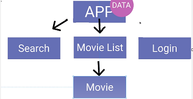
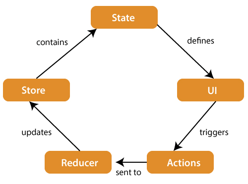

# Index

- [Index](#index)
- [Redux](#redux)
  - [Concept](#concept)
  - [Plain JavaScript Example](#plain-javascript-example)
- [Redux (React)](#redux-react)
  - [Using the latest `configureStore`](#using-the-latest-configurestore)
  - [React Example Using `createStore`](#react-example-using-createstore)
  - [Practice](#practice)
  - [useSelector](#useselector)
    - [Use Memoizing Selectors](#use-memoizing-selectors)
    - [Without Re-render](#without-re-render)

# Redux

Background:

Normally when you want to pass data from one component to another component, you can use *props* or Context. However, *props* and Conext are mainly used in passing data **from parent to child components**. For the same level components (e.g. `Search` and `MovieList`), they need to make use of a global variable store to exchange data (otherwise they need to use the *props* of the top-level component `App`).



Use cases:

- You have larger amounts of application state that are needed in many places in the app.
- The app state is updated frequently over time.
- The logic to update that state may be complex.
- The app has a medium or large-sized codebase, and might be worked on by many people.
- You want to be able to understand when, why, and how the state in your application has updated, and visualize the changes to your state over time.
- You need more powerful capabilities for managing side effects, persistence, and data serialization.

## Concept

Redux lets the components read data from a Redux store, and dispatch actions to the store to update state.



- Store - contain globalized `state`
- Reducer - modify the `state` based on the Action, one reducer = one state
- Action - specify what you want to do to the `state`
- Dispatch - send the Action to the Reducer

## Plain JavaScript Example

**This is for concept only!!!**
```js
import { createStore } from 'redux'

/**
 * This is a reducer - a function that takes a current state value and an
 * action object describing "what happened", and returns a new state value.
 * A reducer's function signature is: (state, action) => newState
 *
 * The Redux state should contain only plain JS objects, arrays, and primitives.
 * The root state value is usually an object. It's important that you should
 * not mutate the state object, but return a new object if the state changes.
 * The state parameter is mainly for initialization of the state.
 */
function counterReducer(state = { value: 0 }, action) {
  switch (action.type) {
    case 'increment':
      return { value: state.value + 1 }
    case 'incrementByAmount':
      return { value: state.value + action.payload}
    default:
      return state
  }
}

// Create a Redux store holding the state of your app.
// Its API is { subscribe, dispatch, getState }.
let store = createStore(counterReducer)

// Create some functions to return an action object.
// Normally each action object contain type and payload, which is used by 
// reducer to decide the new state value.
function increment() {
  return {
    type: 'increment'
  }
}

function incrementByAmount(amount) {
  return {
    type: 'incrementByAmount',
    payload: amount
  }
}

// You can use subscribe() to update the UI in response to state changes.
// Normally you'd use a view binding library (e.g. React Redux) rather than subscribe() directly.
// There may be additional use cases where it's helpful to subscribe as well.
store.subscribe(() => console.log(store.getState()))

// The only way to mutate the internal state is to dispatch an action.
// The actions can be serialized, logged or stored and later replayed.
store.dispatch(increment())           // {value: 1}
store.dispatch(incrementByAmount(5))  // {value: 6}
```

# Redux (React)

## Using the latest `configureStore`

- ref: https://react-redux.js.org/tutorials/quick-start
- typescript ref: https://react-redux.js.org/tutorials/typescript-quick-start
- persist store (will persist after refresh) tutorial: https://blog.logrocket.com/persist-state-redux-persist-redux-toolkit-react/

```
src
├── App.tsx
├── hooks.ts
├── index.tsx
└── redux
     ├── userSlice.ts
     └── store.ts
```

Below is `hooks.ts`
```ts
import { TypedUseSelectorHook, useDispatch, useSelector } from "react-redux";
import type { RootState, AppDispatch } from "./redux/store";

// Use throughout your app instead of plain `useDispatch` and `useSelector`
export const useAppDispatch: () => AppDispatch = useDispatch;
export const useAppSelector: TypedUseSelectorHook<RootState> = useSelector;
```

Below is `index.tsx`
```jsx
import ...
import { Provider } from "react-redux";
import store from "./redux/store";

...

root.render(
  <React.StrictMode>
    <Provider store={store}>
      <App />
    </Provider>
  </React.StrictMode>
);
```

Below is `userSlice.ts` (Each slice = a global state in the store)
```ts
import { PayloadAction, createSlice } from "@reduxjs/toolkit";

interface UserState {
  login: string;
  password: string;
  level: number;
}

const initialState: UserState = {
  login: "",
  password: "",
  level: 0,
};

// Here are 4 types of parameter in reducer, either return object or mutate state
export const userSlice = createSlice({
  name: "user",
  initialState: initialState,
  reducers: {
    setUserLoginPassword: (state, action: PayloadAction<Partial<UserState>>) => {
      return { ...state, ...action.payload };
    },
    resetUser: (state) => {
      return { ...initialState };
    },
    updateUser: (state, action: PayloadAction<UserState>) => {
      return { ...action.payload };
    },
    updateUserLevel: (state, action: PayloadAction<number>) => {
      state.level = action.payload;
    },
  },
});

export const { setUserLoginPassword, resetUser, updateUser, updateUserLevel } = userSlice.actions;

export default userSlice.reducer;
```

Below is `store.ts`
```ts
import { combineReducers, configureStore } from "@reduxjs/toolkit";
import userReducer from "./userSlice";
import { persistReducer, persistStore } from "redux-persist";
import storage from "redux-persist/es/storage";
import thunk from "redux-thunk";

const persistConfig = {
  key: "root",
  storage,  // will store in the local storage
};
const reducers = combineReducers({
  user: userReducer,
});
const persistedReducer = persistReducer(persistConfig, reducers);

const store = configureStore({
  reducer: persistedReducer,
  middleware: [thunk],
});

export type RootState = ReturnType<typeof store.getState>;
export type AppDispatch = typeof store.dispatch;
export const persistor = persistStore(store);
export default store;
```

Below is `App.tsx` (really use the redux state)
```jsx
import { useAppDispatch, useAppSelector } from "../hooks";
import {
  resetUser,
  setUserLoginPassword,
  updateUser,
} from "../redux/userSlice";

const App = () => {
  const user = useAppSelector((state) => state.user);
  const dispatch = useAppDispatch();

  const setUser = () => {
    dispatch(
      setUserLoginPassword({
        login: "user001",
        password: "abc123",
      })
    );
  }

  const reset = () => {
    dispatch(resetUser());
  };

  const update = () => {
    dispatch(
      updateUserLevel({
        level: 1,
      })
    );
  };

  ...
}
```

## React Example Using `createStore`

**Development**

This exmaple is for the login flow.

```
src
├── App.tsx
└── state                     // Or "redux"
    ├── user
    │   ├── user.action.tsx
    │   ├── user.actionCreator.tsx
    │   ├── user.reducer.tsx
    │   └── user.types.tsx
    ├── root-reducer.tsx
    └── store.tsx
```

`src\state\user.types.tsx`:

```jsx
import { CMSPermissionData } from "../../config/types";

// Define the object types used in the process of updating the state.
export type USER_STATE = {
    accID?: string,
    username?: string,
    accessToken?: string,
    permission?: CMSPermissionData[];
    currentEntityId?: string;
}

// Define the name of action types
enum UserActionTypes {
    SET_USER_INFO = 'SET_USER_INFO',
    RESET_USER_STATE = 'RESET_USER_STATE'
}

export default UserActionTypes;

// Define the action object structure (type + payload)
interface SetUserInfoInterface {
    type: UserActionTypes.SET_USER_INFO,
    payload: USER_STATE
}

interface ResetUserInterface {
    type: UserActionTypes.RESET_USER_STATE,
}

// Define the type of the action object, including all different structures
export type UserAction = SetUserInfoInterface | ResetUserInterface;
```


`src\state\user\user.action.tsx`:

```ts
import { UserActionTypes, USER_STATE } from "./user.types";
import { Dispatch } from "redux";

// Return action object
export const SetUserInfo = (value: USER_STATE) => {
    return (dispatch: Dispatch<UserAction>) => {
        dispatch({
            type: UserActionTypes.SET_USER_INFO,
            payload: value
        })
    }
};

export const ResetUserInfo = () => {
    return (dispatch: Dispatch<UserAction>) => {
        dispatch({
            type: UserActionTypes.RESET_USER_STATE,
        })
    }
}
```

`src\state\user\user.actionCreator.tsx`:

```ts
// Create a action creator
import * as userActionCreator from './user.action';
export default userActionCreator;
```

`src\state\user\user.reducer.tsx`:

```js
import { UserActionTypes, UserAction, USER_STATE } from "./user.types";

// Create the initial state
export const INITIAL_STATE: USER_STATE = {
    accID: '',
    username: '',
    accessToken: '',
    permission: null,
    currentEntityId: ''
}

// Create a reducer to receive action object
// Define how to update the state according to the action type
const UserReducer = (state: USER_STATE = INITIAL_STATE, action: UserAction) => {
    switch (action.type) {
        case UserActionTypes.SET_USER_INFO:
            return {
                ...state,
                ...action.payload,
            }
        case UserActionTypes.RESET_USER_STATE:
            return INITIAL_STATE;
        default:
            return state;
    }
}

export type UserReducerType = ReturnType<typeof UserReducer>;

export default UserReducer;
```

`src\state\root-reducer.tsx`:

```js
import { combineReducers } from "redux";
import ConfigReducer from "./config/config.reducer";
import StateReducer from "./state/state.reducer";
import MessageModalReducer from "./modal/modal.reducer";
import UserReducer from "./user/user.reducer";

// Combine all reducers created into a root reducer
// Ensure no name of action types duplicate
const reducers = combineReducers({
    config: ConfigReducer,
    state: StateReducer,
    messageModal: MessageModalReducer,
    user: UserReducer,    // From previous step
});

export type State = ReturnType<typeof reducers>;

export default reducers;
```

`src\state\store.tsx`:

```js
import { createStore, applyMiddleware } from 'redux';
import thunk from 'redux-thunk';
import { persistStore, persistReducer } from 'redux-persist';
import storage from 'redux-persist/lib/storage';
import reducers from './root-reducer';  // From previous step

// Use rootReducer to create store
const persistConfig = {
    key: 'cryptopayAdminPortal',
    storage: storage,
    whiteList: ['config','state', 'messageModal', 'user']
};

const persistedReducer = persistReducer<any, any>(persistConfig, reducers);

export const store = createStore(
    persistedReducer,
    {},
    applyMiddleware(thunk)
);

export const persistor = persistStore(store);
```

`src\index.tsx`:

```js
import React from 'react';
import ReactDOM from 'react-dom';
import './index.css';
import App from './App';
import reportWebVitals from './reportWebVitals';

import { BrowserRouter } from 'react-router-dom';
import { Provider } from 'react-redux';
import { persistor, store } from './state/store';
import { PersistGate } from 'redux-persist/integration/react';

// Provide the store to React
ReactDOM.render(
  <React.StrictMode>
    <Provider store={store}>  // Add this
      <PersistGate loading={null} persistor={persistor}>  // Add this
        <BrowserRouter>
          <App />
        </BrowserRouter>
      </PersistGate>
    </Provider>
  </React.StrictMode>,
  document.getElementById('root')
);
```

`src\pages\login.tsx`: Finally, use redux state in component UI.

```ts
import { bindActionCreators } from 'redux';
import userActionCreator from '../state/user/user.actionCreator';
import { useDispatch, useSelector } from 'react-redux';
import { State } from '../state/root-reducer';

const LoginPage = () => {
    const dispatch = useDispatch();
    
    // Maybe you want to update the user state
    // bindActionCreators is just a convenience method, noramlly need to use dispatch(SetUserInfo(...))
    const { SetUserInfo } = bindActionCreators(userActionCreator, dispatch);

    // Maybe you want to get the info in the user state
    const userToken = useSelector((state: State) => state.user.accessToken);

    const onSubmit = async (e: React.FormEvent<HTMLFormElement>) => {
        var data = await LoginCMSCognito(account.username, account.password, captchaSessionID, account.captcha)

        if (data.status === 0) {
            SetUserInfo({
                accID: account.username,
                username: account.username,
                accessToken: data.accessToken,
                permission: ,
                currentEntityId: 
            });
        }
        // ...
    }

    return (
      // ...
    )
}

export default LoginPage;
```

**Debug / Trace**

```jsx
// For example, you want to know where does the `accessToken` be set
const userToken = useSelector((state: State) => state.user.accessToken);
```

1. Trace to the reducer `user`.
2. See which action type will update the property `accessToken`.
3. Trace to the `action.tsx`, see which function return the action object.
4. Trace the reference (call hierarchy) of this function.

## Practice

- [Style guide - Redux](https://redux.js.org/style-guide/)
- [Hooks - React Redux](https://react-redux.js.org/api/hooks)

In real practice, the Redux state can be used to:

- Control the presence of a root component, such as
  - a dialog,
  - a loading animation,
  - a selection list, and save different selected options for different selection categories.
- Decide if a web socket connection is connected.

## useSelector

- [useSelector() - React Redux](https://react-redux.js.org/api/hooks#useselector)

```jsx
const ... = useSelector(selector_function);
```

`useSelector()` allows you to extract data from the Redux store state for use in this function component, using a *selector function*.

A *selector function* is any function that accepts the entire Redux store state as the only argument, and returns some extracted or derived data.

```jsx
const accessToken = useSelector((state: State) => state.user.accessToken);
```

Note that:

- `useSelector()` will run the *selector function* whenever the function component renders.
- `useSelector()` will run the *selector function* whenever any action is dispatched to the store state.
- Whenever the *selector* is run, `useSelector()` will do a reference comparison of the previous selector result value and the current result value. If they are different, the component will be forced to re-render. If they are the same, the component will not re-render.

You may call `useSelector()` multiple times within a single function component. Each call to `useSelector()` creates an individual subscription to the Redux store. Because of the React update batching behavior used in React Redux v7, a dispatched action that causes multiple `useSelector()`s in the same component to return new values **should only result in a single re-render**.

### Use Memoizing Selectors

Consider the following `useSelector()`:

```jsx
const TodoPage = () => {
  const completedTodos = useSelector((state) => state.todos.filter((todo) => todo.completed));
  ...
}
```

Whenever the Redux store state is updated (i.e. whenever any action is dispatched to the store state), `useSelector()` will run the *selector function*.

| `state` Change | `todos` Change | Run selector func | Trigger Re-render |
|----------------|----------------|-------------------|-------------------|
| True           | False          | True              | False             |
| True           | True           | True              | True              |

If the *selector function* is quite expensive, we might want to memoize its result **unless the specific subset of the state that we care is updated**.

To achieve this, we can use a *memoizing selector*, such as `createSelector()` from Reselect or Redux-toolkit. In this case, 

```jsx
import { createSelector } from "@reduxjs/toolkit";

const selectCompletedTodos = createSelector(
  (state) => state.todos,
  (todos) => todos.filter((todo) => todo.completed),
)

const TodoPage = () => {
  const completedTodos = useSelector(selectCompletedTodos);
  
  ...
}
```

| `state` Change | `todos` Change | Run selector func | Trigger Re-render |
|----------------|----------------|-------------------|-------------------|
| True           | False          | **False**         | False             |
| True           | True           | True              | True              |

Note that *memoizing selectors* have internal state, and therefore they must not be recreated after re-rendering. **Ensure they are declared outside of the function component.**

The *selector function* can depend on the props of the function component:

```jsx
import { createSelector } from "@reduxjs/toolkit";

const selectCompletedTodos = createSelector(
  (state) => state.todos,
  (_, category) => category,
  (todos, category) => todos.filter((todo) => todo.completed && todo.category === category),
)

const TodoPage = ({ category }) => {
  const completedTodos = useSelector((state) => selectCompletedTodos(state, category));
  
  ...
}
```

Note that *memoizing selectors* with props will only ever be used in a single instance of a single component because of the internal state. Therefore, components that will be created multiple times, such as items rendered in a list, cannot add props to the *memoizing selector*.

### Without Re-render

If you want to use a Redux state in a function component, without triggerring re-render:

```jsx
import { State } from "../../redux/root-reducer";
import { store } from "../../redux/store";

const xxxFunction = () => {
  const state: State = store.getState();
  const isOpen = state.selection.selection.isOpen;
}
```
