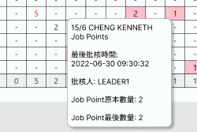

# Angular
`Angular js` is 1.x version of `Angular`

## Commands
- it needs node.js (npm)
  - `npm install -g @angular/cli`
- generate a new repo
  - `ng new todo --routing=false --style=css` 
- hold a dev server
  - `ng serve`
  ```ts
    import { Component } from '@angular/core';

    @Component({
    selector: 'app-root',
    templateUrl: './app.component.html',
    styleUrls: ['./app.component.css']
    })
    export class AppComponent {
    title = 'todo haha';  // this send to app.component.html as {{ title }}
    }
    ```
- if use Angular material
  - install `npm ...` for angular material (change package.json)
  - go to `app.module.ts`, import module and add to `@NgModule` imports
    - e.g. `import { MatTooltipModule } from '@angular/material/tooltip';` and `imports: [MatTooltipModule]`
  - then can directly use property in .html
- if use Bootstrap for Angular
  - install `npm i mdb-angular-ui-kit` (change package.json)
  - same as angular material
    - e.g. `import { MdbTooltipModule } from 'mdb-angular-ui-kit/tooltip';` and `imports:[MdbTooltipModule]`

## Concepts
---
### 1. Change page


1. html:
    ```html
    <button mat-button class="sub-header-bar-button" (click)="redirectToDailyPanel()">
      搜尋/修改工作記錄
    </button>
    ```

2. component.ts:
    ```ts
    redirectToDailyPanel() {
      this.router.navigate(["/courier-commission-calculation-daily"]);
    }
    ```
3. routing.module.ts
    ```ts
    const routes: Routes = [
      {path: '', redirectTo: '/login', pathMatch: 'full'},
      {path: 'courier-commission-calculation-daily', component: CourierCommissionCalculationDisplayPanelDailyComponent},
    ];

    @NgModule({
      imports: [RouterModule.forRoot(routes, {relativeLinkResolution: 'legacy'})],
      exports: [RouterModule]
    })

    export class AppRoutingModule { }
    ```
---
### 2. Search and Generate Result Table
- `[(ngModel)] = "monthSelected"`
  - html object value change <--> .ts variable value change

- `{{monthSelected}}`
  - if .ts var value change --> html object value change

- `(change)="getSelectedMonth(monthSelected)"`
  - can use it even dont have a model, `(ngModelChange)` must with `ngModel`

- `(click)`
  - bind to a function in .ts
  
- `<option *ngFor="let rangeOfMonths of this.rangeOfValidMonths;" ...>`
  - use for loop to create a range of local variable `rangeOfMonths` to use later
  - built-in var: `index, first, last, even, odd`


```html
<div class="seletion-boxes-bar">

  <!--month selection box-->
  <div class="seletion-box">
    <label>選擇月份</label>
    <select class="select-box" name="rangeOfMonths" id="rangeOfMonths" [(ngModel)]="this.monthSelected"
      (change)="getSelectedMonth(monthSelected)">
      <option value='' disabled>--選擇月份--</option>
      <option *ngFor="let rangeOfMonths of this.rangeOfValidMonths;" value="{{rangeOfMonths.month}}">
        {{rangeOfMonths.displayStr}}
      </option>
    </select>
  </div>

  ...

  <!-- search button-->
  <div>
    <button mat-button class="search-button" (click)="getMonthlyData()" [disabled]="!this.isAllowToCallApi">搜索</button>
  </div>
</div>
```
- `| filter : 'userLogin' : searchUserLogin ...`
  - pipeline to filter the range of data
- `[ngClass]="{..., ...}"`
  - different style according to each data
- `ng-container`
  - why use it to wrap up the `<td>`?
    - because it can use *ngFor (or other *ng) without making extra dom elements

```html
<div class="data-table-container">
  <table class="data-table">

    ...

    <tr class="x-container" 
    *ngFor="let data of this.dataForDisplay | filter : 'userLogin' : searchUserLogin | filter : 'userName' : searchUserName; let i = index">
      <td style = "word-break: break-all;">{{data.userLogin}}</td>
      <td style = "word-break: break-all;">{{data.userName}}</td>

      <ng-container *ngFor="let dayData of data.data">
            <td class="data-table-data-display-per-day"
            [ngClass]="{
              'data-table-data-display-per-day-1': dayData.isApproved && dayData.isAdjusted && dayData.amountOfTheDay!=0,
              'data-table-data-display-per-day-2': dayData.isApproved && !(dayData.isAdjusted && dayData.amountOfTheDay!=0),
              'data-table-data-display-per-day-3': !dayData.isApproved && dayData.isAdjusted && dayData.amountOfTheDay!=0,
              'data-table-data-display-per-day-4': !dayData.isApproved && !(dayData.isAdjusted && dayData.amountOfTheDay!=0)
            }">
            {{dayData.amountOfTheDay==0? "-":dayData.amountOfTheDay}}
          </td>
      </ng-container>

      <td style="text-align: center; background-color: #F6F7FA;">{{data.totalAmount}}</td>
      <td style="text-align: center; background-color: #FDFBF5;">{{data.totalAllowance}}</td>
    </tr>
    
    ...

  </table>
</div>
```
---
### 3. Display text when click


- mdb bootstrap popover
  - https://mdbootstrap.com/docs/b5/angular/components/popovers/
  - output (eg `popoverShow`, `popoverHide` mean an event, need to add `()` to use them)
  - condition (eg `popoverDisabled` mean need true/false, need to add `[]` to use them)

- Other challenges
  - popover will break line automatically by space
    - `white-space: nowrap` = even white space won't change line
  - when backend pass `LocalDateTime` approvalTime to frontend, eg 2022-07-06 10:51:20 will become string array `[2022,7,6,10,51,20]`
    - **(Not recommend, using SQL function may slow down the query execution time)** `DATE_FORMAT(approvalTime, '%Y-%m-%d %T')` = 2022-06-28 12:11:40 (mysql command, datetime -> varchar)
    - **(Recommend)** in frontend, create a method that concatenate the array to a string using custom logic
      - Remark: if the second is 0, the string array will become `[2022,7,6,10,51]`, which have no second
  - change only one cells' class to highlight it when showing popover
    - class and style binding: use `[class.some_class]="some_condition"`, set the row and column as the global variable in the `some_condition`
  - use `em/rem` instead of `px` for css length unit
    - `1 em/rem = 1 font size`, default font size = 16px
    - `rem` inherit HTML root size, `em` inherit parent element size

```html
<td ... [mdbPopover]="template" trigger="focus" tabindex="0" placement="right" [popoverDisabled]=".." 
  (popoverShow)="onShown(data.userLogin, dayData.deliveryDay)" (popoverHide)="onHidden()"
  [class.data-table-data-display-per-day-popover]="currentRow === data.userLogin && currentCol === dayData.deliveryDay">
<ng-template #template>
  <div style="white-space: nowrap;">
    <div style="margin-bottom: 10px;">{{data.userName}}</div>
    <div></div>
  </div>
</ng-template>
```

