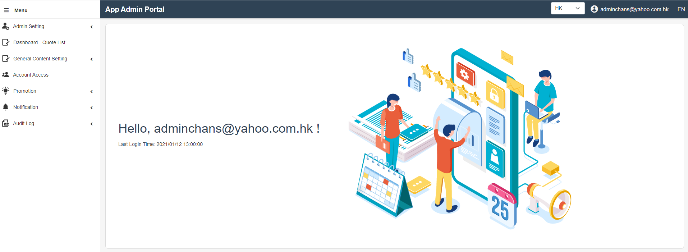
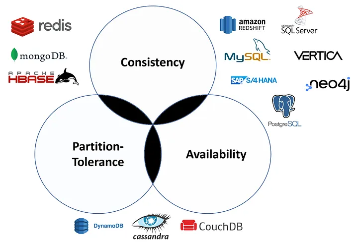

# Index

- [Index](#index)
- [Methodology](#methodology)
- [Software Type](#software-type)
- [Software Development Life Cycle](#software-development-life-cycle)
    - [Planning](#planning)
    - [Analysis](#analysis)
    - [Design](#design)
    - [Implementation](#implementation)
      - [README File](#readme-file)
    - [Testing](#testing)
    - [Deployment \& Maintenance](#deployment--maintenance)
- [Development Platform](#development-platform)
  - [Temporal](#temporal)

# Methodology

- Agile software development
- Test-driven development (TDD)
- Behaviour-Driven Development (BDD)
- Sprints

HKTV
- Everyday standup meeting.

m-Finance
- Need to log work everyday (8 hours) in jira.

# Software Type

ETL Service - Extract Transform Load

- (e.g. pricechart-etl server has a rabbit MQ, extract data and store in DB, vs pricechart-api server get data from DB)
- Extract
  - Copy/export raw data to a staging area, data sources can be SQL or NoSQL servers, web pages, etc
- Transform
  - In the staging area, the raw data undergoes data processing.
  - Filtering, cleansing, de-duplicating, validating, and authenticating the data.
  - Performing calculations, translations, or summarizations based on the raw data. This can  include changing row and column headers for consistency, converting currencies or other units of measurement, editing text strings, and more.
- Load
  - In this last step, the transformed data is moved from the staging area into a target data warehouse. Typically, this involves an initial loading of all data, followed by periodic loading of incremental data changes and, less often, full refreshes to erase and replace data in the warehouse. For most organizations that use ETL, the process is automated, well-defined, continuous and batch-driven.

CRM - Customer Relationship Management

Generally, it includes admin and client portals.

CMS - Content Management System

- A CMS is computer software used to manage the creation and modification of digital content (content management). A CMS is typically used for enterprise content management (ECM) and web content management (WCM).
- A CMS typically has two major components: a content management application (CMA), as the front-end user interface that allows a user, even with limited expertise, to add, modify, and remove content from a website without the intervention of a webmaster; and a content delivery application (CDA), that compiles the content and updates the website.

Trading System

- Trading system logic is not complex and it requires the following:
  - Execution of order and other trade events should be sequenced.
  - Outcome of execution is deterministic.
- For a trading system with low latency with high throughput, trading logic should be single threaded. It should avoid locking within single thread.

Gateway

- API gateway, an application that centralizes different API calls.
  - For example, a notification API gateway may provide one single API for users to send push notification, SMS, WhatsApp, email, etc.
  - Requires a DB to store API config and other data.

# Software Development Life Cycle

A software development life cycle (SDLC) should have the following steps:

- Planning
- Analysis
- Design
- Implementation
- Testing & integration
- Maintenance

### Planning

Greenfield project

- a project that does not have any existing infrastructure or legacy systems. It's essentially a project built from scratch.

POC

- proof of concept, the application just need to work, does not need to be very maintainable / high performance
- it may just be used for once to test the business idea

Notes:

- Make a estimated time plan, including research, design, implementation ... Use real estimated time + some buffer.

### Analysis

In this phase, business analyst should define all basic requirement. The requirement definition can be in the form of:

- FRS - functional requirement specification

### Design

Diagram:

- Sequence diagram - If your application needs to communicate with multiple applications, such as gateways and web servers, you can draw a flow, like login, as a sequence diagram.
  - In markdown file, use `plantuml` to draw the diagram. You may need a render server, like Kroki.

In this phase, UI/UX designer should provide a design guidance on the following aspect:

- Logo
- Theme and colour
- Typography
- Layout
- Iconography
- Button
- Form

Think about what components can be reused.

Different types of database:

- SQL
  - MySQL
  - Oracle
  - PostgreSQL
- NoSQL
  - MongoDB
  - Redis - very fast

CAP theorem states that any distributed data store can provide only two of the following three guarantees:

- Consistency: Every read receives the most recent write or an error.
- Availability: Every request receives a (non-error) response, without the guarantee that it contains the most recent write.
- Partition tolerance: The system continues to operate despite an arbitrary number of messages being dropped (or delayed) by the network between nodes.

Notes:

- When estimating the database storage, try to estimate the maximum data size (worst case).
  - E.g. Price chart need to estimate SKU code as 255 bytes instead of usual 20 bytes.
- Remember to draw ER diagram to design the schema structure if using SQL.

Backend application:

- Java Application
  - Spring boot
    - Web MVC
    - WebFlux
- C# application (.NET) for windows
- Python application
- Messaging protocols / tools
  - RabbitMQ
  - Apache Kafka
- Load balancing
  - Nginx
- Video streaming
  - Wowza
- Report server
  - JasperReports - JDBC
- Data management tools (e.g. Logging)
  - ElasticSearch, Fluentd, Kibana (EFK) - Fluentd simpler to use
  - ElasticSearch, Logstash, Kibana (ELK) - Logstash better at transforming data

Frontend application:

- Angular
- React
- React Native
- Next.js - search engine optimization
- Flutter
  - Performance is better than React Native, more customized UI feature / widget is provided.

Container:

- Docker
- K8S

BI tools

- Tableau
- Microsoft Power BI

### Implementation

#### README File

You should include the following aspects in the `README.md`:

- Overview - Describe the role of the application in the whole system.
- Development - All steps before actual coding.
- Deployment - The steps to deploy in different environment.
- Environment - All deployed environment.
- API Document (Optional) - Refer to `REST API.md` for example.

### Testing

- In local environment
  - try to stimulate the production environment
  - do unit test to ensure the functionality
  - put large amount of data in local DB (eg drdp-28 gen csv need 10M data)
  - do load test to test the traffic and response time
- In development environment
  - do integration testing
- In staging environment
  - do UAT
  - do sanity checking
- In production
  - do PAT (pilot? only for a small portion of real users to test)

### Deployment & Maintenance

- After launch, it is good to ask user if there is any other opinions as they may observe different things.

# Development Platform

## Temporal

- https://docs.temporal.io/

