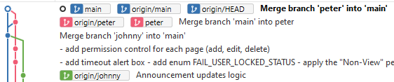
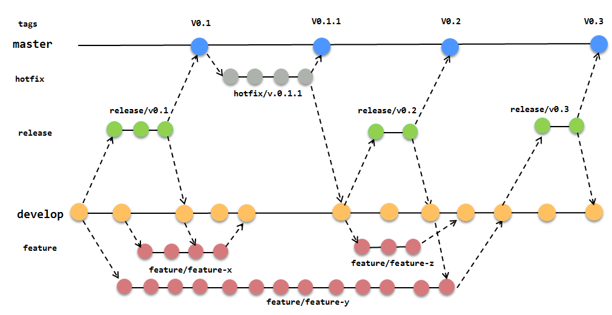
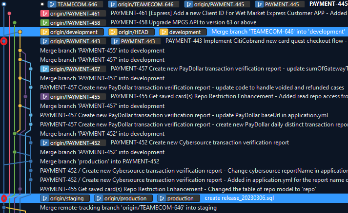

# Index

- [Index](#index)
- [Config](#config)
  - [Change your author name in commit](#change-your-author-name-in-commit)
  - [Change case sensitive](#change-case-sensitive)
- [Command](#command)
  - [merge](#merge)
  - [rebase](#rebase)
    - [merge vs rebase](#merge-vs-rebase)
  - [add](#add)
  - [clean](#clean)
  - [clone](#clone)
  - [checkout](#checkout)
  - [commit](#commit)
  - [Delete remote branch](#delete-remote-branch)
  - [Delete local branch](#delete-local-branch)
  - [Get changes from remote](#get-changes-from-remote)
  - [Push changes to remote](#push-changes-to-remote)
  - [Rename / Move local branch](#rename--move-local-branch)
  - [Revert a commit](#revert-a-commit)
  - [Set up .gitignore](#set-up-gitignore)
  - [Show all local branches](#show-all-local-branches)
  - [Show current branch status](#show-current-branch-status)
  - [Store local changes temporarily in disk](#store-local-changes-temporarily-in-disk)
  - [Undo a commit](#undo-a-commit)
- [Flow](#flow)
  - [Push an existing folder to a new repository](#push-an-existing-folder-to-a-new-repository)
- [Troubleshoot](#troubleshoot)
  - [Merge after Renaming a File into Different Case](#merge-after-renaming-a-file-into-different-case)
- [Concept](#concept)
    - [Different branches](#different-branches)
    - [Before merge to Main branch](#before-merge-to-main-branch)
    - [Workflow](#workflow)
  - [Gitflow (Feature branch development)](#gitflow-feature-branch-development)
  - [Trunk-based workflow](#trunk-based-workflow)
- [GitLab](#gitlab)
  - [CI/CD Pipeline](#cicd-pipeline)

# Config

## Change your author name in commit

```
git config --global user.name "IT - Peter Chau"
```

## Change case sensitive

```
git config --global core.ignorecase false
```

# Command

## merge

```
git merge <merge_from_branch>
```

- The `--no-ff` option means merging without fast forward, which will create a commit of `Merge branch xxx into xxx` and specify all file changes in this merge.

## rebase

```
git rebase <branch_name>
```

- If you are in `feature` branch, doing `git rebase dev` will:
  - first check the latest common commit between `feature` and `dev`
  - then check any new commit of `feature` branch and store them temporarily
  - finally rebase feature branch starting point to the latest `dev` commit
- If you rebase after having already pushed some commits to remote, then remote branch will have some old repeated commits.

If you face the following error:

- The following untracked working tree files would be overwritten by checkout
  - Maybe you have renamed a file before, try to do this again.

### merge vs rebase

- merge can have unstaged changes, but rebase cannot have.
- merge can create a new commit (`--no-ff`) or fast forward, while rebase does not create a new commit.

## add

Stage changed file

```
git add .
git add README.md
```

## clean

Remove untracked files from the working tree.

```
git clean
```

- The option `-n` / `--dry-run` - Don’t actually remove anything, just show what would be done.

## clone

Clone remote branch to local.

```
git clone <https> <folder-name>
```
- `<folder-name>` is optional.

## checkout

Check out to another local branch.

```
git checkout <branch_name>

git checkout -b <branch_name>
```
- The `-b` option create new local branch at the same time.

If you face the following errors when checking out to another local branch:

- `The following untracked working tree files would be overwritten by checkout` - This means in the current local branch, a file is untracked, but a file with the same name appears in another local branch.
  - If you want to keep the untracked file, add it to a commit.
  - If you do not want to keep the untracked file, just do `git checkout -f ...` .

## commit

```
git commit -m "first commit"
```

## Delete remote branch

```
git push -d <remote_name> <branch_name>
```
- In most cases, `<remote_name>` will be `origin`.

## Delete local branch

```
git branch -d <branch_name>
git branch -D <branch_name>
```
- The `-d` option is an alias for `--delete`, which only deletes the branch if it has already been fully merged in its upstream branch.
- The `-D` option is an alias for `--delete --force`, which deletes the branch "irrespective of its merged status."
- Troubleshoot: If gives the error `Cannot delete branch 'Test_Branch' checked out at '[directory location]'.`, switch to other branch first and delete again. If gives another error `The branch 'Test_Branch' is not fully merged.`, do force delete.

## Get changes from remote

```
git fetch <remote_name>

git pull
```
- In most cases, `<remote_name>` will be `origin`.
- `git fetch` retrieves the latest remote data from origin (not yet do any file transferring). For example, we can see where is `origin/dev` now, but do not have a local branch `dev`.
- `git pull` really copies those changes into local branch.

## Push changes to remote
```
git push
git push -u <remote_name> <branch_name>
git push --delete <remote_name> <branch_name>

e.g.
git push -u origin main
```
- In most cases, `<remote_name>` will be `origin`.
- The `-u` option can also be `--set-upstream`. It creates a new remote branch and push the current local branch to remote.
- Before push, think carefully whether may need to rebase later. If rebase after push, remote branch will have duplicate commits for the same change.

## Rename / Move local branch
```
git branch -m <new_branch_name>

git branch -M <new_branch_name>
```
- The `-m` option can also be `--move`
- The `-M` option means `--move --force`

## Revert a commit
```
git reflog

git revert 4945db2
```
- The `git reflog` command will list the previous commits of a local repository.
- The `git revert` command will undo only the changes associated with a specific commit.
- After a few commits to main, you want to remove your changes to main caused by a merge commit.
  - check `git reflog`
  - revert from the latest commit to the oldest commit

## Set up .gitignore

```
/xxx/xxx
```
- IMPORTANT: `.gitignore` cannot ignore the file that are already tracked by Git, e.g. committed before adding it into `.gitignore`. To ignore it, you need to stop tracking it first.

## Show all local branches

```
git branch
git branch -a
```
- The `-a` option show all branches (local and remote)

## Show current branch status

```
git status
```

## Store local changes temporarily in disk

```
git stash
git stash pop
```
- You can stash in branch A and pop in branch B

## Undo a commit

```
git reset --hard <commit_number_before_the_merge>
git push --force -u origin
```
- `git reset` allows the current branch go back to previous commit
- `git push --force` allows the push even it is not up to date with the remote repository branch.
- The `-u` option creates a tracking reference for every branch that you successfully push onto the remote repository.

# Flow

## Push an existing folder to a new repository

```sh
cd existing_folder
git init --initial-branch=main
git remote add origin https://gitlab.m-finance.duckdns.org/peter.chau/poptrade-stage-2.git

touch .gitignore  # add a .gitignore file

git add .
git commit -m "Initial commit"
git push -u origin main
```

# Troubleshoot

## Merge after Renaming a File into Different Case

By default, git sets `core.ignorecase=true` when `git init` or `git clone` is run on a machine with a case-insensitive file system, like Windows. Therefore, before renaming a file into different case, set `core.ignorecase=false`. But this will also cause a problem.

Consider the following test case:

1. In `master` branch, there is a file `example.tsx`.
2. Check out to a new local `feature` branch from `master` branch.
3. In `feature` branch, rename the file to `Example.tsx`.
4. Force check out to `master` branch.
5. Merge `feature` branch into `master` branch.

One would expect in `master` branch, the file `example.tsx` becomes `Example.tsx` at this point. However, the `merge` command fails with:

```sh
error: The following untracked working tree files would be overwritten by merge:
        Example.tsx
```

This is because `master` branch tracks `example.tsx`. It does not track `Example.tsx` from `feature` branch. Since the system is case-insensitive, `example.tsx` will overwrite `Example.tsx`.

To solve this problem, remove file `example.tsx` from `master` branch. Then, it can accept the file `Example.tsx` from `feature` branch.

# Concept

### Different branches

- **Local** - self develop (feature, poc, hotfix, etc.)
- **Develop** - testing a feature in the development server that will not cover original feature
- **Staging** - testing a feature that will update original feature, and sanity check, ensure the update will work properly in prod
- **Production** (here means **Master** / **Main** branch) - record the official release history
- **Release** - production build (release or fallback)

### Before merge to Main branch
At first, I create `feature` based on `main`. However, when I want to merge `feature` to `main`, someone had merged their `feature` to `main` already.



- Obviously no conflict: I will stash my `feature`, rebase on the latest `main`, then stash pop.
  - If the new code from `main` and the stashed `feature` code modift the same file, git will try to auto merge them first.
- Obviously have conflict: I will merge `main` into my `feature`, manually solve conflict. A merge commit will be created "Merge branch 'main' into 'feature'    # Conflicts: xxx".

### Workflow

## Gitflow (Feature branch development)



The overall flow is:
1. A `develop` branch is created from `master`
2. `feature` branches are created from `develop`
3. When a `feature` is complete it is merged into the `develop` branch for testing
4. Once `develop` has acquired enough features for a release (or a predetermined release date is approaching), fork a `release` branch off of `develop`
5. Use the `release` branch to build production (merged into `master`)
6. When the `release` branch is done, it is merged into `develop` in case of some minor updates.
7. If an issue in `master` is detected, a `hotfix` branch is created from `master`
8. Once the `hotfix` is complete, it is merged to both `develop` and `master`

Some key takeaways:
- The workflow is great for a release-based software workflow.
- Every feature is released based on the timeline. For example, feature X must be released earlier or together with feature Z.
- The easiest workflow for one developer's work.

## Trunk-based workflow


The overall flow is:
1. `feature` branch is created from `production` (`master`)
2. When a `feature` is completed, it is merged into the `develop` branch for testing (may need to solve conflict because your `feature` branch does not contain code developing by others)
3. When the `feature` is finished testing and is ready to build, check if `production` code is updated (if yes, you need to merge `production` into `feature` branch and resolve conflict first). Then, merge the `feature` branch into the `staging`.
4. Fork a `release` branch off of `staging`.
5. Use the `release` branch to build `production`.

Some key takeaways:
- `develop` branch contains all features while `production` branch contains developed features.
- Advantage:
  - Allow different features to be released separately, especially when a later feature is released before other earlier features.
- Disvantage:
  - Since your `feature` branch should only contain `production` code, you should not merge code from `develop` into `feature` branch. Therefore, you can only test code integration and resolve conflict in `develop` branch after merging from your `feature` branch
  - If you know that your `feature` code need to depend on other `feature` code, you need to violate the rule to merge code from `develop` into `feature` branch.
  - If you know that your `feature` code need to depend on your previous `feature` code, you need to create a parent `feature` branch for all children `feature` branches. For example:
    - Create a parent `feature` branch called `TEAMECOM-646` from `production`
    - Create a child `feature` branch called `PAYMENT-443` from `TEAMECOM-646`
    - After finished `PAYMENT-443`, merge it into `TEAMECOM-646`
    - Create a child `feature` branch called `PAYMENT-444` from `TEAMECOM-646`
    - After finished `PAYMENT-444`, merge it into `TEAMECOM-646`
    - (... Many other children `feature` branches ...)
    - Merge `TEAMECOM-646` into `development`
    - Merge `TEAMECOM-646` into `production`

# GitLab

## CI/CD Pipeline

- https://about.gitlab.com/topics/ci-cd/cicd-pipeline/

A CI/CD pipeline is a series of steps that streamline the software delivery process. It drives software development through building, testing and deploying code in stages. Pipelines are comprised of jobs, which define what will be done, such as compiling or testing code, as well as stages that spell out when to run the jobs.

Example

- Build docker image
- Auto deploy to dev and staging
- Build SDK (can be found in package registry)

In GitLab, the CI/CD pipeline is defiend in the file `.gitlab-ci.yml`.

> If a branch does not contain the file `.gitlab-ci.yml`, commits of this branch will not run the pipeline. If a commit contains change of `.gitlab-ci.yml`, it will run the pipeline based on the latest `.gitlab-ci.yml`.

The following is a sample GitLab CI/CD configuration file that demonstrates a basic 3 stage CI/CD pipeline. Instead of real tests or scripts, it uses echo commands to simulate the pipeline execution.

A pipeline is composed of independent jobs that run scripts, grouped into stages. Stages run in sequential order, but jobs within stages run in parallel.

```yml
stages:          # List of stages for jobs, and their order of execution
  - build
  - test
  - deploy

build-job:       # This job runs in the build stage, which runs first.
  stage: build
  script:
    - echo "Compiling the code..."
    - echo "Compile complete."

unit-test-job:   # This job runs in the test stage.
  stage: test    # It only starts when the job in the build stage completes successfully.
  script:
    - echo "Running unit tests... This will take about 60 seconds."
    - sleep 60
    - echo "Code coverage is 90%"

lint-test-job:   # This job also runs in the test stage.
  stage: test    # It can run at the same time as unit-test-job (in parallel).
  script:
    - echo "Linting code... This will take about 10 seconds."
    - sleep 10
    - echo "No lint issues found."

deploy-job:      # This job runs in the deploy stage.
  stage: deploy  # It only runs when *both* jobs in the test stage complete successfully.
  environment: production
  script:
    - echo "Deploying application..."
    - echo "Application successfully deployed."
```