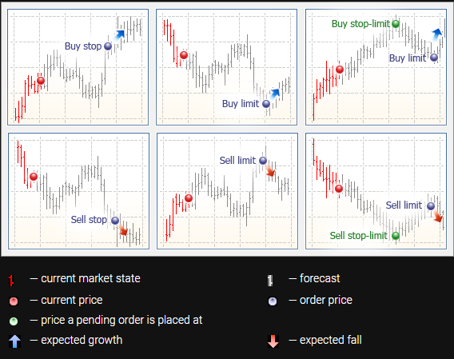

# Index
- [Index](#index)
- [MT4](#mt4)
  - [Server API](#server-api)
    - [Hooks](#hooks)
  - [Manager API](#manager-api)
- [MT5 Concept](#mt5-concept)
  - [Trading Operation](#trading-operation)
  - [Order](#order)
    - [Take profit / Stop loss](#take-profit--stop-loss)
    - [Order Status](#order-status)
    - [Order Execution](#order-execution)
    - [Sequence of a Trade Request](#sequence-of-a-trade-request)
  - [Margin Calculation](#margin-calculation)
  - [Position accounting system](#position-accounting-system)
    - [Netting system](#netting-system)
    - [Hedging system](#hedging-system)
  - [Admin Terminal](#admin-terminal)
    - [Overview](#overview)
    - [Troubleshoot](#troubleshoot)
      - [Position price not change but the market price is changing](#position-price-not-change-but-the-market-price-is-changing)
      - [Market watch (list of selected symbols) cannot hide symbol](#market-watch-list-of-selected-symbols-cannot-hide-symbol)
- [MT5 API](#mt5-api)
  - [Overview](#overview-1)
  - [Interface](#interface)
    - [Common Interface](#common-interface)
    - [Gateway API Interface](#gateway-api-interface)
  - [MT5 Server API](#mt5-server-api)
    - [Hooks](#hooks-1)
  - [MT5 Gateway API](#mt5-gateway-api)
    - [Introduction](#introduction)
      - [What is Gateway API?](#what-is-gateway-api)
      - [How to launch the Gateway Server?](#how-to-launch-the-gateway-server)
      - [How to debug and view log?](#how-to-debug-and-view-log)
    - [Before Development](#before-development)
      - [Project Configuration](#project-configuration)
      - [The Structure of the Gateway Server](#the-structure-of-the-gateway-server)
    - [Frequently Used Methods (.NET)](#frequently-used-methods-net)
      - [SMTGatewayAPIFactory](#smtgatewayapifactory)
      - [CIMTGatewayAPI](#cimtgatewayapi)
      - [CIMTGatewaySink](#cimtgatewaysink)
    - [Implementation](#implementation)
      - [Before Starting the Gateway API](#before-starting-the-gateway-api)
      - [Starting the Gateway API](#starting-the-gateway-api)
      - [Conversion between Trading Operations and CIMTRequest](#conversion-between-trading-operations-and-cimtrequest)
      - [Receiving a Trade Request](#receiving-a-trade-request)
      - [Processing a Trade Request](#processing-a-trade-request)
      - [Send a Price Tick](#send-a-price-tick)
    - [Broker+](#broker)
      - [Design](#design)
      - [Exception Handling](#exception-handling)
      - [Deployment](#deployment)
    - [Troubleshoot](#troubleshoot-1)
  - [MT5 Manager API](#mt5-manager-api)
    - [Before Development](#before-development-1)
    - [CIMTManagerAPI](#cimtmanagerapi)
      - [Connection to the MT5 Server](#connection-to-the-mt5-server)
      - [Order](#order-1)
      - [Deal](#deal)
      - [Position](#position)
      - [Getting Trade Requests](#getting-trade-requests)
      - [Processing Trade Requests](#processing-trade-requests)
      - [Configuration of Symbols](#configuration-of-symbols)
      - [Configuration of Groups](#configuration-of-groups)
      - [User](#user)
      - [User Account](#user-account)
      - [Time Configuration](#time-configuration)
      - [Holiday Configuration](#holiday-configuration)
      - [Selected Symbols](#selected-symbols)
      - [Tick Data](#tick-data)
      - [History (Chart) Data](#history-chart-data)
      - [Client Positions Summary](#client-positions-summary)
    - [CIMTDealerSink](#cimtdealersink)
    - [Flow of OrderSink, DealSink and PositionSink](#flow-of-ordersink-dealsink-and-positionsink)
      - [Open Positions](#open-positions)
      - [Close Positions](#close-positions)
      - [Submit Pending Orders](#submit-pending-orders)
      - [Pending Orders Executed](#pending-orders-executed)
    - [Implementation](#implementation-1)
      - [Pumping Mode](#pumping-mode)
      - [Principles of Applications](#principles-of-applications)
      - [Mask](#mask)
      - [Working with Arrays](#working-with-arrays)
      - [Submit Market Order](#submit-market-order)
      - [Submit Pending Order](#submit-pending-order)
      - [Delete Pending Order](#delete-pending-order)
      - [Modify Pending Order](#modify-pending-order)
      - [Modify Position](#modify-position)
      - [Get Historical Position](#get-historical-position)
      - [Update User](#update-user)

# MT4
- ref: https://support.metaquotes.net/en/docs/mt4/api/manager_api
- MT4 manager API used C++ to implement, there are github providing C# version.
- It provides a list of hooks (listener API for some MT4 events)
- At first, manager is in `direct` mode. Then, it is changed to `pumping` mode.
- Better have a `PumpManager.cs` and `DirectManager.cs`
  - `private CManagerInterface manager;`
    e.g.
    ```cs
    public double GetUserBalance(User user)
    {
        UserRecord userRecordPtr = MT4ManagerAPI.new_UserRecordPointer();
        manager.UserRecordGet(user.Login, userRecordPtr);
        double balance = userRecordPtr.balance;

        user.Balance = balance;

        MT4ManagerAPI.delete_UserRecordPointer(userRecordPtr);

        return balance;
    } 
    ```

## Server API

### Hooks
- [Trading hooks](https://support.metaquotes.net/en/docs/mt4/api/server_api/server_api_hook/server_api_hook_trade)

## Manager API
- Methods
  - MarginLevelGet -> equity, balance
  - UserRecordGet -> enable_read_only (0 is allowed trade, 1 is not allowed)
  - UserRecordUpdate -> change enable_read_only
  - TradeTransaction -> update balance, close position
  - TradesGetByLogin -> get list of positions


# MT5 Concept

## Trading Operation

- [Trading operation](https://support.metaquotes.net/en/docs/mt5/manager/trade_principles)
- [Viewing and editing trading operation](https://support.metaquotes.net/en/docs/mt5/manager/edit_trades)

There are three basic terms: order, deal and position:

- An **order** is an instruction given to a broker to buy or sell a financial instrument. **There are two main types of orders: Market and Pending.** In addition, there are special Take Profit and Stop Loss levels.
- A **deal** is a commercial exchange (buying or selling) of a financial security. Buying is executed at the demand price (Ask), and Sell is performed at the supply price (Bid). **A deal can be opened as a result of a market order execution or a pending order triggering.** Note that in some cases, execution of an order can result in several deals.
- A **position** is a trade obligation, i.e. the number of bought or sold contracts of a financial instrument. *A long position is financial security bought expecting the security price go higher. A short position is an obligation to supply a security expecting the price will fall in the future.*


## Order
- Market order
  - A market order is an instruction to buy or sell a financial instrument. **Execution of this order results in committing a deal (成交). The price at which the deal is conducted is determined by the [type of execution](#order-execution).**
  - A symbol is bought at the Ask price and sold at the Bid price.
- Pending order
  - A pending order is the client's instruction to a brokerage company to buy or sell a security under pre-defined conditions in the future.
  - Buy Limit — a trade order to buy at the Ask price that is equal to or less than that specified in the order. The current price level is higher than the value in the order. Usually this order is placed in anticipation of that the security price, having fallen to a certain level, will increase.
  - Buy Stop — a trade order to buy at the "Ask" price equal to or greater than the one specified in the order. The current price level is lower than the value in the order. Usually this order is placed in anticipation of that the security price, having reached a certain level, will keep on increasing.
  - Sell Limit — a trade order to sell at the "Bid" price equal to or greater than the one specified in the order. The current price level is lower than the value in the order. Usually this order is placed in anticipation of that the security price, having increased to a certain level, will fall.
  - Sell Stop — a trade order to sell at the "Bid" price equal to or less than the one specified in the order. The current price level is higher than the value in the order. Usually this order is placed in anticipation of that the security price, having reached a certain level, will keep on falling.
  - Buy Stop Limit — this type combines the two first types being a stop order for placing Buy Limit. As soon as the future Ask price reaches the stop-level indicated in the order (the Price field), a Buy Limit order will be placed at the level, specified in Stop Limit price field. A stop level is set above the current Ask price, while Stop Limit price is set below the stop level.
  - Sell Stop Limit — this type is a stop order for placing Sell Limit. As soon as the future Bid price reaches the stop-level indicated in the order (the Price field), a Sell Limit order will be placed at the level, specified in Stop Limit price field. A stop level is set below the current Bid price, while Stop Limit price is set above the stop level.
  


### Take profit / Stop loss

- Take profit

  This order condition for long positions is checked using the Bid price (the order is always set above the current Bid price), and the Ask price is used for short positions (the order is always set below the current Ask price)

- Stop loss

  This order condition for long positions is checked using the Bid price (the order is always set below the current Bid price), and the Ask price is used for short positions (the order is always set above the current Ask price).

### Order Status

After an order is formed and sent to the trade server, it may pass the following stages:
- Started — an order's correctness was checked, but it has not been accepted by the server yet;
- Placed — a dealer has accepted an order;
- Partially filled — an order is filled partially;
- Filled — an entire order is filled;
- Canceled — an order is canceled by a client;
- Rejected — an order is rejected by a dealer;
- Expired — an order is canceled due to its expiration.

### Order Execution

- Instant Execution
  
  In this mode, a market order is executed at the price offered by a client. When an execution request is sent, the client terminal automatically inserts current prices in the order. If a dealer/server accepts the prices, the order will be executed. If the requested price is not accepted, the so-called Requote is sent — prices, at which this order can be executed, are returned to the client.

- Request Execution
  
  In this mode, a market order is executed at the price previously received from a dealer/server. Before submitting a market order, prices of its execution are requested. Upon receiving them, a trader can confirm or reject the execution of the order.

- Market Execution
  
  In this mode, a decision on execution is taken by the dealer/server without the additional consent of the trader. The fact that a trader sends a market order in this mode means that the trader agrees to the price, at which it will be executed.

- Exchange Execution

  In this mode, trade operations conducted from the terminals are sent to an external trading system (exchange). Trade operations are executed at the prices of current market offers.

### Sequence of a Trade Request

**Market Order**

1. Client places an market order.
2. Correctness of the order is checked.
3. The order (symbol, price, volume, etc.) is received by a dealer.
4. The order (price, volume, etc.) is confirmed by the dealer. 
5. A deal is performed / rejected by the dealer / cancelled by the trader.
6. The order is executed / rejected / cancelled.
7. If there are no positions for a symbol, conclusion of a deal results in opening of a position. If there is a position for the symbol, the deal will lead to increase or reduction of the position volume, its closure or reversal.

```
2023.10.11 06:13:28.926	192.168.123.138	'55556': instant buy 0.01 USDCHF at 0.90425 (0.90385 / 0.90425)
2023.10.11 06:13:28.926	192.168.123.138	'55556': request confirmed at client price 0.90425, rule 'Auto Execution' (instant buy 0.01 USDCHF at 0.90425)(0.90385 / 0.90425)
2023.10.11 06:13:28.926	192.168.123.138	'55556': deal performed [#626 buy 0.01 USDCHF at 0.90425]
2023.10.11 06:13:28.926	192.168.123.138	'55556': order performed buy 0.01 at 0.90425 [#414 buy 0.01 USDCHF at 0.90425], time 0.74 ms
```

**Pending Order**

```
2023.10.12 09:12:59.895	192.168.123.138	'55556': buy limit 0.1 EURUSD at 1.06310 (1.06314 / 1.06314)
2023.10.12 09:12:59.895	192.168.123.138	'55556': request confirmed, rule 'Auto Execution' (buy limit 0.1 EURUSD at 1.06310)
2023.10.12 09:12:59.896	192.168.123.138	'55556': order placed [#470 buy limit 0.1 EURUSD at 1.06310], time 0.56 ms

2023.10.12 09:13:01.209		'55556': order [#470 buy limit 0.1 EURUSD at 1.06310] triggered, activation price 1.06310 [1.06310 / 1.06310]
2023.10.12 09:13:01.209		'55556': activate order #470 buy limit 0.1 EURUSD at 1.06310 (1.06310 / 1.06310)
2023.10.12 09:13:01.209		'55556': request confirmed at client price 1.06310, rule 'Auto Execution' (activate #470 buy limit 0.1 EURUSD at 1.06310)(1.06310 / 1.06310)
2023.10.12 09:13:01.209		'55556': deal performed [#671 buy 0.1 EURUSD at 1.06310]
2023.10.12 09:13:01.209		'55556': order performed buy 0.1 at 1.06310 [#470 buy limit 0.1 EURUSD at 1.06310], time 0.33 ms

```

- Note that an execution of an order can result in several deals.

## Margin Calculation

- [Basic Margin Calculation](https://support.metaquotes.net/en/docs/mt5/platform/administration/admin_symbols/admin_symbols_settings/symbol_settings_trade/margin_calculation/margin_formula)
- [Margin Calculation](https://support.metaquotes.net/en/docs/mt5/platform/administration/admin_symbols/admin_symbols_settings/symbol_settings_trade/margin_calculation)
- [Profit Calculation](https://support.metaquotes.net/en/docs/mt5/platform/administration/admin_symbols/admin_symbols_settings/symbol_settings_trade/profit_calculation)

## Position accounting system

### Netting system

With this system, you can have only one common position for a symbol at the same time:
- If there is an open position for a symbol, executing a deal in the same direction increases the volume of this position.
- If a deal is executed in the opposite direction, the volume of the existing position can be decreased, the position can be closed (when the deal volume is equal to the position volume) or reversed (if the volume of the opposite deal is greater than the current position).
  - E.g. Close position `SELL 1.00 GBPUSD`, new order can be `BUY 0.9 GBPUSD` plus `BUY 0.1 GBPUSD`.

### Hedging system

With this system, you can have multiple open positions of one and the same symbol, including opposite positions.
- If you have an open position for a symbol, and execute a new deal (or a pending order triggers), a new position is additionally opened. Your current position does not change.
- To close a position, need to specify that position when creating a new order in the opposite direction. The volume of this order cannot exceed the remaining volume of the position.
  - E.g. Close position `SELL 1.00 GBPUSD`, new order can be `BUY 1.00 GBPUSD`, `BUY 0.50 GBPUSD`, etc. But it cannot be `BUY 2.00 GBPUSD`.

## Admin Terminal

### Overview

- End of day time - network cluster -> main trader server -> end of day
- Commission - set according to group, can be instant, daily or monthly.
- Market close - can be set by symbol session / holidays. Note that holiday work time means time interval that can trade.

Limit and Stop level (SL/TP)
- Market order:
  - `SL` <= `market price - stop level points`
  - `TP` >= `market price + stop level points`
- Pending order:
  - `Price` <= / >= `market price - / + limit points`
  - `SL` <= `order price - stop level points`
  - `TP` >= `order price + stop level points`

Spread
- The general spread of a symbol can be set in Symbols.
- The group specified spread of a symbol can be set in Groups/Symbols. Note that this spread is added on the general spread, not override.

### Troubleshoot

#### Position price not change but the market price is changing

- Possible reason 1: The symbol trading calculation is set as Forex, but the profit currency does not have price feed in MT5. To solve this, change the trading calculation to CFD, and set the profit currency to any currency that has price feed, such as USD.

#### Market watch (list of selected symbols) cannot hide symbol

- Reason 1: If a symbol exists in some positions / orders, it cannot be hidden in the market watch.
- Reason 2: If a chart window is opened for that symbol, it cannot be hidden in the market watch.

# MT5 API

## Overview

- MT5 uses C++ to implement, and includes a ready implementation in .NET, which is a wrapper over the main Manager API C++ library.
- Managed wrapper — a .NET class providing an interface of the native API without inheritance.
- It provides a `MetaTrader5SDK.exe`, including libraries, examples and documentation.
- It provides a list of [events](https://support.metaquotes.net/en/docs/mt5/api/event_list) and [hooks](https://support.metaquotes.net/en/docs/mt5/api/hook_list).
  - The handlers of the events, such as `OnOrderAdd()`, are implemented in *sinks*, such as `IMTOrderSink`.
  - (.NET) For *sink* classes, you must call the `RegisterSink` method in the child class constructor and check the return value. To receive events, call the subscribe function. At the end, you must unsubscribe from the events. (except `CIMTDealerSink` and `CIMTGatewaySink`)
    ```cs
    tickSink = new TickSink();
    tickSink.RegisterSink();
    managerAPI.TickSubscribe(tickSink);
    ...
    managerAPI.TickUnsubscribe(tickSink);
    tickSink.Release();
    ```
  - The *sink* classes can be used as event logger.
  - For the events, you can use `async` to override the method. However, using `await` does not guarantee the order of completion.
- [Trade Request Processing by the Server and Call of Hooks](https://support.metaquotes.net/en/docs/mt5/api/hook_scheme)

**For .NET implementation:**

- All API managed wrappers inherit the `IDisposable` interface. You can either use `using` or `Release()`, they are the same.
- All managed wrappers of API interfaces should only be created using factories special methods (for example, `UserCreate`, `UserCreateAccount`, etc.). To copy the instance, try to use `Assign`, etc.
- All methods do not throw exceptions.

## Interface

### Common Interface

- [CIMTRequest](https://support.metaquotes.net/en/docs/mt5/api/reference_trading/trading_request/imtrequest) - A trade request is formed on the side of MT5 as a result of a trade order (market order or pending order) sent by a client. A trade request notifies the Gateway API of trade operations on the platform side.
  - `Action` [EnTradeActions](https://support.metaquotes.net/en/docs/mt5/api/reference_trading/trading_request/imtrequest/imtrequest_enum) - Type of a trade request, such as request execution, instant execution, add pending order, etc.
  - `Type` [EnOrderType](https://support.metaquotes.net/en/docs/mt5/api/reference_trading/trading_order/imtorder/imtorder_enum#enordertype) - Type of a order in a trade request, such as buy, sell, buy limit, sell limit, etc.
- [CIMTExecution](https://support.metaquotes.net/en/docs/mt5/api/reference_trading/trading_request/imtexecution) - A trade execution is formed on the side of the Gateway API. It is used to notify MT5 of events in an external trading system. Based on the trade execution, the appropriate action is performed in MT5.
- [CIMTAccount](https://support.metaquotes.net/en/docs/mt5/api/reference_trading/user_account/imtaccount)
- [CIMTUser](https://support.metaquotes.net/en/docs/mt5/api/reference_user/imtuser)
  - `Rights` [EnUsersRights](https://support.metaquotes.net/en/docs/mt5/api/reference_user/imtuser/imtuser_enum#enusersrights) - Type of user permission, such as trade disabled.
- [CIMTConGroup](https://support.metaquotes.net/en/docs/mt5/api/config_group/imtcongroup)

### Gateway API Interface

- [CIMTConGateway](https://support.metaquotes.net/en/docs/mt5/api/config_gateway/imtcongateway)

## MT5 Server API
- Doc: https://support.metaquotes.net/en/docs/mt5/api/serverapi
- It is used to write a plugin, with the following purposes:
  - Manage the internal server data, such as clients, databases, configurations.
  - Receive notifications of events.
  - Change the behaviour of the server.

### Hooks
- **IMPORTANT**: Call of hooks reference of a trade request from order placing till its final processing: https://support.metaquotes.net/en/docs/mt5/api/hook_scheme
  - After all checks and verifications, but prior to adding the order, the `HookTradeRequestAdd` hook is called.
    - A hook for adding a checked trade request in the requests queue.
  - Before processing in accordance with the routing rules, the `HookTradeRequestRoute` hook is called.
    - A hook of trade request routing in a requests queue.
  - If a gateway processes a request on the trading platform side, the request is added to the execution queue. After an additional verification of all incoming parameters of a request, immediately before execution, the `HookTradeRequestProcess` hook is called.
    - A hook of trade request execution.
  - If the gateway processes a request at the external system, the request (order) is set to Placed, while the platform asynchronously waits for a trade execution (17) at the gateway. As soon as the gateway generates and sends the trade execution to the platform using `IMTGatewayAPI::DealerExecuteAsync`, the `HookTradeExecution` hook is called. The hook is called before the execution is applied.
    - A hook of applying a trade execution.

Events | Hooks
------ | -----
Sent upon the fact of an action. | Sent before an action.
Is intended only for notifications. | Allows influencing the action performed.
All parameters of methods-events are constant. Accordingly, they can be read but cannot be changed. | Some parameters are not constant. Accordingly, they can be changed.
All subscribers receive event notifications. | Hooks are handles in the order of configurations of plugins. Within a plugin, handling is performed in the order of subscribing to an appropriate interface. Hook is handled until the first method that returns code other than `MT_RET_OK` (except otherwise stated). In this case, the hook is not forwarded to next methods.
Methods of events are of the "void" type. | Methods-hooks will always return one of the return codes.

## MT5 Gateway API

- [Overview](https://support.metaquotes.net/en/docs/mt5/api/gatewayapi)
- [Interaction of the Platform and Gateway API](https://support.metaquotes.net/en/docs/mt5/api/gatewayapi_interaction)
- [Trade Operations in Gateway API](https://support.metaquotes.net/en/docs/mt5/api/gatewayapi_trade_processing)
- [How to develop a gateway](https://support.metaquotes.net/en/docs/mt5/api/gatewayapi_develop_gateway) - Including events, gateway structure and explaining sample program.
- [Developing Data Feeds](https://support.metaquotes.net/en/docs/mt5/api/gatewayapi_develop_datafeed)

### Introduction

#### What is Gateway API?

Gateway API is a special library to develop a **Gateway Server** for integrating the MT5 with other trading systems.

```
       MT5                              Gateway Server

Main Trade Server                 (MT5 API)
     Trade Server    <--->    MT5APIGateway.dll  +  External API    <--->    External Trading System
   History Server
```

From a technical point of view, the main task of the gateway server is to arrange data exchange between two different trading systems: MT5 and an external one. The exchange data can be a trade or a quote (price tick). Each system submits its own interaction interface.
- Interaction with MT5 trading platform is located in two Gateway API interfaces: `IMTGatewayAPI` and `IMTGatewayAPISink` (event notification interface).
- Interaction with an external system is arranged using API submitted by an external system provider.

#### How to launch the Gateway Server?

1. Compile the gateway server application and copy the whole build folder, including the executable file, to `gateway\<gateway name>` subdirectory of the history server directory. This directory is the working directory of the gateway. All gateway data, operation logs, temporary parameters, etc. will be stored here.
2. Go to MT5 Admin Terminal -> Network Cluster -> History Server -> Journal. Check if the executable file module is loaded successfully.
   1. `2023.10.11 05:50:37.920	Gateways	MT5GatewayServer.exe module loaded`
3. Go to MT5 Admin Terminal -> Gateways, right click Add. [Gateway config doc](https://support.metaquotes.net/en/docs/mt5/platform/administration/admin_gateways/gateways_config)
   1. Choose the module and input the external trading system information.
   2. In Groups, add the client groups whose trade operations will be processed by the gateway.
   3. In Symbols, add the symbols that will be translated through the gateway.
   4. If you want to map a symbol name between MT5 and the external system, go to Translations. Note that the spread should be configured in Groups. The bid/ask translation is not used.
      1. If you set spread in group, such as ask +5, if the trader see the price LLG $1916.44, the price in the trade request forwarded to the gateway would be $1916.39. Suppose then the deal price from the gateway is $1916.7, then the trader would see the price $1916.75.
   5. Enable the gateway server. It will launch as separate process.
4. Go to MT5 Admin Terminal -> Routing, right click Add.
   1. In Common, set Perform Action to "Process to dealers".
   2. In Common, set Where request is to "All", except some special case e.g. pending order.
   3. In Dealers, add the gateway as the dealer.
5. After adding the routing rule, move it upwards (at least upper than "Auto Execution"). The list of routing rules will be applied from top to bottom.

#### How to debug and view log?

Debug:
- Use remote gateway to debug.
- To test the code changes of the gateway, just need to disable the gateway, replace .exe file, and enable it again.

View Log:
- Use `IMTGatewayAPI` logger to write log in the application.
- View it in the gateway -> journal.

### Before Development

#### Project Configuration

- Choose Console App (.NET framework).
- Target framework: .NET framework 4.7.2 or newer.
- When build project, choose `x64`. Go to project > properties > build, ensure the platform target is `x64`.

Required DLL (.NET) - move to the project folder, click Dependencies, add project reference.

- MetaQuotes.MT5CommonAPI64.dll
- MetaQuotes.MT5GatewayAPI64.dll
- MT5APIGateway64.dll  (This cannot add reference, set [copy always](https://stackoverflow.com/questions/18743907/visual-studio-how-to-copy-to-output-directory-without-copying-the-folder-stru) to output dir after build)

Wrapper name conversion

c++ | .NET
--- | ----
`CMTGatewayAPIFactory` | `SMTGatewayAPIFactory`
`IMTGatewayAPI`        | `CIMTGatewayAPI`
`IMTGatewaySink`       | `CIMTGatewaySink`

#### The Structure of the Gateway Server

- Basic application class - inherited from `CIMTGatewaySink`. It is the entry point of the gateway server. It implements launch / stop operations of the server, initialization, connection to / disconnection from `CIMTGatewayAPI`, getting notifications from MT5 and submitting them to the gateway class.
  - `CMTGatewayAPIFactory` initialize the gateway API.
  - `CIMTGatewayAPI` will be passed to the gateway class.
- Gateway class - provides interaction of MT5 with an external trading system. Most business logic should be implemented here.
  - `CIMTGatewayAPI` passed from the basic application class. It provides methods for interaction of the gateway with MT5.
  - `CIMTConGateway` configuration of the gateway API, including external trading server IP, login and password.
- External trading system API class - provide interaction with the external trading system, such as send request and receive message
- Trade dispatcher class - processes all trade requests for MT5 and the external trading system using the API classes, such as transferring trading requests to an external trading system, processing of external trading system responses to MT5 trading requests, etc.
  - `CIMTGatewayAPI`
  - External trading system API class

### Frequently Used Methods (.NET)

#### [SMTGatewayAPIFactory](https://support.metaquotes.net/en/docs/mt5/api/cmtgatewayapifactory)

- `Initialize`
- `CreateGateway`
- `Shutdown`

#### [CIMTGatewayAPI](https://support.metaquotes.net/en/docs/mt5/api/imtgatewayapi)

- **Server** - [doc](https://support.metaquotes.net/en/docs/mt5/api/imtgatewayapi/imtgatewayapi_server)
  - `Start` gateway API server port launch.
  - `Stop` gateway API server port stop.
- **Trade Requests**
  - `RequestGetAll` get all the trade requests in the queue, not including those confirmed and placed.
- **Processing Trade Operations** - [doc](https://support.metaquotes.net/en/docs/mt5/api/imtgatewayapi/imtgatewayapi_dealing)
  - `DealerStart` connect the gateway server to the **MT5 trade requests queue** as a dealer. When connecting, you should also specify the [flag](https://support.metaquotes.net/en/docs/mt5/api/imtgatewayapi/imtgatewayapi_enum#endealerrequestflags) of automatic capturing of new trade requests from the queue `CIMTGatewayAPI.DEALER_FLAG_AUTOLOCK`. `OnDealerLock` will start to be called.
  - `DealerStop` disconnect the gateway server from the MT5 trade requests queue, stop acting as a dealer.
  - `DealerLockAsync` pick a request from the requests queue by ID. It will trigger `OnDealerLock`.
  - `DealerAnswerAsync` return the result of the trade request as a confirmation object `CIMTConfirm`, which is created by `CIMTGatewayAPI.DealerConfirmCreate`.
  - `DealerExecuteAsync` notify the MT5 that the trade order is executed in the external trading system by sending a trade execution object `CIMTExecution`, which is created by `CIMTGatewayAPI.DealerExecutionCreate`.
- **Synchronizing Trading Data** - [doc](https://support.metaquotes.net/en/docs/mt5/api/imtgatewayapi/imtgatewayapi_user_control)
  - `GatewayAccountAnswer` transfer a client's trading data, including the state of positions, orders and balance, from an external trading system to MT5 for synchronization.
- **External Connection Status** - [doc](https://support.metaquotes.net/en/docs/mt5/api/imtgatewayapi/imtgatewayapi_state)
  - `StateConnect` set the state of the gateway/data feed external connection, affecting online / offline state shown in the MT5 admin terminal.
- **Logging to the Gateway Journal** - [doc](https://support.metaquotes.net/en/docs/mt5/api/imtgatewayapi/imtgatewayapi_common)
  - `LoggerOutString` it is faster than `LoggerOut`.
- **Configuration of Symbols** - [doc](https://support.metaquotes.net/en/docs/mt5/api/imtgatewayapi/imtgatewayapi_config/imtgatewayapi_config_symbol)
  - `SymbolCreate` create a symbol object `CIMTConSymbol`.
  - `SymbolGet` get a symbol configuration, such as contract size. It will automatically check translation settings and match the symbol name.
- **Quotes and News Feeds** - [doc](https://support.metaquotes.net/en/docs/mt5/api/imtgatewayapi/imtgatewayapi_send)
  - `SendTick` / `SendTicks` send a current price tick `MTTick`.

#### [CIMTGatewaySink](https://support.metaquotes.net/en/docs/mt5/api/imtgatewaysink)

- Common functions
  - `RegisterSink` remember to call this during initialization.
- Gateway
  - `OnGatewayConfig` it is called when MT5 history server passed the configuration `CIMTConGateway` to the gateway API.
  - `OnGatewayStart` it is called when the gateway API is synchronized with MT5 and is ready for work.
    - E.g. enable gateway in MT5 admin.
  - `OnGatewayStop` it is called when the gateway API is not synchronized and is not ready for work.
    - E.g. disable gateway in MT5 admin.
  - `OnGatewayShutdown` it is called when MT5 shutdown or gateway API disconnection. This event allows the programmer to gracefully terminate the gateway API. After receiving the event, the application must stop operation; otherwise, the process will be stopped forcibly after 5 seconds.
- Trading operation
  - `OnDealerLock` it is called when a request `CIMTRequest` is picked for processing from a requests queue. Gateway is required to be online.
  - `OnDealerAnswer` it is called when a request is confirmed and the confirmation object `CIMTConfirm` is received.
  - `HookGatewayAccountRequest` it is called before transferring a client's trading data from an external trading system to MT5 for synchronization.
  - `HookGatewayPositionsRequest` it is called before sending the states of positions of the client to MT5.

### Implementation

#### Before Starting the Gateway API

1. Use `SMTGatewayAPIFactory.Initialize` to initialize the gateway API library.
2. Use `SMTGatewayAPIFactory.CreateGateway` to create a `CIMTGatewayAPI` object. Set the `MTGatewayInfo` which contains gateway name, default server, mode (quotes / trade), etc.
3. Call `CIMTGatewaySink.RegisterSink`.

#### Starting the Gateway API

1. The `CIMTGatewayAPI.Start` method is called to open the server port of the Gateway server. After that, the Gateway server begins to accept incoming connections from the platform components. The process of data synchronization between the platform and the Gateway server begins.
2. First a MT5 history server is connected to the Gateway server. It passes the configuration to the gateway and gets a stream of quotes and operation logs from it
3. The `CIMTGatewaySink.OnGatewayConfig` event is called. A `CIMTConGateway` object is passed to the gateway.
4. Then the MT5 main trade server is connected to the Gateway server. It passes the trading platform settings of symbols, groups, trading parameters, etc.
5. Further, all other MT5 trade servers of the platform are connected.
6. After synchronization, the `CIMTGatewaySink.OnGatewayStart` event is called. The Gateway server can start performing its basic functions - transferring trading symbols, quotes, trading requests, etc.

- The gateway configuration can be found in the `CIMTConGateway` object, including `TradingServer`, `TradingLogin`, `TradingPassword` and `Flags` (trade only / trade and quotes).
- Client request management is carried out through **a queue of trade requests**.

#### Conversion between Trading Operations and CIMTRequest

- In `Volume`, 1 unit means 1/10000 lots. For example, if you trade 0.01 lot, the `Volume` will become 100. It does not mean the amounts, which equals to `Volume / 10000.0 * contractSize`.

Open position with instant execution - Client send a order of `#507 instant buy 0.01 USDCAD at 1.36819`
```
ID [2665160] Type [OP_FIRST] Action [TA_INSTANT] Position [0] Volume [100] Volume/10000.0 [0.01] Price [1.36819]

Note: Type `OP_FIRST` equals to `OP_BUY`.
```

Close position with instant execution - Client send a order of `#508 instant sell 0.01 USDCAD at 1.36815, close #507`
```
ID [2665161] Type [OP_SELL] Action [TA_INSTANT] Position [507] Volume [100] Volume/10000.0 [0.01] Price [1.36815]
```
- If a order is to close a position, it contains the position ID.

Open position with instant execution and STOP LOSS - Client send a order of `#511 instant buy 0.01 EURUSD at 1.05474 sl: 1.05472`
```
ID [2665164] Type [OP_FIRST] Action [TA_INSTANT] Position [0] Volume [100] Volume/10000.0 [0.01] Price [1.05474]

Note: Type `OP_FIRST` equals to `OP_BUY`.
```

Close position because of STOP LOSS - Client send a order of `#512 activate #511 stop loss, sell 0.01 EURUSD at 1.05472`
```
ID [2665165] Type [OP_SELL] Action [TA_ACTIVATE_SL] Position [511] Volume [100] Volume/10000.0 [0.01] Price [1.05472]
```

Open position because of pending order - Client send a order of `#513 activate #513 buy limit 0.01 EURUSD at 1.05458`
```
ID [2665166] Type [OP_BUY_LIMIT] Action [TA_SERVER_FIRST] Position [0] Volume [100] Volume/10000.0 [0.01] Price [1.05458]

Note: Action `TA_SERVER_FIRST` equals to `TA_ACTIVATE`.
```

#### Receiving a Trade Request

1. After the execution of the `CIMTGatewayAPI.DealerStart` method, the queue of trade requests is downloaded in the gateway server, and events associated with trade requests (`CIMTRequestSink.OnRequestAdd`, `CIMTRequestSink.OnRequestUpdate` and `CIMTRequestSink.OnRequestDelete`) start arriving.
2. After that, trade requests `CIMTRequest` will be locked in the queue and will be forwarded to the handler `CIMTGatewaySink.OnDealerLock` for processing.
3. When a client place an order, he will see "Order has been placed in queue", and the order is not confirmed yet.
4. To disconnect from the trade requests queue, call `CIMTGatewayAPI.DealerStop`.

- Note that you should connect to the queue **after the external trading system API is connected and synchronized with MT5**, and once the external system is disconnected, you should also disconnect from the queue immediately.

#### Processing a Trade Request

After getting a trade request `CIMTRequest` from the queue, **if the request does not require any action on the side of the external trading system**, then it should be confirmed immediately with the following response code.

1. Use the `CIMTGatewayAPI.DealerConfirmCreate` method to create the confirmation object `CIMTConfirm`.
2. Set the `Retcode` as `MTRetCode.MT_RET_REQUEST_DONE`.
3. Set the `ID` and `Price`.
4. Pass the `CIMTConfirm` back to MT5 by the `CIMTGatewayAPI.DealerAnswerAsync` method.
5. After that the processing of a trade request is completed.

- The above step 3 assumes the request is for a trade operation in the instant execution mode. Other requests please check [CIMTConfirm doc](https://support.metaquotes.net/en/docs/mt5/api/reference_trading/trading_request/imtconfirm).

If the request **requires some actions on the side of the external trading system** (e.g. the order price will be changed), then it should be confirmed immediately with the following response code. After that, you should notify MT5 of what operation will be performed on the side of the external trading system by sending `CIMTExecution`.

1. Use the `CIMTGatewayAPI.DealerConfirmCreate` method to create the confirmation object `CIMTConfirm`.
2. Set the `Retcode` as `MTRetCode.MT_RET_REQUEST_PLACED`.
3. Set the request ID `ID`.
4. Pass the `CIMTConfirm` back to MT5 by the `CIMTGatewayAPI.DealerAnswerAsync` method.
5. The client will see that the order is placed as "started".

Suppose we want to place a new order in the external trading system.

5. Use the `CIMTGatewayAPI.DealerExecutionCreate` method to create an object of trade execution `CIMTExecution`.
6. Set the `Order` (# in MT5) and `Action(CIMTExecution.EnTradeExecutions.TE_ORDER_NEW_REQUEST)`.
7. Pass the `CIMTExecution` back to MT5 by the `CIMTGatewayAPI.DealerExecuteAsync` method.
8. The client will see that the order is placed as "request adding".

Suppose the new order is placed successfully in the external trading system.

9. Use the `CIMTGatewayAPI.DealerExecutionCreate` method to create an object of trade execution `CIMTExecution`.
10. Set the `Login` (MT5), `Order` (# in MT5), `Symbol`, `OrderVolume` and `Action(CIMTExecution.EnTradeExecutions.TE_ORDER_NEW)`.
11. Pass the `CIMTExecution` back to MT5 by the `CIMTGatewayAPI.DealerExecuteAsync` method.
12. The client will see that the order is placed as "placed".

Suppose the new order is executed (full or partial) in the external trading system.

13. Use the `CIMTGatewayAPI.DealerExecutionCreate` method to create an object of trade execution `CIMTExecution`.
14. Set the `Login` (MT5), `Order` (# in MT5), `Symbol`, `DealAction(CIMTDeal.EnDealAction.DEAL_BUY or CIMTDeal.EnDealAction.DEAL_SELL)`, `DealVolume`, `DealPrice`, and `Action(CIMTExecution.EnTradeExecutions.TE_ORDER_FILL)`.
15. Pass the `CIMTExecution` back to MT5 by the `CIMTGatewayAPI.DealerExecuteAsync` method.
16. After that the processing of a trade operation is completed.

In case the external trading system reports that the operation failed.

13. Use the `CIMTGatewayAPI.DealerExecutionCreate` method to create an object of trade execution `CIMTExecution`.
14. Set the `Order` (# in MT5) and `Action(CIMTExecution.EnTradeExecutions.TE_ORDER_REJECT)`.
15. Pass the `CIMTExecution` back to MT5 by the `CIMTGatewayAPI.DealerExecuteAsync` method.
16. After that the processing of a trade operation is completed.

- The above process assumes the attempt to place a new order in the external trading system. Other operations please check [CIMTExecution doc](https://support.metaquotes.net/en/docs/mt5/api/reference_trading/trading_request/imtexecution) and [Action parameter EnTradeExecutions doc](https://support.metaquotes.net/en/docs/mt5/api/reference_trading/trading_request/imtexecution/imtexecution_enum#entradeexecutions).

#### Send a Price Tick

1. Create a structure `new MTTick()`. Fill in the data. Do not to pass both Last/Volume and Bid/Ask information on one tick. Minimal pass Symbol, Bid and Ask.
2. Use the `CIMTGatewayAPI.SendTick` method to send the tick.

### Broker+

#### Design

- After a client sending a trade request in MT5, it would call the external trading server to place an order and get back the result of order execution.
  - WILL ONLY process the trade request related to deal execution, such as market order execution and pending order triggering. Other trade requests, such as SL/TP modification, order modification or pending order, WILL NOT be processed.
  - Manager can check the external order ID in each filled order.
- After receiving the execution result from the external trading server, notify MT5 the execution result:
  - If the deal is executed in the external trading server, then ask MT5 to fill the order and open a position.
  - If the deal is rejected in the external trading server, then ask MT5 to reject the order and delete it.

#### Exception Handling

There are two atomic variables in the Gateway class to keep track the connection status of the gateway API and the external trading system.

- Gateway API: `STOPPED`, `CONFIGURED`, `STARTED`
- External trading system: `DISCONNECTED`, `CONNECTING`, `CONNECTED`, `SYNCHRONIZED`

If the external trading system is disconnected, the gateway would try to reconnect automatically.
- For the first few times of attempts, the try interval should be a short period, maybe every 3 seconds.
- For the attempts after that, the try interval should be a longer period, maybe every 10 seconds.

Cases when external system disconnection:

1. The external trading system is disconnected after the gateway receiving a trade request from MT5. The order *is not yet* executed in the external trading system, which is put in MT5 as "started" / "placed".

   To simulate this case, you can block outbound port 5000 in the MT5 server, and then immediately place an order in MT5 trader terminal.

2. The external trading system is disconnected after the gateway sending a trade request to the external trading system, and before receiving the execution result from it. *It is possible that the order is executed in the external trading system*, but it is not confirmed in MT5, which is put in MT5 as "placed".

   To simulate this case, you can comment the whole method of `OnAddOrderResponse`.

3. The external trading system is disconnected before a client sending a trade request, then the request will be routed to auto execution, which will not pass through the gateway.

For case 1 and 2, *those orders are stored in the LiteDB of the gateway*. This ensures that even the gateway is down / restarted accidentally before the external trading system being reconnected, those *not yet executed* orders will not be lost.^

*^: Previous approach is just storing all orders in a ConcurrentDictionary.*

After reconnection, the gateway will try to get those orders again from the external trading system.
- If the deal is executed in the external trading server, then ask MT5 to fill the order and open a position.
- If the deal is rejected / not found in the external trading server, then ask MT5 to reject the order and delete it.

#### Deployment

1. After build release, copy the whole build folder `Release64/`, including the executable file, to `Gateway\<gateway name>` subdirectory of the history server directory. This directory is the working directory of the gateway. All gateway data, operation logs, temporary parameters, etc. will be stored here. Example folder: `D:\MetaTrader 5 Platform\History\Gateway\m_FINANCE Gateway`
2. Go to MT5 Admin Terminal -> Network Cluster -> History Server -> Journal. Check if the executable file module is loaded successfully.
   1. If it is successfully, a log `MT5GatewayServer.exe module loaded` will be shown.
3. Go to MT5 Admin Terminal -> Gateways, right click Add.
   1. Common - choose the module and input the external trading system information.
      1. If you set "Trade only", no quotes will be sent to MT5 and a separate data feed should be used.
      2. If you set "Trade and quotes", quotes will be sent to MT5, and the log of each quote will be shown.
   2. Groups - add the client groups whose trade operations will be processed by the gateway.
   3. Symbols - add the symbols that will be translated through the gateway.
   4. Translations - map a symbol name between MT5 and the external system. Note that the bid / ask translation would not be used.
   5. Parameters - add a parameter "Path", with value "<gateway_directory>", e.g. "D:\MetaTrader 5 Platform\History\Gateway\m_FINANCE Gateway"
4. Go to MT5 Admin Terminal -> Routing, right click Add.
   1. Common - set "Perform Action" to "Process to dealers", enable "skip this rule if not dealers online".
   2. Common - set "Where request is" to "All", except the following:
      1. Price
      2. Pending order
      3. SL & TP modification
      4. Order modification
      5. Order removal
      6. Pending order by dealer
      7. Position modification by dealer
      8. Order modification by dealer
      9. Order removing by dealer
   3. Common - set "Where order is" to "All".
   4. Common - you can also set other conditions, such as "Account\Group" and "Request\Symbols", in "Where conditions are".
   5. Dealers - add the gateway as the dealer.
5. Go to MT5 Admin Terminal -> Routing, right click Add.
   1. Common - set "Perform action" to "Reject".
   2. For all other setting in Common, they should be the same as the previous routing rule. This routing rule is to directly reject orders if the gateway is offline.
6. After adding the routing rule, move it upwards (at least upper than "Auto Execution"). The list of routing rules will be applied from top to bottom.
7. Enable the gateway server. After the gateway is enabled, you can check log in the gateway's journal.

### Troubleshoot

**Cannot load the gateway module in the history server**

- Double check `SMTGatewayAPIFactory.CreateGateway(info, args, out res)`. Ensure `info` is filled correctly, such as `server_default`, `login_default`, `password_default`, etc. Since `info` is struct, need to use `ref` to pass by reference.

## MT5 Manager API

- [Document](https://support.metaquotes.net/en/docs/mt5/api/managerapi)

MT5 Manager API consists of two main API interfaces - `IMTManagerAPI` and `IMTAdminAPI`, which provide access to the commands of the manager and administrator terminals (GUI) respectively.

### Before Development

Before using MT5 Manager API in your application, you need to:

1. Open a manager account in MT5 Administrator following this [guideline](https://support.metaquotes.net/en/docs/mt5/api/managerapi_preparing). This manager account is used for the Manager API.
2. Set up a project.
3. Copy the DLL files to the project directory.

Set up a project

- Choose Console App (.NET framework).
- Target framework: .NET framework 4.7.2 or newer.
- When build project, choose `x64`. Go to project > properties > build, ensure the platform target is `x64`.

Required DLL (.NET) - move to the project folder, click Dependencies, add project reference.
- MetaQuotes.MT5CommonAPI64.dll
- MetaQuotes.MT5ManagerAPI64.dll
- MT5APIManager64.dll (This cannot add reference, set *copy always* to output directory after build)

Wrapper name conversion

c++ | .NET
--- | ----
`CMTManagerAPIFactory` | `SMTManagerAPIFactory`
`IMTManagerAPI`        | `CIMTManagerAPI`

### [CIMTManagerAPI](https://support.metaquotes.net/en/docs/mt5/api/imtmanagerapi)

Note that when working with configuration base and database interfaces, any `*Add`, `*Update`, `*Delete` and `*Clear` methods of these interfaces only affect the appropriate local object. To send changes to a server, you should call the corresponding `*Add` or `*Update` method of the Manager API.

#### Connection to the MT5 Server
- [Functions document](https://support.metaquotes.net/en/docs/mt5/api/imtmanagerapi/imtmanagerapi_connection)
- `Connect` Connect to the MT5 trading platform. Set the pumping mode that will be established.
- `Disconnect` Disconnect from the trading platform.
- [CIMTManagerSink](https://support.metaquotes.net/en/docs/mt5/api/imtmanagersink) - Need `Subscribe`.
  - `OnConnect` It is called when the manager API connects to the MT5 server.
  - `OnDisconnect` It is called (immediately) when the manager API disconnects from the MT5 server.

#### Order 
- [Functions document](https://support.metaquotes.net/en/docs/mt5/api/imtmanagerapi/imtmanagerapi_trading/imtmanagerapi_trading_order) - The order object [`CIMTOrder`](https://support.metaquotes.net/en/docs/mt5/api/reference_trading/trading_order/imtorder).
  - No commission.
  - `Order` The order ticket.
  - `Symbol` symbol name (not full path).
  - `Type` Buy, sell, buy limit, etc.
  - `VolumeInitial / VolumeCurrent`
  - `PriceSL / PriceTP / PriceOrder / PriceCurrent`
  - `TimeSetup` order placing time (unix timestamp with MT5 server time zone).
  - `TypeTime` Expiration type, e.g. GTC or Today
  - `TimeExpiration` order expiration time (unix timestamp with MT5 server time zone).
    - 0: no expiration time.
    - If expired by day, eg. `2023-11-02`, then the timestamp represents `2023-11-02 00:00:00`.
  - `TimeDone` order execution time (unix timestamp with MT5 server time zone).
    - 0: not done.
  - `State` current state of the order, e.g. placed, cancelled, filled, etc.
- [CIMTOrderSink](https://support.metaquotes.net/en/docs/mt5/api/reference_trading/trading_order/imtordersink) - need `OrderSubscribe`
  - Note that this not only includes Pending Order, but also includes Market Order. To exclude it, filter by `CIMTOrder.Type()`.
- `OrderCreate` create an order object.
- `OrderCreateArray` create an order array object [`CIMTOrderArray`](https://support.metaquotes.net/en/docs/mt5/api/reference_trading/trading_order/imtorderarray).
- `OrderGet` get an order `CIMTOrder` by an order ticket.
- `OrderGetByTickets` get a list of orders `CIMTOrderArray` by a list of order tickets.
- `OrderGetOpen` get a list of pending orders `CIMTOrderArray` by a client login.
- `HistoryRequest` Get the client's closed orders (history) in the specified date range.

#### Deal

- [Functions document](https://support.metaquotes.net/en/docs/mt5/api/imtmanagerapi/imtmanagerapi_trading/imtmanagerapi_trading_deal) - The deal object [`CIMTDeal`](https://support.metaquotes.net/en/docs/mt5/api/reference_trading/trading_deal/imtdeal).
  - `Deal` The deal ticket, which is not the same as the order / position ticket.
  - `Order` The ticket of the order, as a result of which a deal was executed.
  - `Action` Buy, sell, balance, etc.
  - `Entry` In, out, etc.
  - `Commission` Get the amount of commission charged for a deal. Only deals contain commission (position and order do not).
- [CIMTDealSink](https://support.metaquotes.net/en/docs/mt5/api/reference_trading/trading_deal/imtdealsink) - Need `DealSubscribe`.
- `DealRequest` Get the deals of a client in the specified date range.
- `DealRequest` Get a deal by a ticket.
- `DealRequestPage` Get client deals by period, offset and limit.

#### Position

- **Note that this part is related to OPEN positions only, it does not operate with any historical positions.**
- [Functions document](https://support.metaquotes.net/en/docs/mt5/api/imtmanagerapi/imtmanagerapi_trading/imtmanagerapi_trading_position)
- The position object [`CIMTPosition`](https://support.metaquotes.net/en/docs/mt5/api/reference_trading/trading_position/imtposition)
  - No commission.
  - `Position` The position ticket.
  - `Symbol` symbol name (not full path).
  - `Action` Buy, sell.
  - `Volume` one unit corresponds to 1/10000 lots.
  - `TimeCreate` position open time (unix timestamp with MT5 server time zone).
  - `PriceOpen / PriceCurrent / PriceSL / PriceTP`
  - `Profit / Storage`
  - `RateMargin`
- [CIMTPositionSink](https://support.metaquotes.net/en/docs/mt5/api/reference_trading/trading_position/imtpositionsink) - Need `PositionSubscribe`.
- `PositionCreate` create a position object.
- `PositionCreateArray` create a position object array [`CIMTPositionArray`](https://support.metaquotes.net/en/docs/mt5/api/reference_trading/trading_position/imtpositionarray).
- `PositionGet` Get a list of **OPEN** positions `CIMTPositionArray` by a client login.
- `PositionGetByTicket` Get a **OPEN** position `CIMTPosition` by position ticket.
- `PositionGetBySymbol` Get a list of **OPEN** positions `CIMTPositionArray` by symbol and group mask.

#### Getting Trade Requests
- [Functions document](https://support.metaquotes.net/en/docs/mt5/api/imtmanagerapi/imtmanagerapi_trade_operations/imtmanagerapi_trading_request)

#### Processing Trade Requests
- [Functions document](https://support.metaquotes.net/en/docs/mt5/api/imtmanagerapi/imtmanagerapi_trade_operations/imtmanagerapi_dealing)
- `RequestCreate` create a trade request object [`CIMTRequest`](https://support.metaquotes.net/en/docs/mt5/api/reference_trading/trading_request/imtrequest). Check required fields based on `Action`.
  - `Symbol` symbol name (not full path).
- `DealerSend` send a `CIMTRequest` object to the trade server. [Example Usage](https://support.metaquotes.net/en/articles/1534).
  - Note that in case of sending request (not receiving request), `Action` can only be set by [`EnTradeActions`](https://support.metaquotes.net/en/docs/mt5/api/reference_trading/trading_request/imtrequest/imtrequest_enum#entradeactions) in between 200 - 255.
    - `TA_DEALER_POS_EXECUTE` open position, close position.
    - `TA_DEALER_ORD_REMOVE` delete pending order.
    - `TA_DEALER_POS_MODIFY` modify position.
    - `TA_DEALER_ORD_MODIFY` modify pending order.
  - Note that the `MT_RET_OK` response code only means the request has successfully been sent to the MT5 server.
  - Note that the result of the order request execution is passed asynchronously. The result handler `OnDealerAnswer` is defined in a *dealer sink* class extending `CIMTDealerSink`. If you want to ensure the trade request is executed, pass a `EventWaitHandle` to the *dealer sink* and use `EventWaitHandle.Set() & .WaitOne()` to wait for it. If you want to get the returned result `CIMTRequest`, pass a `CIMTRequest` to the *dealer sink* and use `CIMTRequest.Assign()` after getting the result.
  - For the response code of all trade requests, please check [here](https://support.metaquotes.net/en/docs/mt5/api/retcodes_trade_request).
- `DealerBalance` Conduct balance operations on an account.

#### Configuration of Symbols
- [Functions document](https://support.metaquotes.net/en/docs/mt5/api/imtmanagerapi/imtmanagerapi_config/imtmanagerapi_config_symbol) - The symbol configuration object [`CIMTConSymbol`](https://support.metaquotes.net/en/docs/mt5/api/config_symbol/imtconsymbol).
  - `Spread` only the general spread, not include the group specified add-on spread.
  - `Symbol` name of the symbol, e.g. `EURUSD`.
  - `Path` full path of the symbol, e.g. `Forex\EURUSD`.
  - `Digits / Point` decimal places. If `Digits` = 5, then `Point` = (double)1E-05.
  - `TradeMode` disabled, full access, etc.
  - `CalcMode` Forex, CFD, etc.
  - `ExecMode` instant, market, etc.
  - `VolumeMin / VolumeMax / VolumeStep` one unit corresponds to 1/10000 lot.
  - `SessionTradeNext` get a [`CIMTConSymbolSession`](https://support.metaquotes.net/en/docs/mt5/api/config_symbol/imtconsymbolsession) object (created by `SymbolSessionCreate`).
- [CIMTConSymbolSink](https://support.metaquotes.net/en/docs/mt5/api/config_symbol/imtconsymbolsink) - need `SymbolSubscribe`.
- `SymbolCreate` create a symbol configuration object 
- `SymbolGet` get a `CIMTConSymbol` object by the symbol name, which contains the default trade setting of the symbol.
- `SymbolGet` get a `CIMTConSymbol` object by the symbol name and the group name, which contains the overridden trade setting of the symbol for the specified group. If the specified group does not have the symbol, it returns `MT_RET_ERR_NOTFOUND`.
- `SymbolTotal` get the total number of symbol configurations available in the platform for this manager account.
- `SymbolNext` Get the symbol configuration by the position of the configuration, starting from 0.

#### Configuration of Groups
- [Functions document](https://support.metaquotes.net/en/docs/mt5/api/imtmanagerapi/imtmanagerapi_config/imtmanagerapi_config_group) - The group configuration object [`CIMTConGroup`](https://support.metaquotes.net/en/docs/mt5/api/config_group/imtcongroup).
  - `Currency` deposit currency.
  - `MarginCall / MarginStopOut / MarginSOMode` the levels of Margin Call and Stop Out in percentage / money terms.
  - `SymbolNext` get a `CIMTConGroupSymbol` object by the full path of symbol name (only the full path shown in the admin terminal Groups/Symbols are allowed, e.g. `Forex\*`, `Forex\*,!Forex\EURUSD`).
- [CIMTConGroupSink](https://support.metaquotes.net/en/docs/mt5/api/config_group/imtcongroupsink) - need `GroupSubscribe`.
  - `OnGroupUpdate` it is called when the group settings are updated, return `CIMTConGroup`.
- `GroupSymbolCreate` create a group symbol setting object [`CIMTConGroupSymbol`](https://support.metaquotes.net/en/docs/mt5/api/config_group/imtcongroupsymbol).
- `GroupCreate` create a group config object.
- `GroupGet` get a `CIMTConGroup` object by the group name.
- `GroupNext`- get a `CIMTConGroup` object by index.
- `GroupTotal` get the total number of group configurations available in the platform.

#### User

- [Functions document](https://support.metaquotes.net/en/docs/mt5/api/imtmanagerapi/imtmanagerapi_user) - The user object [`CIMTUser`](https://support.metaquotes.net/en/docs/mt5/api/reference_user/imtuser).
  - `Balance`
  - `Leverage` user leverage (will override the default leverage set by group).
  - `Rights`
    - `(MTUser.Rights() & CIMTUser.EnUsersRights.USER_RIGHT_TRADE_DISABLED) > 0` meaning this right is *true*, i.e. trade is disabled.
    - `(MTUser.Rights() & CIMTUser.EnUsersRights.USER_RIGHT_TRADE_DISABLED) == 0` meaning this right is *false*, i.e. trade is enabled.
  - `Group` group name
  - `EquityPrevDay` Note that it is updated after around 1 minute when switching to the next trade day.
- `UserCreate` create a user object.
- `UserGet` get a user `CIMTUser` by login.
- `UserUpdate` Update a user record `CIMTUser`. (Direct)
- `UserPasswordCheck` Check the user's password. If password incorrect, return `MTRetCode.MT_RET_USR_INVALID_PASSWORD`.

#### User Account

- [Functions document](https://support.metaquotes.net/en/docs/mt5/api/imtmanagerapi/imtmanagerapi_user) - The user trading account object [`CIMTAccount`](https://support.metaquotes.net/en/docs/mt5/api/reference_trading/user_account/imtaccount).
  - `Balance / Equity / Profit / Credit`
  - `Margin / MarginFree / MarginLevel`
  - `BlockedCommission` Note that normal `Commission` is deprecated.
- `UserCreateAccount` Create a user trading account object.
- `UserAccountGet` Get a client's trading account `CIMTAccount` by login. Require pump mode of users and positions.

#### Time Configuration

- [Functions document](https://support.metaquotes.net/en/docs/mt5/api/imtmanagerapi/imtmanagerapi_config/imtmanagerapi_config_time) - The time configuration object [`CIMTConTime`](https://support.metaquotes.net/en/docs/mt5/api/config_time/imtcontime).
- `TimeCreate` Create an object of the time configuration.
- `TimeGet` Get the time configuration object.
- `TimeServer` Get the MT5 server unix timestamp now.

#### Holiday Configuration
- [Functions document](https://support.metaquotes.net/en/docs/mt5/api/imtmanagerapi/imtmanagerapi_config/imtmanagerapi_config_holiday)
- `HolidayTotal`
- `HolidayNext`

#### Selected Symbols

Type | Pump Mode | Manager Permission
---- | --------- | ------------------
Functions | PUMP_MODE_SYMBOLS | ?

Functions
- [Functions document](https://support.metaquotes.net/en/docs/mt5/api/imtmanagerapi/imtmanagerapi_selected)
- `SelectedAddAll` Add all available symbols to the list of selected symbols.
- `SelectedDeleteAll` Delete all symbols from the list of selected symbols (local storage).
- `SelectedTotal` Get the total number of symbols in the list of selected symbols.
- `SelectedNext` Get the name of a symbol by a position in the list of selected symbols.

#### Tick Data

*IMPORTANT: To call tick data functions or use tick sink, you need to add the target symbols to the selected symbol list. The selected list is stored in local file, and it would not be synchronized between manager API and manager terminal (market watch). The symbols, for which there are orders and positions, are automatically added to the list of selected symbols and cannot be deleted.*

Type | Pump Mode | Manager Permission
---- | --------- | ------------------
Tick Functions | ? | ?
Tick Sink | None | None

Functions

- [Functions document](https://support.metaquotes.net/en/docs/mt5/api/imtmanagerapi/imtmanagerapi_tick)
- `TickSubscribe` & `TickUnsubscribe`
- `TickLast` Get the last quote of a symbol with the symbol and current manager group spread.
- `TickLastRaw` Get the last quote of a symbol with the symbol spread only.
  - Note that the raw tick data can be checked in Charts & Ticks (Admin terminal).
- `TickStat` Get statistical information about quotes for the specified symbol.

Tick Sink

*Before using the tick sink, need to call `TickSubscribe`*.

- [CIMTTickSink](https://support.metaquotes.net/en/docs/mt5/api/reference_ticks/imtticksink)
- `OnTick` It is called when a quote [`MTTickShort`](https://support.metaquotes.net/en/docs/mt5/api/mttickshort) of a selected symbol is saved in the database. Note that `bid` and `ask` include symbol spread only.
- `OnTickStat` It is called when a statistic information [`MTTickStat`](https://support.metaquotes.net/en/docs/mt5/api/mttickstat) of a selected symbol is saved in the database. Note that `bid_high`, `bid_low`, etc. include symbol spread only.

#### History (Chart) Data

- [Functions document](https://support.metaquotes.net/en/docs/mt5/api/imtmanagerapi/imtmanagerapi_charts) - The minute bar object [`MTChartBar`](https://support.metaquotes.net/en/docs/mt5/api/mtchartbar).
  - `Volume` It is from the tick data.
- `ChartRequest` Request minute bars `MTChartBar` for a symbol. Minute bar includes data from hh:mm:00 to hh:mm:59. The passed array of bars is sorted by the datetime in ascending order. **Need pump mode of symbols.**
  - For example, if the parameter `from` is `15:34:24`, `to` is `15:38:24`, then it returns 4 one-minute bars from `15:35:00` to `15:38:00`.
  - The method cannot be called from event handlers (any IMT*Sink class methods).
- Note that the chart data can be checked in Charts & Ticks (Admin terminal).
- Note that the data (current market price) are based on Bid price, included the symbol spread.

#### Client Positions Summary

- [Functions document](https://support.metaquotes.net/en/docs/mt5/api/imtmanagerapi/imtmanagerapi_summary) - The summary object [`CIMTSummary`](https://support.metaquotes.net/en/docs/mt5/api/reference_trading/trading_summary/imtsummary).
  - `VolumeBuyClients / VolumeSellClients` Gets the total volume of client buy / sell positions.
- [CIMTSummarySink](https://support.metaquotes.net/en/docs/mt5/api/reference_trading/trading_summary/imtsummarysink) - Need `SummarySubscribe`.
  - `OnSummaryUpdate`
- `SummaryCreate` Create an object of the summary of clients' positions `CIMTSummary`.
- `SummaryGet` Get a summary record for a symbol.

### CIMTDealerSink

- [Functions document](https://support.metaquotes.net/en/docs/mt5/api/imtdealersink)
- This sink is for receiving the execution result of a trade request sent by Manager API.
- `OnDealerResult` (deprecated) it is called when receiving an asynchronous response `CIMTConfirm`.
- `OnDealerAnswer` it is called when receiving an asynchronous response `CIMTRequest` of the server to a dealer's trade request performed using the `DealerSend` method.
  - `ResultRetcode`
  - `ResultOrder` number of the order formed as a result of request execution.

### Flow of OrderSink, DealSink and PositionSink

#### Open Positions

```
Order added - #2010 buy 1 USDCAD at 1.36855
Order deleted - #2010 buy 1 / 1 USDCAD at 1.36855
Position added - #2010 buy 1 USDCAD 1.36855
Deal added - #1930 buy 1 USDCAD at 1.36855 Type [DEAL_BUY] Direction [ENTRY_IN]
```

#### Close Positions

Close partially
```
Order added - #2011 sell 0.1 USDCAD at 1.36829
Position updated - #2010 buy 0.9 USDCAD 1.36855
Deal added - #1931 sell 0.1 USDCAD at 1.36829 Type [DEAL_SELL] Direction [ENTRY_OUT]
Order deleted - #2011 sell 0.1 / 0.1 USDCAD at 1.36829
```

Close whole position
```
Order added - #2012 sell 0.9 USDCAD at 1.36827
Order deleted - #2012 sell 0.9 / 0.9 USDCAD at 1.36827
Position deleted - #2010 buy 0.9 USDCAD 1.36855
Deal added - #1932 sell 0.9 USDCAD at 1.36827 Type [DEAL_SELL] Direction [ENTRY_OUT]
```

#### Submit Pending Orders

```
Order added - #2013 buy limit 1 USDCAD at 1.36849
Order updated - #2013 buy limit 1 USDCAD at 1.36849
```

#### Pending Orders Executed

```
Order updated - #2013 buy limit 1 USDCAD at 1.36849
Position added - #2013 buy 1 USDCAD 1.36849
Deal added - #1933 buy 1 USDCAD at 1.36849 Type [DEAL_BUY] Direction [ENTRY_IN]
Order deleted - #2013 buy limit 1 / 1 USDCAD at 1.36849
```

### Implementation

#### Pumping Mode

- [Enum Document](https://support.metaquotes.net/en/docs/mt5/api/imtmanagerapi/imtmanagerapi_connection/imtmanagerapi_enpumpmodes)

Enabled *pumping mode* means that the application will synchronize the appropriate server database with a locally created database. Thus, to obtain information the application can access a local database using the `*Get` and `*Next` methods (for example, `CIMTManagerAPI.SymbolGet`, etc.). If there is no need to synchronize databases, which can be quite large, you may leave the pumping mode disabled. In this case required information can be requested directly from the server using `*Request` methods (for example, `CIMTManagerAPI.SymbolRequest`, etc.).

Note that you can only call `*Get` and `*Next` methods by a manager connected in pumping mode. Whereas you can call `*Request` in any pumping mode.

During calls of any `*Request` methods (such as `CIMTManagerAPI.SymbolRequest` or `CIMTManager.GroupRequest`), information is requested straight from the server. Too frequent requests can lead to the activation of the anti flood control system, as a result of which connection between the Manager API and the server can be lost. In order not to overload the server, control the frequency of these method calls and, if possible, use `*Get` methods, which receive information from the local application cache.

All methods of event handling interfaces (`IMT*Sink`) are called from the network thread. Therefore, any methods of the same manager or administrator interface, which send commands to the trade server (such as `*Request`, `*Update`, `*Delete`, `*Send`, etc.) are prohibited in these interfaces. Only methods working with local data (`*Get`, `*Next`, `*Total`, etc.) can be called from event handlers.

#### Principles of Applications

- Loading MT5APIManager.dll using the `SMTManagerAPIFactory.Initialize` method of the Manager API factory.
- Creating the manager interface `CIMTManagerAPI` using the `SMTManagerAPIFactory.CreateManager` method.
- Verifying that the versions of the main header file MT5APIManager.h (the version parameter of one of the interface creation methods) and of the loaded DLL (passed by `SMTManagerAPIFactory.Version`) match.
- Connecting an application to a server with the `CIMTManagerAPI.Connect` method, using the created administrator or manager interface, as well as details of the manager account created on the server.
- After the work is completed, the application is disconnected from the server using the `CIMTManagerAPI.Disconnect` method.
- Next the created interface is deleted using the `CIMTManagerAPI.Release` method.
- The last stage is unloading the DLL of the manager API from the memory using the `SMTManagerAPIFactory.Shutdown` method.

#### Mask

Group mask: All groups except demo groups = `*,!demo*`

#### Working with Arrays

For .NET, there is a `ToArray` method for all array interfaces. For example, `CIMTOrderArray` will become `CIMTOrder[]`.
- No element copying is performed during `ToArray` call. Elements in the new array refer to the elements of the original array. Therefore, when an element is destroyed by calling Dispose or Release in one array, the appropriate element becomes invalid (destroyed) on the other array. Do not call Dispose/Release methods for the []ToArray array elements.

```cs
using var MTOrderArray = managerAPI.OrderCreateArray();

...

foreach (var MTOrder in MTOrderArray.ToArray())
{
  ...
}

MTOrderArray.Total()
```

#### Submit Market Order

```cs
// CIMTRequest
MTRequest.Action(CIMTRequest.EnTradeActions.TA_DEALER_POS_EXECUTE);
MTRequest.Login(55556);
MTRequest.Symbol("EURUSD");
MTRequest.Volume(Decimal.ToUInt64(0.01 * 10000m));// 0.01 is number of lots
MTRequest.Type((CIMTOrder.EnOrderType)0);// 0: buy, 1: sell
MTRequest.TypeFill(CIMTOrder.EnOrderFilling.ORDER_FILL_FOK);
MTRequest.Position(0);// 0: open positoin, if specified: close position
MTRequest.PriceSL(0);// 0: no SL
MTRequest.PriceTP(0);// 0: no TP
MTRequest.Comment("comment");
// Note that no `PriceOrder` and `PriceDeviation` is used, so the market price is used. Spread is considered.
```

Validation:
- User exists. `MT_RET_ERR_DATA`
- User is enabled account.
- User is enabled trading.
- Symbol exists in the user's group configuration. `MT_RET_REQUEST_INVALID`
- Symbol is enabled trading. `MT_RET_REQUEST_TRADE_DISABLED`
- Symbol TP/SL level are valid. `MT_RET_REQUEST_INVALID_STOPS` #
- Symbol Volume is valid. (min (except close position) / max / step)
- Request time is in the symbol trading session time.
- Request time is not in holiday.

`MT_RET_REQUEST_*`: This validation has been implemented by MT5 manager API, and a error message will be sent via `DealerSink`'s `CIMTRequest.ResultRetCode`.

#: This validation relies on the MT5 manager API only.

#### Submit Pending Order

```cs
// CIMTRequest
MTRequest.Action(CIMTRequest.EnTradeActions.TA_DEALER_ORD_PENDING);
MTRequest.Login(55556);
MTRequest.Symbol("EURUSD");
MTRequest.Volume(Decimal.ToUInt64(0.01 * 10000m));// 0.01 is number of lots
MTRequest.Type((CIMTOrder.EnOrderType)2);// 2: BUY LIMIT, 3: SELL LIMIT, 4: BUY STOP, 5: SELL STOP
MTRequest.PriceOrder(1.06711);
MTRequest.TypeTime((CIMTOrder.EnOrderTime)0);// 0: GTC, 1: Day, 3: specified day
MTRequest.TimeExpiration();// filled if the expiration type in TypeTime requires specific time
MTRequest.TypeFill(CIMTOrder.EnOrderFilling.ORDER_FILL_RETURN);
MTRequest.PriceSL(0);// 0: no SL
MTRequest.PriceTP(0);// 0: no TP
MTRequest.Comment("comment");
```

Validation:
- User exists. `MT_RET_ERR_DATA`
- User is enabled account.
- User is enabled trading.
- Symbol exists in the user's group configuration. `MT_RET_REQUEST_INVALID`
- Symbol is enabled trading. `MT_RET_REQUEST_TRADE_DISABLED`
- Symbol trigger price are valid (depends on type of pending order & limit). `MT_RET_REQUEST_INVALID_PRICE` #
- Symbol TP/SL level are valid. `MT_RET_REQUEST_INVALID_STOPS` #
- Symbol Volume is valid. (min / max / step)
- Request time is in the symbol trading session time.
- Request time is not in holiday.

`MT_RET_REQUEST_*`: This validation has been implemented by MT5 manager API, and a error message will be sent via `DealerSink`'s `CIMTRequest.ResultRetCode`.

#: This validation relies on the MT5 manager API only.

#### Delete Pending Order

```cs
// CIMTRequest (Use the order ticket to get a CIMTOrder first)
managerAPI.OrderGet(request.Ticket, MTOrder)

MTRequest.Action(CIMTRequest.EnTradeActions.TA_DEALER_ORD_REMOVE);
MTRequest.Login(55556);
MTRequest.Symbol(MTOrder.Symbol());
MTRequest.Order(1690);
MTRequest.Type((CIMTOrder.EnOrderType)MTOrder.Type());
```

Validation:
- Pending order exists.
- User exists.
- User is enabled account.
- User is enabled trading.
- User login matches the pending order's login. `MT_RET_REQUEST_INVALID`

#### Modify Pending Order

```cs
// CIMTRequest for modifying pending order (Use the order ticket to get a CIMTOrder first)
managerAPI.OrderGet(1690, MTOrder)

MTRequest.Action(CIMTRequest.EnTradeActions.TA_DEALER_ORD_MODIFY);
MTRequest.Login(55556);
MTRequest.Order(1690);
MTRequest.Symbol(MTOrder.Symbol());
MTRequest.Type((CIMTOrder.EnOrderType)MTOrder.Type());
MTRequest.PriceSL(request.SL == -1 ? MTOrder.PriceSL() : request.SL);// -1: not modify, 0: remove, other: modify
MTRequest.PriceTP(request.TP == -1 ? MTOrder.PriceTP() : request.TP);// -1: not modify, 0: remove, other: modify
MTRequest.PriceOrder(request.OrderPrice == -1 ? MTOrder.PriceOrder() : request.OrderPrice);// -1: not modify, other: modify
```

Pending order validation:
- Pending order exists.
- User exists. `MT_RET_ERR_DATA`
- User is enabled account.
- User is enabled trading.
- User login matches the pending order's login. `MT_RET_REQUEST_INVALID`
- Symbol exists in the user's group configuration. `MT_RET_REQUEST_INVALID` #
- Symbol is enabled trading. `MT_RET_REQUEST_TRADE_DISABLED` #
- Symbol trigger price are valid (depends on type of pending order & limit). `MT_RET_REQUEST_INVALID_PRICE` #
- Symbol TP/SL level are valid. `MT_RET_REQUEST_INVALID_STOPS` #
- Request time is in the symbol trading session time.
- Request time is not in holiday.

#### Modify Position

```cs
// CIMTRequest for modifying position (Use the position ticket to get a CIMTPosition first)
managerAPI.PositionGetByTicket(1690, MTPosition)

MTRequest.Action(CIMTRequest.EnTradeActions.TA_DEALER_POS_MODIFY);
MTRequest.Login(55556);
MTRequest.Position(1690);
MTRequest.Symbol(MTPosition.Symbol());
MTRequest.PriceSL(request.SL == -1 ? MTPosition.PriceSL() : request.SL);// -1: not modify, 0: remove, other: modify
MTRequest.PriceTP(request.TP == -1 ? MTPosition.PriceTP() : request.TP);// -1: not modify, 0: remove, other: modify
```

Position validation:
- Position exists.
- User exists. `MT_RET_ERR_DATA`
- User is enabled account.
- User is enabled trading.
- User login matches the position's login. `MT_RET_REQUEST_POSITION_CLOSED`
- Symbol exists in the user's group configuration. `MT_RET_REQUEST_INVALID` #
- Symbol is enabled trading. `MT_RET_REQUEST_TRADE_DISABLED` #
- Symbol TP/SL level are valid. `MT_RET_REQUEST_INVALID_STOPS` #
- Request time is in the symbol trading session time.
- Request time is not in holiday.

`MT_RET_REQUEST_*`: This validation has been implemented by MT5 manager API, and a error message will be sent via `DealerSink`'s `CIMTRequest.ResultRetCode`.

#: This validation relies on the MT5 manager API only.

#### Get Historical Position

You need to get historical deals by `DealRequest` or other similar methods, and then match the deals with the same position ID but opposite direction (i.e. `in` <-> `out`).

#### Update User

```cs
if (isEnableTrade)
	MTUser.Rights(MTUser.Rights() & ~CIMTUser.EnUsersRights.USER_RIGHT_TRADE_DISABLED);
else
	MTUser.Rights(MTUser.Rights() | CIMTUser.EnUsersRights.USER_RIGHT_TRADE_DISABLED);

ManagerAPI.UserUpdate(MTUser);
```