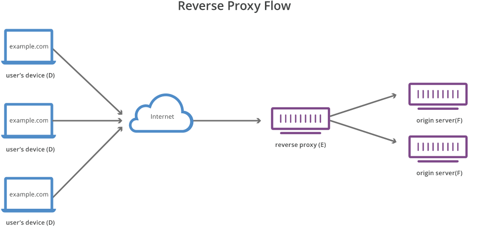

# Nginx

## DNS load balancing
A domain may use multiple servers. DNS will return a list of all the servers's IP addresses in **a different order** each time it responds to a new client using the **round‑robin method**.

```bash
# for example, this domain return 3 IP addresses
# the order of IP address is different each time
PS C:\Users\cwchau> nslookup live-stream.hktvmall.com
Server:  dns.google
Address:  8.8.8.8

Non-authoritative answer:
Name:    live-stream.hktvmall.com
Addresses:  14.198.241.226
          14.198.249.229
          14.198.249.228

PS C:\Users\cwchau> nslookup live-stream.hktvmall.com
Server:  dns.google
Address:  8.8.8.8

Non-authoritative answer:
Name:    live-stream.hktvmall.com
Addresses:  14.198.249.228         <-- different order
          14.198.241.226
          14.198.249.229
```

Problem in basic DNS load balancing:
- DNS does not check for server or network outages or errors
- IP addresses are usually cached

Solution provided by NGINX+:
- NGINX Plus can monitor changes to the list of IP addresses in the corresponding DNS record, and automatically apply the changes to load balancing for the upstream group
- For example, if a domain name resolves to several IP addresses, the servers are load balanced according to Least Connection.
  ```conf
  http {
      resolver 10.0.0.1 valid=300s ipv6=off;
      resolver_timeout 10s;
      server {
          location / {
              proxy_pass http://backend;
          }
      }
      upstream backend {
          zone backend 32k;
          least_conn;
          # ...
          server backend1.example.com resolve;
          server backend2.example.com resolve;
      }
  }
  ```
ref: https://www.nginx.com/resources/glossary/dns-load-balancing/

## Reverse Proxy

Benefit:
- DNS load balancing will show the IP addresses of the origin servers, but load balancing using a reverse proxy never needs to reveal the IP address of the origin servers.
- Other usages: protection from attacks, SSL encryption, caching

## Load Balancing
NGINX install guide: https://docs.nginx.com/nginx/admin-guide/installing-nginx/installing-nginx-open-source/
- there is a guide teaching how to compile and install from source, and how to build docker image for NGINX+

Load balancer admin guide: https://docs.nginx.com/nginx/admin-guide/load-balancer/http-load-balancer/

ref: https://nginx.org/en/docs/http/load_balancing.html

doc: https://nginx.org/en/docs/http/ngx_http_upstream_module.html#server

### Method
- round-robin
- least-connected
  - assign to the server with the least number of active connections
  - suitable when some of the requests take longer to complete
- hash
  - use a user‑defined key which can be a text string, variable, or a combination to decide which server
  - the optional `consistent` parameter to the hash directive enables ketama consistent‑hash load balancing.
- ip-hash
  - use hash of IP address (first three octets of an IPv4 address or the entire IPv6 address) to decide which server
  - same IP address always go to the same server (session persistence)
- random
  - should be used for distributed environments where multiple load balancers are passing requests to the same set of backends.
- least-time (nginx plus)
  - assign to the server with the least average response time and least number of active connections

### Health Check
The `max_fails` directive sets the number of consecutive unsuccessful attempts to communicate with the server that should happen during `fail_timeout`. 
- By default, `max_fails` is set to 1. When it is set to 0, health checks are disabled for this server. 
- The cases of error, timeout and invalid_header are always considered unsuccessful attempts. Other cases can be set by `proxy_next_upstream`.

The `fail_timeout` parameter defines the time of the check fail period, and also how long the server will be marked as failed. After `fail_timeout` interval following the server failure, nginx will start to gracefully probe the server with the live client’s requests. If the probes have been successful, the server is marked as a live one.
- By default, `fail_timeout` is set to 10 seconds.

Testing: If one server is down, set `fail_timeout=25`, the first request takes over 10s and google chrome cancels and requests again. Since the server is marked as failed, nginx will not ask it for 25s, so the second request respond quickly.

```conf
http {
    upstream myweb {
        server web1.example.com   max_fails=5   fail_timeout=30s;
        server web2.example.com;
    }

    server {
        listen       80;

        location / {
            proxy_pass http://myweb;
        }
    }
}
```

### Set up
You can add the load balancing method you want in the section of `upstream`. After modifying `default.conf`, you need to restart nginx.

Ref of variable (eg. $host, $remote_addr): http://nginx.org/en/docs/varindex.html
- `$binary_remote_addr` - whole IPv4 address, can solve the problem of `ip_hash` in a LAN subnet.
```conf
# /etc/nginx/conf.d/default.conf (or in /etc/nginx/nginx.conf)

http {
    upstream myweb {
        // least_conn;
        // ip_hash;
        // hash $binary_remote_addr consistent;
        server web1.example.com weight=3;
        server web2.example.com;
        server web3.example.com;
        server web4.example.com backup;
    }

    server {
        listen       80;

        location / {
            proxy_pass http://myweb;
            proxy_set_header   Host    $host;
            proxy_set_header   X-Real-IP   $remote_addr;
            proxy_set_header   X-Forwarded-For $proxy_add_x_forwarded_for;
        }
    }
}
```
- The load balancing method defaults to round-robin
- All requests are proxied to the server group `myweb`

### Wowza Video Streaming
[Wowza set up in docker](#wowza-set-up-in-docker)

Network Flow:
- http://localhost:8081/vod/sample.mp4/playlist.m3u8
- http://localhost:8081/vod/sample.mp4/chunklist_w1210004075.m3u8
- http://localhost:8081/vod/sample.mp4/media_w1210004075_0.ts and ...

Network Explanation:
- When a client request `playlist.m3u8`, any one of the load balancing servers respond the chunklist title.
- When the client request `chunklist_xxx.m3u8`, any one of the load balancing servers respond the chunklist.
- Then the client will keep sending request of `media_xxx.ts` and any one of the servers will respond the media file.
- Interestingly, each of these requests from the same client will be load balanced to different servers. For example:
  - `/vod/sample.mp4/playlist.m3u8` from `edge03`
  - `/vod/sample.mp4/chunklist_w1210004075.m3u8` from `edge01`
  - `/vod/sample.mp4/media_w1210004075_0.ts` from `edge02`
  - `/vod/sample.mp4/media_w1210004075_1.ts` from `edge03`
  - `/vod/sample.mp4/media_w1210004075_2.ts` from `edge01`
  - and ...
- This happens when using round-robin or least-connected. When using **ip-hash**, even the same client send a sequence of request, always the same server responds.

Testing:
```
7 video
round-robin / least_conn:
edge 1: 7       edge 2: 7       edge 3: 7

ip_hash:
edge 1: 0       edge 2: 0       edge 3: 7
```

Some Questions:
- why a wowza server can understand chunklist title created by other wowza server?
  - it does not matter... can be a random number
- how to keep all request of the same chunklist from a designated wowza server?

Some useful link?
- https://www.nginx.com/products/nginx/streaming-media/

### NJS
ref: https://nginx.org/en/docs/njs/?utm_medium=owned-social&utm_source=youtube&utm_campaign=ww-nx_mad

Use cases
- Complex access control and security checks in njs before a request reaches an upstream server
- Manipulating response headers
- Writing flexible asynchronous content handlers and filters

### Video Streaming Server
ref: https://www.nginx.com/blog/video-streaming-for-remote-learning-with-nginx/

# Appendix
## Wowza set up in Docker
default.conf:
```conf
upstream wowza {
    server hktv.edge01.com:80;
    server hktv.edge02.com:80;
    server hktv.edge03.com:80;
}

server {
    listen       80;
    listen  [::]:80;
    server_name  localhost;

    location / {
        root   /usr/share/nginx/html;
        index  index.html index.htm;
        proxy_pass http://wowza;
    }
}
```
docker-compose.yml:
```yml
version: "3.5"
services:
  hktv_wowza_edge_1:
    build:
      context: ./edge-01-context
      dockerfile: Dockerfile-edge
      args:
          - IMAGE_TAG=$IMAGE_TAG
          - TRANSCODER_SSH_KEYSTORE_FILE=$TRANSCODER_SSH_KEYSTORE_FILE
    hostname: hktv.edge01.com
    env_file:
      - .env.edge01
    working_dir: /usr/local/WowzaStreamingEngine
    ports:
      - "10280:80"
      - "12443:443"
      - "1937:1935"
      - "8286:8086"
      - "8287:8087"
      - "8288:8088"
      - "8289:8089"
    networks:
      hktv_wowza_system_network:
        ipv4_address: 172.16.213.42
    container_name: hktv_wowza_edge_1
  hktv_wowza_edge_2:
    build:
      context: ./edge-02-context
      dockerfile: Dockerfile-edge
      args:
          - IMAGE_TAG=$IMAGE_TAG
          - TRANSCODER_SSH_KEYSTORE_FILE=$TRANSCODER_SSH_KEYSTORE_FILE
    hostname: hktv.edge02.com
    env_file:
      - .env.edge02
    working_dir: /usr/local/WowzaStreamingEngine
    ports:
      - "10380:80"
      - "13443:443"
      - "1938:1935"
      - "8386:8086"
      - "8387:8087"
      - "8388:8088"
      - "8389:8089"
    networks:
      hktv_wowza_system_network:
        ipv4_address: 172.16.213.43
    container_name: hktv_wowza_edge_2
  hktv_wowza_edge_3:
    build:
      context: ./edge-03-context
      dockerfile: Dockerfile-edge
      args:
          - IMAGE_TAG=$IMAGE_TAG
          - TRANSCODER_SSH_KEYSTORE_FILE=$TRANSCODER_SSH_KEYSTORE_FILE
    hostname: hktv.edge03.com
    env_file:
      - .env.edge03
    working_dir: /usr/local/WowzaStreamingEngine
    ports:
      - "10480:80"
      - "14443:443"
      - "1939:1935"
      - "8486:8086"
      - "8487:8087"
      - "8488:8088"
      - "8489:8089"
    networks:
      hktv_wowza_system_network:
        ipv4_address: 172.16.213.44
    container_name: hktv_wowza_edge_3
  nginx:
    container_name: hktv_wowza_nginx
    image: nginx:latest  # 1.23.2
    ports:
      - "8081:80"
    depends_on:
      - hktv_wowza_edge_1
      - hktv_wowza_edge_2
      - hktv_wowza_edge_3
    volumes:
      - "./default.conf:/etc/nginx/conf.d/default.conf"
    networks:
      hktv_wowza_system_network:
        ipv4_address: 172.16.213.45
networks:
  hktv_wowza_system_network:
    ipam:
      driver: default
      config:
        - subnet: 172.16.213.0/24
```