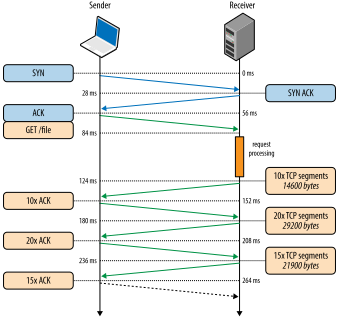

# Index
- [Index](#index)
- [TCP Socket](#tcp-socket)
	- [Introduction](#introduction)
		- [Why use TCP instead of HTTP?](#why-use-tcp-instead-of-http)
		- [Overview](#overview)
		- [Server-side API](#server-side-api)
	- [Troubleshoot](#troubleshoot)
		- [Blocking](#blocking)
- [Vert.x](#vertx)
	- [Overview](#overview-1)
		- [Verticles](#verticles)
		- [Event Bus](#event-bus)
	- [Implementation](#implementation)
		- [Create Vert.x Instance](#create-vertx-instance)
		- [Extend AbstractVerticle](#extend-abstractverticle)
	- [RxJava3](#rxjava3)
		- [Rxified API](#rxified-api)
	- [TCP Server](#tcp-server)
		- [Example](#example)
		- [netSocket.write](#netsocketwrite)

# TCP Socket
## Introduction
### Why use TCP instead of HTTP?


HTTP is a layer built on top of the TCP layer to somewhat standardize data transmission. So naturally using TCP sockets will be less heavy than using HTTP. 
- From above graph, we can see that in a HTTP request, apart from the entity body, there are many header lines (much more overhead).
- HTTP is a stateless protocol, if we want to have real time application, many TCP sessions are created.
- If performance is the only thing you care about then plain TCP is the best solution for you.

### Overview
**TCP feature**
1. 3-Way Handshake
2. Segment Numbering System - TCP keeps track of the segments being transmitted or received by assigning numbers to each and every single one of them.
3. Connection Oriented - It means sender and receiver are connected to each other till the completion of the process.
   1. For each connection, client can send more than once message to server.
4. Full Duplex - In TCP data can be transmitted from receiver to the sender or vice – versa at the same time.
5. Flow Control - Flow control limits the rate at which a sender transfers data. This is done to ensure reliable delivery. The receiver continually hints to the sender on how much data can be received (using a sliding window).
6. Error Control
7. Congestion Control



**TCP Segment Structure**


### Server-side API
Socket Programming in **Java**
- java.net.Socket
- Nio selector
- Netty
- Vert.x (the most high-level library)

## Troubleshoot
### Blocking
Take a client script as an example:
```py
import socket

# Server details
server_address = '127.0.0.1'
server_port = 12345

# Create a socket object
client_socket = socket.socket(socket.AF_INET, socket.SOCK_STREAM)

# Connect to the server
client_socket.connect((server_address, server_port))
print('Connected to the server.')

# Send data to the server
message = 'Hello, server!'
client_socket.send(message.encode('utf-8'))

# Receive data from the server
data = client_socket.recv(1024)
print('Received from server:', data.decode('utf-8'))

# Close the socket
client_socket.close()
```
- This is a blocking script, after sending message to server, it will keep waiting until receiving data from the server.

# Vert.x
## Overview
- https://www.baeldung.com/vertx
- https://vertx.io/docs/vertx-core/java/

Vert.x is an open source, **reactive** and polyglot software development toolkit from the developers of Eclipse.

### Verticles

Verticles are chunks of code that get deployed and run by `Vert.x`. A `Vert.x` instance maintains N event loop threads (where N by default is core*2) by default. Verticles can be written in any of the languages that `Vert.x` supports and a single application can include verticles written in multiple languages.

An application would typically be composed of many verticle instances running in the same `Vert.x` instance at the same time. The different verticle instances communicate with each other by sending messages on the event bus.

### Event Bus

The event bus is the nervous system of `Vert.x`. There is a single event bus instance for every `Vert.x` instance and it is obtained using the method `eventBus`.

## Implementation
- API docs (Vertx): https://vertx.io/docs/apidocs/io/vertx/core/Vertx.html

```xml
// Note that most functionality in Vert.x core is fairly low level.
<dependency>
 <groupId>io.vertx</groupId>
 <artifactId>vertx-core</artifactId>
 <version>4.4.5</version>
</dependency>

// If you want to use rxJava, just add the below dependency, it already included vertx-core.
<dependency>
 <groupId>io.vertx</groupId>
 <artifactId>vertx-rx-java3</artifactId>
 <version>4.4.5</version>
</dependency>
```
- To create an instance of `Vertx` you can use the static factory methods: `vertx()`, `vertx(io.vertx.core.VertxOptions)` and `clusteredVertx(io.vertx.core.VertxOptions, Handler)`.

### Create Vert.x Instance
```java
public class TcpServer
{
	Vertx vertx = Vertx.vertx();
}
```

### Extend AbstractVerticle
- Manual: https://vertx.io/docs/vertx-core/java/#_verticles
- API docs: https://vertx.io/docs/apidocs/io/vertx/core/AbstractVerticle.html
```java
import io.vertx.core.AbstractVerticle;
import io.vertx.core.Vertx;
import io.vertx.core.net.NetServer;
import io.vertx.core.net.NetServerOptions;


public class TcpServerVerticle extends AbstractVerticle
{
	public static void main(String[] args)
	{
		Vertx.vertx().deployVerticle(new TcpServerVerticle());
	}

	@Override
	public void start()
	{
		NetServer server = vertx.createNetServer();

		...
	}
}
```

## RxJava3
- Manual: https://vertx.io/docs/vertx-rx/java3/#_vert_x_api_for_rxjava3
- API docs: https://vertx.io/docs/apidocs/io/vertx/rxjava3/core/Vertx.html

Vert.x itself is async using its own Future class, use rxJava if you want all reactive code are consistent.
- write = Completable
- read = Flowable, once subscribe, will run the action function every time when it emits item.

### Rxified API
ref: https://vertx.io/docs/vertx-rx/java3/#_rxified_api
```java
// For example

// NetSocket.class
public Completable write(String str) {
	Completable ret = this.rxWrite(str);
	ret = ret.cache();
	ret.subscribe(CompletableHelper.nullObserver());
	return ret;
}

public Completable rxWrite(String str) {
	return AsyncResultCompletable.toCompletable((handler) -> {
		this.delegate.write(str, handler);
	});
}


// Immediate write
// no need to subscribe
// completion provides the asynchronous result
response.write(buffer);

// No write happened
completion = response.rxWrite(buffer);

// Perform an actual write
completion.subscribe(() -> ..., err -> ...);
```

## TCP Server
- ref: https://vertx.io/docs/vertx-core/java/#_writing_tcp_servers_and_clients
- [NetSocket](https://vertx.io/docs/apidocs/io/vertx/core/net/NetSocket.html)
- [Buffer](https://vertx.io/docs/apidocs/io/vertx/core/buffer/Buffer.html)

### Example
```java
NetServerOptions options = new NetServerOptions().setPort(12345);
NetServer server = vertx.createNetServer(options);

// Handle making a new connection, with an instance of NetSocket
server.connectHandler(socket -> {

	socket.handler(buffer -> {
		// Handle every time receiving data on the socket, with an instance of Buffer
		// One socket can receive data many times before connection closed

		// ****************************************** Read data from the buffer
		// Read a string in UTF-8 decoding
		String message = buffer.toString().trim();
		System.out.println("Received from client: " + message);


		// ******************************************* Writing data to a socket
		// Write a buffer
		Buffer tbuffer = Buffer.buffer().appendFloat(12.34f).appendInt(123);
		socket.write(buffer);

		// Write a string in UTF-8 encoding
		socket.write("some data");

		// Write a string using the specified encoding
		socket.write("some data", "UTF-16");

		// *************************************************** Close the socket
		socket.close();
	});

	socket.exceptionHandler(t -> {
		// Handle receiving any exceptions, with an instance of Throwable
	})

	socket.closeHandler(v -> {
		// Handle connection close, either from client or server socket.close()
		System.out.println("Client disconnected.");
		
		// After the connection close, the socket object will not be null
	});
});

// Turn on the server and start listening to the port
server
	.listen()
	.onComplete(res -> {
		if (res.succeeded())
			System.out.println("Server is now listening on actual port: " + server.actualPort());
		else
			System.out.println("Failed to bind!");
		
	});

// Turn off the server
server.close();
```
- Note that the `NetServer` is executed in vert.x own thread (e.g. `vert.x-eventloop-thread-0`).


### netSocket.write
The implementation:
- Call `NetSocket write(io.vertx.core.buffer.Buffer message)`
- Call `NetSocketImpl write(io.vertx.core.buffer.Buffer message, Handler<AsyncResult<Void>> handler)`
- Call `NetSocketImpl write(io.netty.buffer.ByteBuf buff, Handler<AsyncResult<Void>> handler)` Use netty ByteBuf
- Call `NetSocketImpl writeMessage(Object message, Handler<AsyncResult<Void>> handler)`
- Call `ConnectionBase writeToChannel(Object msg, boolean forceFlush, ChannelPromise promise)`

```java
public final void writeToChannel(Object msg, boolean forceFlush, ChannelPromise promise) {
  synchronized (this) {
    if (!chctx.executor().inEventLoop() || writeInProgress > 0) {
      // Make sure we serialize all the messages as this method can be called from various threads:
      // two "sequential" calls to writeToChannel (we can say that as it is synchronized) should preserve
      // the message order independently of the thread. To achieve this we need to reschedule messages
      // not on the event loop or if there are pending async message for the channel.
      queueForWrite(msg, forceFlush, promise);
      return;
    }
  }
  // On the event loop thread
  write(msg, forceFlush ? true : null, promise);
}

private void queueForWrite(Object msg, boolean forceFlush, ChannelPromise promise) {
  writeInProgress++;
  chctx.executor().execute(() -> {
    boolean flush;
    if (forceFlush) {
      flush = true;
    } else {
      synchronized (this) {
        flush = --writeInProgress == 0;
      }
    }
    write(msg, flush, promise);
  });
}
```