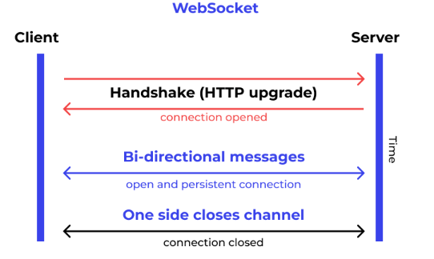
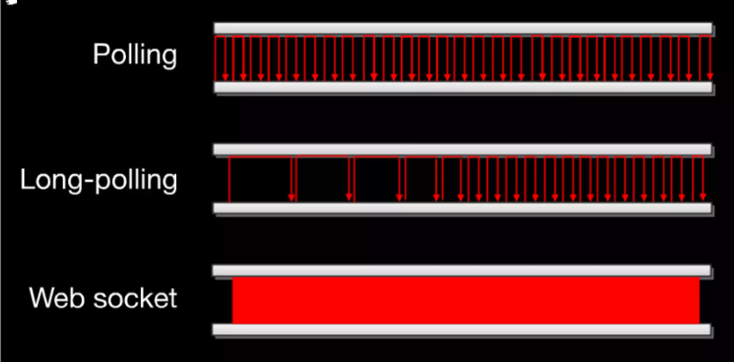

# Index
- [Index](#index)
- [WebSocket](#websocket)
  - [Overview](#overview)
    - [Opening Handshake](#opening-handshake)
    - [URL](#url)
    - [Closing Handshake](#closing-handshake)
  - [Benefit](#benefit)
  - [Server-side API](#server-side-api)
- [Server-side API](#server-side-api-1)
  - [C#](#c)
    - [WebSocketState](#websocketstate)
    - [Workflow](#workflow)
    - [Structure](#structure)
    - [Main Program](#main-program)
    - [Web Socket Server](#web-socket-server)
      - [Accept Request and Receive Message](#accept-request-and-receive-message)
      - [Manage User Web Sockets](#manage-user-web-sockets)
    - [UserWebSocket](#userwebsocket)
    - [Request Format](#request-format)
    - [Response Format](#response-format)
- [Client-side API](#client-side-api)
  - [C#](#c-1)
    - [Workflow](#workflow-1)
    - [Request Message](#request-message)
    - [Response Message](#response-message)
    - [Implementation](#implementation)
    - [Remarks](#remarks)

# WebSocket

- https://en.wikipedia.org/wiki/WebSocket
- https://www.wallarm.com/what/a-simple-explanation-of-what-a-websocket-is
- https://developer.mozilla.org/en-US/docs/Web/API/WebSockets_API/Writing_WebSocket_servers
- https://www.slideshare.net/julienlapointe/introduction-to-websockets-presentation
- https://docs.oracle.com/javaee/7/tutorial/websocket001.htm#BABDABHF
- [RFC 6455 The WebSocket Protocol](https://www.rfc-editor.org/rfc/rfc6455.html)

## Overview

WebSocket is a computer communications protocol for providing **asyn­chro­nous, bi-directional, full duplex** communication channels over a single TCP socket.

WebSocket is distinct from HTTP. However:
- Both protocols are located at layer 7 in the OSI model and depend on TCP at layer 4. 
- RFC 6455 states that WebSocket "is designed to work over HTTP ports 443 and 80 as well as to support HTTP proxies and intermediaries", thus making it compatible with HTTP. To achieve compatibility, the WebSocket handshake uses the **HTTP Upgrade header** to change from the HTTP protocol to the WebSocket protocol.

### Opening Handshake

Client handshake request

```bash
GET /chat HTTP/1.1
Host: example.com:8000
Upgrade: websocket
Connection: Upgrade
Sec-WebSocket-Key: dGhlIHNhbXBsZSBub25jZQ==
Sec-WebSocket-Version: 13
```

- Note that HTTP/2 WebSockets use `CONNECT` requests rather than `GET`.

Server handshake response

```bash
HTTP/1.1 101 Switching Protocols
Upgrade: websocket
Connection: Upgrade
Sec-WebSocket-Accept: s3pPLMBiTxaQ9kYGzzhZRbK+xOo=
```

In addition to `Upgrade` headers, the client sends a `Sec-WebSocket-Key` header containing base64-encoded random bytes, and the server replies with a hash of the key in the `Sec-WebSocket-Accept` header. This is intended to prevent a caching proxy from re-sending a previous WebSocket conversation, and does not provide any authentication, privacy, or integrity. The hashing function appends the fixed string `258EAFA5-E914-47DA-95CA-C5AB0DC85B11` (a UUID) to the value from `Sec-WebSocket-Key` header (which is not decoded from base64), applies the SHA-1 hashing function, and encodes the result using base64.

The client applies the same operation to the value of the `Sec-WebSocket-Key` header, and the connection is established successfully if the result matches the value received from the server. The client and the server can send messages to each other after a successful handshake.

### URL

WebSocket endpoints are represented by URIs that have the following form:
```bash
ws://host:port/path?query
wss://host:port/path?query
```
The `ws` scheme represents an unencrypted WebSocket connection, and the `wss` scheme represents an encrypted connection. The port component is optional; the default port number is 80 for unencrypted connections and 443 for encrypted connections. The path component indicates the location of an endpoint within a server. The query component is optional.

### Closing Handshake

Either the client or the server sends a Close frame. Then, the other side sends back its own Close frame in response, which echos the status code it received.

- The Close frame contains an opcode of 0x8.
- The Close frame MAY contain a body that indicates a reason for closing, such as an endpoint shutdown, etc.

After both sending and receiving a Close frame, the web socket connection is closed, and the server must close the underlying TCP connection.

## Benefit

The WebSocket protocol enables interaction between a web browser (or other client application) and a web server with **lower overhead** and **less traffic** than half-duplex alternatives such as HTTP polling, **facilitating real-time data transfer** from and to the server.

This is made possible by providing a standardized way for the server to send content to the client without being first requested by the client, and allowing messages to be passed back and forth while keeping the connection open. In this way, a two-way ongoing conversation can take place between the client and the server.



**Use WebSocket when you want low latency 2-way communication (real-time web application):**
- Chat
- Notifications
- Online games
- Financial trading
- Live maps
- Data visualization dashboards
- Collaboration maps

**If you use HTTP:**
- Connection is typically closed after 1 request / response pair (vs WebSocket, connection stays open)
- 150ms to establish new TCP connection for each HTTP message (vs WebSocket, 50ms for message transmission)
- Polling overhead (constantly sending messages to check if new data is ready)



## Server-side API
- Threaded servers:
  - Can be used but not recommended
  - 1 thread/process per socket -> memory hog!
- Evented-servers:
  - Ideal
  - 1 process handles all requests
  - Waits for I/O before processing requests (reactor pattern)
- Suggested servers:
  - Ruby: Event Machine + em-websocket
  - JavaScript: Node.js + WebSocket module (socket.io)
  - Python: Twisted + txWebSocket
  - Java: javax.websocket

# Server-side API

## C#

ASP.NET Core Web socket
- [Document](https://learn.microsoft.com/en-us/aspnet/core/fundamentals/websockets)

System.Net.WebSockets.WebSocket
- [Document](https://learn.microsoft.com/en-us/dotnet/api/system.net.websockets.websocket)

### WebSocketState

```cs
//     Defines the different states a WebSockets instance can be in.
public enum WebSocketState
{
    None = 0,           //     Reserved for future use.
    Connecting = 1,     //     The connection is negotiating the handshake with the remote endpoint.
    Open = 2,           //     The initial state after the HTTP handshake has been completed.
    CloseSent = 3,      //     A close message was sent to the remote endpoint.
    CloseReceived = 4,  //     A close message was received from the remote endpoint.
    Closed = 5,         //     Indicates the WebSocket close handshake completed gracefully.
    Aborted = 6         //     Indicates that the WebSocket has been aborted.
}
```

If both server and client are using .NET, the state transitions should look like this:

- Both parties are connected and in the Open state
- “A” sends a Close frame
- “A” switches to the `CloseSent` state
- “B” receives the Close frame
- “B” switches to the `CloseReceived` state
- “B” sends an acknowledgement of the Close frame
- “B” switches to the `Closed` state
- “A” receives the acknowledgement
- “A” switches to the `Closed` state
- Both parties are now disconnected

### Workflow

1. Start a web server using ASP.NET core to receive `HttpContext`.
2. Accept web socket request from the client (call `HttpContext.WebSockets.AcceptWebSocketAsync`) and get the `WebSocket` object.
3. Run a `Task` thread which has a while loop to keep calling `WebSocket.ReceiveAsync` until the connection closes. This is to receive message from the client.
4. Run a `Task` thread which has a while loop to keep reading message from a `Channel`. Once a message is read from the `Channel`, call `WebSocket.SendAsync` to send this message to the client.
5. If either *receive* or *send* thread is completed, close the web socket (gracefully) by calling `WebSocket.CloseAsync`. Then, the other thread would also be completed.
   1. Server initiates to close connection.
   2. Client initiates to close connection.
   3. Client disconnects if the internet connection is lost. If you want to take some action when that happens, set a timeout after nothing is received from the client within a certain time window.

### Structure

Main program - `Program.cs`
- Run the web host of ASP.NET. Call `WebSocketServer.InvokeAsync` if receive web socket request.

Web socket server - `WebSocketServer.cs`
- The main class to manage all web sockets. **Receive message here.**

User web socket - `UserWebSocket.cs`
- The wrapper class to link `WebSocket` and the user object. **Send message here.**

### Main Program

```cs
public class Program
{
    public static void Main(string[] args)
    {
        var builder = WebApplication.CreateBuilder(args);
        var app = builder.Build();
        app.UseRouting();
        app.UseWebSockets();
        app.Use(async (context, next) =>
        {
            try
            {
                if (context.WebSockets.IsWebSocketRequest)
                {
                    Logger.Info($"Received a web socket request");
                    await webSocketServer.InvokeAsync(context);
                }
                else
                    await next(context);
            }
            catch (Exception ex)
            {
                Logger.Error(ex);
            }
        });
        app.RunAsync();
    }
}
```
- It can be changed to controller based.

### Web Socket Server

#### Accept Request and Receive Message

`WebSocket.ReceiveAsync` will return `Task<WebSocketReceiveResult>`, which has the following properties:
- `MessageType` - `WebSocketMessageType` - Indicates whether the current message is a UTF-8 message, a binary message, or a close message.
    ```cs
    public enum WebSocketMessageType
    {
        Text = 0,       //     The message is clear text.
        Binary = 1,     //     The message is in binary format.
        Close = 2       //     A receive has completed because a close message was received.
    }
    ```
- `CloseStatus` - `WebSocketCloseStatus?` - Indicates the reason why the remote endpoint initiated the close handshake.
- `CloseStatusDescription` - `string?` - Returns the optional description that describes why the close handshake has been initiated by the remote endpoint.
- `EndOfMessage` - `bool` - Indicates whether the message has been received completely.

The valid state of `WebSocket.ReceiveAsync`: Open, CloseSent.

```cs
public class WebSocketServer
{
    // Each user web socket must have a unique connection ID to be accessed
    private readonly ConcurrentDictionary<string, UserWebSocket> UserWebSocketByUserConnID = new();

    /* This task is the entry point of the web socket connection. It creates the user
     * web socket, adds it to the dictionary, and then calls the private method ReceiveAsync
     * and waits for it to complete. Finally, remove the user web socket from the dictionary.
     */
    public async Task InvokeAsync(HttpContext context)
    {
        // You can put some verification logic before accept the web socket connection

        try
        {
            // Accept the web socket request finally
            var webSocket = await context.WebSockets.AcceptWebSocketAsync();

            var user = new User()
            {
                ConnID = Guid.NewGuid().ToString(),
                // Other information ...
            };
            var userWebSocket = new UserWebSocket(webSocket, user);
            AddUserWebSocket(userWebSocket);

            await ReceiveAsync(userWebSocket);

            TryRemoveUserWebSocket(userWebSocket.User.ConnID);
        }
        catch (Exception e)
        {
            logger.Error(e);
        }
    }

    /* This task would keep calling WebSocket.ReceiveAsync until the connection is not open.
     *
     * If received a text message, call method to handle this request.
     *
     * If received a close request, call the user web socket to close the connection gracefully.
     *
     * If WebSocket.ReceiveAsync threw exception, still call the user web socket to close the connection.
     */
    private async Task ReceiveAsync(UserWebSocket userWebSocket)
    {
        var buffer = new ArraySegment<byte>(new byte[1024 * 4]);
        while (userWebSocket.IsConnectingOrOpen())
        {
            try
            {
                using var ms = new MemoryStream();
                WebSocketReceiveResult? result;
                do
                {
                    result = await userWebSocket.WebSocket.ReceiveAsync(buffer, CancellationToken.None);
                    ms.Write(buffer.Array, buffer.Offset, result.Count);
                }
                while (!result.EndOfMessage);

                ms.Seek(0, SeekOrigin.Begin);

                if (result.MessageType == WebSocketMessageType.Text)
                {
                    using var reader = new StreamReader(ms, Encoding.UTF8);
                    string message = reader.ReadToEnd();
                    
                    // Handle this request message, including validation
                }
                else if (receiveResult.MessageType == WebSocketMessageType.Close)
                {
                    // Client sends a Close frame
                    await userWebSocket.CloseAsync();
                }
            }
            catch (Exception e)
            {
                logger.Error($"Socket Receive Error: {userWebSocket.User.ConnID}, {ex}");
                await userWebSocket.CloseAsync();
            }
        }
    }
}
```
- To determine if client sends a *Close* frame, the condition can also be `!receiveResult.CloseStatus.HasValue`.

#### Manage User Web Sockets

```cs
public class WebSocketServer
{
    ...

    public void AddUserWebSocket(UserWebSocket userWebSocket)
    {
        UserWebSocketByUserConnID.AddOrUpdate(userWebSocket.User.ConnID, userWebSocket,
            (key, oldUserWebSocket) =>
            {
                oldUserWebSocket.Close();
                return userWebSocket;
            });
        logger.Info($"Add web socket for user [{userWebSocket.User.ConnID}] - [SUCCESS] Login [{userWebSocket.User.Login}]");
    }

    public UserWebSocket? TryRemoveUserWebSocket(string connID)
    {
        if (UserWebSocketByUserConnID.TryRemove(connID, out UserWebSocket? userWebSocket))
        {
            UnsubscribeAllBroadcastChannel(userWebSocket.User.ConnID);

            userWebSocket.Close();

            logger.Info($"Remove web socket for user [{connID}] - [SUCCESS]");
        }
        return userWebSocket;
    }

    public UserWebSocket? TryGetUserWebSocketByConnID(string connID){}

}    
```

### UserWebSocket

`WebSocket.CloseAsync` will return `Task`. It sends a message to the client to close the connection, waits for a response, and then returns.

The valid state of `WebSocket.CloseAsync`: Open, CloseReceived, CloseSent.

The valid state of `WebSocket.SendAsync`: Open, CloseReceived.

```cs
public class UserWebSocket
{
    private static readonly NLog.Logger logger = NLog.LogManager.GetCurrentClassLogger();
    private static readonly NLog.Logger auditlogger = NLog.LogManager.GetLogger("TradingGateway.WebSocketServer.Audit");
    private static readonly JsonSerializerOptions jsonOption = new() { DefaultIgnoreCondition = JsonIgnoreCondition.WhenWritingNull };

    private readonly Channel<string> WebSocketChannel;
    private readonly Task Connection;

    public readonly WebSocket WebSocket;
    public readonly User User;

    /* When the user web socket is created, it would create a task that keeps calling 
     * WebSocket.SendAsync until the channel is closed.
     *
     * If WebSocket.SendAsync threw exception (CloseSent / Closed / Aborted), try to 
     * close the channel.
     * 
     * If Channel.Reader.ReadAllAsync threw exception / too many message in the channel,
     * try to close the channel.
     *
     * If CloseAsync is called (by web socket server), try to close the channel.
     *
     * At the end, WebSocket.CloseAsync would be called and wait until it is completed.
     */
    public UserWebSocket(WebSocket webSocket, User user)
    {
        WebSocketChannel = Channel.CreateUnbounded<string>();
        WebSocket = webSocket;
        User = user;

        Connection = Task.Run(async () =>
        {
            try
            {
                await foreach (string message in WebSocketChannel.Reader.ReadAllAsync())
                {
                    try
                    {
                        await webSocket.SendAsync(Encoding.UTF8.GetBytes(message), 
                            WebSocketMessageType.Text, true, CancellationToken.None);

                        auditlogger.Info($"Send message for user [{User.ConnID}] - [SUCCESS] Message {message}");
                    }
                    catch (Exception ex)
                    {
                        // SendAsync threw exception
                        logger.Error($"Send message for user [{User.ConnID}] - [FAIL] {ex}");
                        WebSocketChannel.Writer.TryComplete();
                        break;
                    }
                }
            }
            catch (Exception ex)
            {
                logger.Error($"Read message from web socket channel for user [{User.ConnID}] - [FAIL] {ex}");
                WebSocketChannel.Writer.TryComplete();
            }
            if (!IsClosedOrAborted())
                await WebSocket.CloseAsync(WebSocketCloseStatus.NormalClosure, "Socket Close", CancellationToken.None);
        });
    }

    public void AddNewMessage(string message)
    {
        if (WebSocketChannel.Reader.Count > 1000)
        {
            logger.Error($"Add new message to web socket channel for user [{User.ConnID}] - [FAIL] {WebSocketChannel.Reader.Count} messages in the channel");
            WebSocketChannel.Writer.TryComplete();
        }
        else
        {
            WebSocketChannel.Writer.TryWrite(message);
        }
    }

    public async Task CloseAsync()
    {
        logger.Info($"Close web socket for user [{User.ConnID}] - [START]");

        try
        {
            WebSocketChannel.Writer.TryComplete();
            await Connection;

            logger.Info($"Close web socket for user [{User.ConnID}] - [END]");
        }
        catch (Exception ex)
        {
            logger.Error($"Close web socket for user [{User.ConnID}] - [FAIL] {ex}");
        }
    }

    public bool IsConnectingOrOpen()
    {
        return WebSocket.State == WebSocketState.Connecting || WebSocket.State == WebSocketState.Open;
    }

    public bool IsClosedOrAborted()
    {
        return WebSocket.State == WebSocketState.Closed || WebSocket.State == WebSocketState.Aborted;
    }
}
```

### Request Format

For the data field, it can be any object, depending on different requests.
```cs
public class Request
{
    public class ActionType
    {
        public const string GetHistoricalDeals = "get_historical_deals";
        ...
    }

    [JsonPropertyName("action")]
    public required string Action { get; set; }

    [JsonPropertyName("pid")]
    public required string Pid { get; set; }

    [JsonPropertyName("data")]
    public object? Data { get; set; }

    public T? GetData<T>()
    {
        try
        {
            return JsonSerializer.Deserialize<T>(JsonSerializer.Serialize(Data));
        }
        catch (Exception)
        {
            throw;
        }
    }
}

public class HistoricalDealsRequest
{
    public required ulong Login { get; set; }
    public required string Symbol { get; set; }
    ...
}
```

To parse the request and then the request data:

```cs
private async Task ReceiveAsync(UserWebSocket userWebSocket)
{
    ...

    string message = reader.ReadToEnd();
    Request? request = null;
    try
    {
        request = JsonSerializer.Deserialize<Request>(message, jsonOption);
    }
    catch (Exception e)
    {
        logger.Error($"Invalid request {message}, {e}");
        continue;
    }
    ...
}

private void HandleGetHistoricalDeals(UserWebSocket userWebSocket, Request request)
{
    HistoricalDealsRequest? requestData;
    try
    {
        requestData = request.GetData<HistoricalDealsRequest>();
    }
    catch (Exception e)
    {
        // wrong format
    }
    // Do other validation
}
```

### Response Format

# Client-side API

## C#

System.Net.WebSockets.ClientWebSocket
- [Document](https://learn.microsoft.com/en-us/dotnet/api/system.net.websockets.clientwebsocket)

### Workflow

1. Connect to the server web socket with the URL by creating a `ClientWebSocket` object.
2. Run a `Task` (task thread) which has a while loop to keep trying to receive message (call `ReceiveAsync`) from the server until the connection closes. The `Task` also manages the close operation. 
3. If you want to send message to the server, call `SendAsync` in the main thread.
4. If you want to close the web socket, call `CloseAsync`.

### Request Message

1. Create an object of request.
   1. The `pid` is used to keep track of the request message (i.e. a response message with the same `pid` corresponds to the request message sent before). A dictionary with key = `pid` and value = the request object can be used.
   2. The `action` is used to classify the purpose of the request message.
   3. The `data` is used as `object` to fit in different request models.
2. Use a `JsonSerializer` to **serialize** the object of request into a JSON string, acting as the request message.

```cs
class Request
{
    public required string Action { get; set; }
    public required string Pid { get; set; }
    public required object Data { get; set; }  // can be `LoginRequestData`, or other class
}

class LoginRequestData
{
    public string username { get; set; }
    public string password { get; set; }
    public int type { get; set; }
}
```

```json
{"pid":"43eae41d-7572-444c-b280-b8f8722ce13d","action":"login","data":{"username":"mft","password":"mF123456","type":1}}
```

### Response Message

1. Receive the response message as a JSON string.
2. Use a `JsonSerializer` to **deserialize** the response message into an object of response.

```json
// Resposne object without `data`
{"pid":"43eae41d-7572-444c-b280-b8f8722ce13d","actionAck":"login","status":1}

// Response object with `data`
{"pid":"a9eccdcb-3367-4a49-b71f-ecc606eba1b7","actionAck":"addDeal","status":1,"data":{"external_order_id":"860","external_volume":"100.0","external_price":"1989.1","external_symbol":"LLG"}}
```

```cs
class Response
{
    public required string ActionAck { get; set; }
    public string? Pid { get; set; }
    public bool? Status { get; set; }
    public object? Data { get; set; }
}
```


### Implementation

```cs
using System.Net.WebSockets;

private ClientWebSocket webSocketclient;
private readonly ConcurrentDictionary<string, TaskCompletionSource<bool>> 
    loginTaskConDict = new ConcurrentDictionary<string, TaskCompletionSource<bool>>();

private async Task<bool> Login(string login, string password)
{
    var source = new TaskCompletionSource<bool>();
    loginTaskConDict.Clear();
    if (loginTaskConDict.TryAdd(login, source))
    {
        Request request = new Request()
        {
            pid = Guid.NewGuid().ToString(),
            action = Constant.Action.Login,
            data = new LoginRequestData()
            {
                username = login,
                password = password,
                type = 1
            },
        };

        await SendRequest(request);

        Task timeout = Task.Delay(30000);
        if (source.Task == await Task.WhenAny(source.Task, timeout))
        {
            return await source.Task;
        }
    }
    return false;
}

public void OnLoginResposne(string login, Response response)
{
    if (loginTaskConDict.TryRemove(login, out TaskCompletionSource<bool> source))
    {
        if (response.status == 1)
        {
            isConnected = true;
            source.SetResult(true);
        }
        else
        {
            isConnected = false;
            source.SetResult(false);
        }
    }
}

public async Task SendRequest(Request request)
{
    if (webSocketclient.State == WebSocketState.Open && !websocketConnectCancellation.IsCancellationRequested)
    {
        string jsonString = JsonSerializer.Serialize(request, jsonOption);

        // send message
        await webSocketclient.SendAsync(
            new ArraySegment<byte>(Encoding.UTF8.GetBytes(jsonString)), 
            WebSocketMessageType.Text, 
            true, 
            websocketConnectCancellation.Token
        );
    }
}

public async Task CloseWebSocket()
{
    isConnected = false;
    if (webSocketclient != null)
    {
        if (webSocketclient.State == WebSocketState.Open)
            await webSocketclient.CloseAsync(WebSocketCloseStatus.NormalClosure, string.Empty, CancellationToken.None);
        webSocketclient.Dispose();
        webSocketclient = null;
    }
}

public async Task<bool> ConnectToWebSocket(string server, string login, string password)
{
    try
    {
        string wsUrl = $"ws://{server}/";
        
        // connect to the web socket
        await webSocketclient.ConnectAsync(new Uri(wsUrl), websocketConnectCancellation.Token);
        var receive = Task.Run(async () =>
        {
            var buffer = new ArraySegment<byte>(new byte[8192]);
            while (true)
            {
                WebSocketReceiveResult result;
                using (var ms = new MemoryStream())
                {
                    try
                    {
                        do
                        {
                            result = await webSocketclient.ReceiveAsync(buffer, websocketConnectCancellation.Token);
                            ms.Write(buffer.Array, buffer.Offset, result.Count);
                        } while (!result.EndOfMessage);
                    }
                    catch (OperationCanceledException ex)
                    {
                        await CloseWebSocket();
                        break;
                    }
                    catch (Exception ex)
                    {
                        await CloseWebSocket();
                        break;
                    }

                    if (result.MessageType == WebSocketMessageType.Close)
                    {
                        await CloseWebSocket();
                        break;
                    }

                    ms.Seek(0, SeekOrigin.Begin);
                    using (var reader = new StreamReader(ms, Encoding.UTF8))
                    {
                        try
                        {
                            string message = await reader.ReadToEndAsync();

                            Response response = JsonSerializer.Deserialize<Response>(message, jsonOption);
                            string action = response.actionAck;

                            switch (action)
                            {
                                case Constant.Action.Login:
                                    OnLoginResposne(login, response);
                                    break;
                                case Constant.Action.AddOrder:
                                    OnAddOrderResponse(response);
                                    break;
                                case Constant.Action.GetOrder:
                                    OnGetOrderResposne(response);
                                    break;
                                default:
                                    break;
                            }
                        }
                        catch (Exception ex)
                        {
                            ...
                        }
                    }
                }
            }
        });

        return await Login(login, password);
    }
    catch (Exception ex)
    {
        ...
    }
    return false;
}
```

### Remarks

- The methods `SendAsync`, `ReceiveAsync`, `CloseAsync`, `CloseOutputAsync` always check the state of socket before taking any other action. If the state is not `WebSocketState.Open`, they throw exception.
- Exactly one send and one receive operation is supported on each `ClientWebSocket` object in parallel. Issuing multiple receives at the same time is not supported and will result in an undefined behavior.
  ```
  System.InvalidOperationException: There is already one outstanding 'ReceiveAsync' call for this WebSocket instance. ReceiveAsync and SendAsync can be called simultaneously, but at most one outstanding operation for each of them is allowed at the same time.
  ```
- When opening / closing connection (`ConnectAsync` / `CloseAsync`), you can return an empty cancellation token `CancellationToken.None` becasue the open / close operation rarely be cancelled. It may be good to use a real cancellation token for sending / receiving message (`SendAsync` / `ReceiveAsync`).
- Each `ClientWebSocket` object can only connect and close once. After close, cannot use it to open connection again. You need to create a new `ClientWebSocket` object.