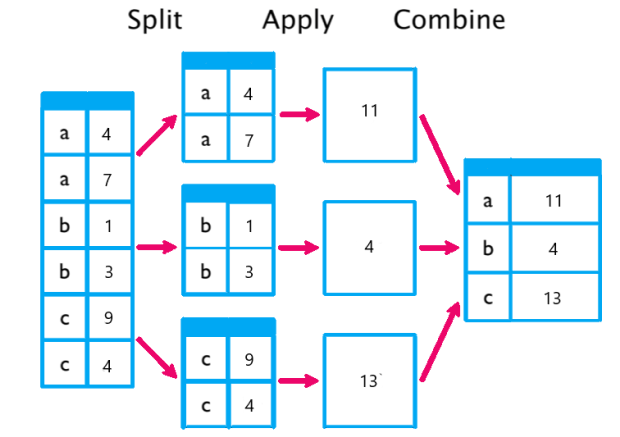

# Index

- [Index](#index)
- [Table Design](#table-design)
  - [Data Type](#data-type)
  - [Create table](#create-table)
- [Command line interface](#command-line-interface)
  - [How to](#how-to)
    - [Create database](#create-database)
    - [Alter table](#alter-table)
    - [Update](#update)
    - [Delete](#delete)
    - [Insert](#insert)
    - [Query](#query)
    - [Query datetime](#query-datetime)
    - [Union](#union)
    - [Get other field for the same row with max value for each group](#get-other-field-for-the-same-row-with-max-value-for-each-group)
    - [Check query performance](#check-query-performance)
  - [Concept](#concept)
    - [Distinct](#distinct)
    - [GROUP BY](#group-by)
      - [Aggregate function](#aggregate-function)
      - [Example](#example)
      - [Optimization](#optimization)
    - [INNER JOIN](#inner-join)
    - [LEFT JOIN](#left-join)
    - [Foreign Key](#foreign-key)
    - [Index](#index-1)
    - [Order of Execution](#order-of-execution)
    - [Stored Procedure](#stored-procedure)
  - [Appendix](#appendix)
    - [Left join performance](#left-join-performance)

# Table Design

## Data Type

- [Data Types - MySQL 8.0 Reference Manual](https://dev.mysql.com/doc/refman/8.0/en/data-types.html)

Integer | Range | Size
------- | ----- | ----
bigint | -9,223,372,036,854,775,808 to 9,223,372,036,854,775,807 | 8 bytes
int | -2,147,483,648 to 2,147,483,647 | 4 bytes
mediumint | -8,388,608 to 8,388,607 | 3 bytes
smallint | -32,768 to 32,767 | 2 bytes
tinyint | -128 to 127 | 1 byte

- Note that `boolean` actually is `tinyint(1)`, `0` is `false` and `1` is `true`.
- For `tinyint(1)`, the `(1)` does not specify the range, it only means the display width.

Decimal | Type | Size
------- | ---- | ----
float | floating-point | 4 bytes
double | floating-point | 8 bytes
decimal(M,D) | fixed-point (exact value) | M + 2 bytes

- ref: http://c.biancheng.net/view/2424.html
- *Percentages* - assuming 2 decimal places
  - fractional equivalent (e.g. 100.00% stored as 1.0000) -> `decimal(5,4)`
  - face value (e.g. 100.00% is stored as 100.00) -> `decimal(5,2)`

## Create table

```sql
USE `hktv_payment`;

DROP TABLE IF EXISTS `temp_guest_card`;

CREATE TABLE IF NOT EXISTS `temp_guest_card` (
  -- add column
  `id` bigint NOT NULL,
  `token` varchar(255) NOT NULL,
  `user_pk` bigint NOT NULL,
  `first6` varchar(10) DEFAULT NULL,
  `last4` varchar(10) DEFAULT NULL,
  `citi_cobrand_info_id` bigint DEFAULT NULL,
  `num_of_fail` tinyint(1) NOT NULL DEFAULT '0',
  `record_creation_time` datetime NOT NULL DEFAULT CURRENT_TIMESTAMP,
  `record_last_modified_time` datetime DEFAULT CURRENT_TIMESTAMP ON UPDATE CURRENT_TIMESTAMP,

  -- add primary key
  PRIMARY KEY (`id`),

  -- add index
  KEY `userPk_token_index` (`user_pk`,`token`),
  KEY `token_index` (`token`),

  -- add foreign key
  CONSTRAINT `tgc_fk_citi_cobrand_info_id` FOREIGN KEY (`citi_cobrand_info_id`) REFERENCES `payment_citi_cobrand_info` (`id`)

) ENGINE=InnoDB DEFAULT CHARSET=utf8mb4 COLLATE=utf8mb4_0900_ai_ci ENCRYPTION='Y';
```

**Usage of `NULL` value**

You should never confuse `NULL` values for zeros or blank strings. When you see a `NULL` value in a table, it means that you don’t know the value yet.

Note that `NULL` value also take storage space, and may even take more than blank strings or zeros.

If neither `NULL` nor `NOT NULL` is specified during creation, the column is treated as though `NULL` had been specified.

**ID column**

- [Using AUTO_INCREMENT - MySQL 8.4 Reference Manual](https://dev.mysql.com/doc/refman/8.4/en/example-auto-increment.html)

Use the smallest integer data type for the AUTO_INCREMENT column that is large enough to hold the maximum sequence value you require. Use the `UNSIGNED` attribute if possible to allow a greater range.

If the column is declared `NOT NULL`, it is also possible to assign `NULL` to the column to generate sequence numbers.

**Type column**

Split one column into type column and parameter column if available.

- For example, if there are two items with name column `add_1` and `add_2`, change these two items with two columns `add, 1` and `add, 2`.

Use an extra ID column instead of some pre-existing column in your data set that already does uniquely identify your row.

- For example, although `add, 1` and `add, 2` are unique, add an extra `id` column. It's easier and more convenient to have just a single surrogate ID that you can guarantee will be unique over all rows.

**Config column**

For a column that store config, different type may have different number of config, do not open many columns, instead, use one column and store it as JSON string.

**Status column**

Value of status columns (like pending, completed...)
  - Integer
    - can add contraints
    - can use enum in application code
    - OR if you sure only two kind of status, then use 0 or 1.
  - String
    - more readable

**Datetime column**

Naming of datetime columns should be `create_time`, `last_update_time`, `expire_time`. It is better than `create_on`, `last_update_on`, etc.

`record_creation_time` will be set automatically, and `record_last_modified_time` will be updated automatically.

**Foreign key**

Foreign key naming: `FK_item_history_AND_item_config_COL_item_id`

# Command line interface

```sh
# enter mysql, can refer to client options
mysql -u<username> -p<password> <database_name> -h <host_name>

# choose a database to query its tables
show databases;
use [database_name];

create [database_name];
drop [database_name]

# show all tables in the database
show tables;

# describe columns in the table
desc [table_name];

# dump a database
mysqldump -u<username> -p<password> -v <database_name> > dbdump.sql
```
- mysql client options: https://dev.mysql.com/doc/refman/8.0/en/mysql-command-options.html
- mysqldump: https://dev.mysql.com/doc/refman/8.0/en/mysqldump.html#mysqldump-syntax

## How to
### Create database
```sql
CREATE DATABASE IF NOT EXISTS `hktv_payment` DEFAULT CHARACTER SET utf8 ;
```
- One database (aka. schema) contains many tables.

### Alter table
```sql
USE `hktv_payment`;

-- modify column
ALTER TABLE temp_guest_card CHANGE COLUMN `last4` `last4` VARCHAR(15) NULL DEFAULT NULL;

-- add column
ALTER TABLE temp_guest_card ADD payer_account_country VARCHAR(255) DEFAULT NULL AFTER citi_cobrand_info_id;

-- Foreign Key
ALTER TABLE refund_request DROP FOREIGN KEY fk_transaction_code;
ALTER TABLE refund_request ADD CONSTRAINT rr_fk_transaction_code FOREIGN KEY (transaction_code) REFERENCES transaction (transaction_code);

-- 
CREATE INDEX num_of_fail_index ON temp_guest_card (num_of_fail)  
```

### Update
```sql
UPDATE table_name
SET column1 = value1, column2 = value2, ...
WHERE condition;

-- update column value by increment
UPDATE temp_guest_card
SET num_of_fail = num_of_fail + 1
WHERE CODE = 'tsbHB-D-9rw_FuB-9MniCw0bVsV2VP-ca069fb1GahW4ZLT0';
```

### Delete
```sql
DELETE FROM table_name 
WHERE condition;
```

### Insert
```sql
-- Allow some column to be null
INSERT INTO table_name (column1, column2, column3, ...)
VALUES (value1, value2, value3, ...);

-- All columns contain value
INSERT INTO table_name
VALUES (value1, value2, value3, ...);

-- Use default value
INSERT INTO table_name
VALUES (value1, DEFAULT, DEFAULT, ...);

-- Insert multiple rows
INSERT INTO table_name
VALUES (value1, value2, value3, ...), (value1, value2, value3, ...), ...;

-- Insert multiple rows with a SELECT subquery
INSERT INTO table_name (column1, column2, column3, ...) 
SELECT value1, value2, value3 FROM another_table;
```
- For inserting multiple rows, consider the max query length `SHOW VARIABLES LIKE 'max_allowed_packet';`.

### Query
```sql
SELECT column1, column2, ...
FROM table_name
WHERE condition;

-- for not equal, both are ok
WHERE column1 != 'something'
WHERE column1 <> 'something'

-- split string: https://dev.mysql.com/doc/refman/8.0/en/string-functions.html#function_substring
SUBSTRING()
SUBSTRING_INDEX()
```

### Query datetime
Note that `DATETIME` is a data type. To compare different `DATETIME`, use something like `< '2020-04-01 00:00:00'`

```sql
SELECT * FROM table_name 
WHERE record_creation_time > '2012-12-25 12:30:00'

SELECT * FROM table_name 
WHERE record_creation_time > '2012-12-25'

-- query row in previous day 0000 - 2359
SELECT * FROM table_name 
WHERE record_creation_time >= DATE(NOW() - INTERVAL 1 DAY) AND 
      record_creation_time < DATE(NOW())

-- if server time is UTC and need to change to UTC+8
CURRENT_TIMESTAMP() + INTERVAL 8 HOUR
```
- `DATE()` will extract the date only. If `NOW()` = `'2023-02-22 11:36:55'`, then `DATE(NOW())` = `'2023-02-22'`.
- There are many other `INTERVAL`, such as `HOUR` and `YEAR`

### Union
```sql
SELECT expression1, expression2, ... expression_n
FROM tables
[WHERE conditions]
UNION [ALL | DISTINCT]
SELECT expression1, expression2, ... expression_n
FROM tables
[WHERE conditions];
```
- Default: `UNION DISTINCT`
- `ORDER BY` can be put at the end after union two tables.

### Get other field for the same row with max value for each group
ref: https://stackoverflow.com/questions/12102200/get-records-with-max-value-for-each-group-of-grouped-sql-results

Let’s take a sample `Employee_dept` table:
id | dept | name | salary
-- | ---- | ---- | ------
1  | IT   | Ajay | 2900
2  | IT   | Harry| 4500
3  | IT   | Rick | 3300
4  | CS   | Bob  | 3590
5  | CS   | Raj  | 2000

To find the employee who has the highest *salary* in each *department*:

```sql
SELECT t.*
FROM Employee_dept t
  LEFT JOIN Employee_dept b 
    ON t.dept = b.dept AND t.salary < b.salary
WHERE b.salary IS NULL;
```

This is the result table (only show IT) after `LEFT JOIN`:

id | dept | name | salary | id     | dept   | name   | salary
-- | ---- | ---- | ------ | ------ | ------ | ------ | ------
1  | IT   | Ajay | 2900   | 2      | IT     | Harry  | 4500
1  | IT   | Ajay | 2900   | 3      | IT     | Rick   | 3300
2  | IT   | Harry| 4500   | (Null) | (Null) | (Null) | (Null)
3  | IT   | Rick | 3300   | 2      | IT     | Harry  | 4500

- Only the row with highest salary has `NULL` value for second table.

This is the final table for the query:

id | dept | name | salary
-- | ---- | ---- | ------
2  | IT   | Harry| 4500
4  | CS   | Bob  | 3590

**Get other field with latest date for each group**

Pre-requisite: the table must have an unique `id` column that is incrementing as the date.

```sql
SELECT * 
FROM transaction 
WHERE id IN 
  (
    SELECT MAX(id) 
    FROM transaction 
    GROUP BY transaction_code
  )
```
- It works because in each group, the row with max `id` must be the latest row. So getting these rows with max `id` means getting rows with latest date for each group.

### Check query performance
```sql
set profiling = 1;

-- ... your query

show profiles;
```
- To improve your query, try using `explain` before the query statement. Try to avoid full table scan by adding index.

## Concept

### Distinct

- Most of the `SELECT DISTINCT` queries will perform exactly as fast as their simple `SELECT` counterparts, because the optimizer will do away with the step necessary for eliminating duplicates.
- In most cases, a `DISTINCT` clause can be considered as a special case of `GROUP BY`. For example, the following two queries are equivalent:
  ```sql
  SELECT DISTINCT c1, c2, c3 FROM t1
  WHERE c1 > const;
  
  SELECT c1, c2, c3 FROM t1
  WHERE c1 > const GROUP BY c1, c2, c3;
  ```
- Optimization for `DISTINCT` queries can refer to `GROUP BY`
  - In short, using indexed column(s) in `select distinct column(s)` should be the fastest

### GROUP BY
#### Aggregate function
Aggregation functions include `AVG`, `COUNT`, `MIN`, `MAX`, `SUM`. The following uses `SUM` as an example to show the split-apply-combine strategy.



#### Example
Let’s take a sample `Employee_dept` table:
id | dept | name | salary
---| ---- | ---- | ------
1  | IT   | Ajay | 2900
2  | IT   | Harry| 4500
3  | CS   | Bob  | 3590
4  | CS   | Raj  | 2000

In this table, to find the highest salary for each department’s employees, we’ll use the following query:

```sql
SELECT dept, MAX(salary) FROM Employee_dept GROUP BY dept;
```

dept | MAX(salary)
---- | -----------
IT   | 4500
CS   | 3590

However, what if we want to find the employee who has the highest salary in each department?

```sql
SELECT dept, name, MAX(salary) FROM Employee_dept GROUP BY dept;  -- Does this work???
```

- The first situation is that this query triggers an error `incompatible with sql_mode=only_full_group_by`. It is because `Name` is not inside the `GROUP BY` clause.
- The second situation is that this query can still run, but it just return **the first row for non-group-by columns (not guaranteed)** (so the name may or may not be corresponding to the salary!!! ):
  dept | name | MAX(salary)
  ---- | ---- | -----------
  IT   | Ajay | 4500
  CS   | Bob  | 3590
- To achieve the above objective, please refer to [this example](#get-other-field-for-the-same-row-with-max-value-for-each-group).

#### Optimization
- The most efficient way to process:
  - The `GROUP BY` uses only columns that form a leftmost prefix of the `index` and no other columns, and that the index stores its keys in order (for example, for a BTREE index, but not for a HASH index).
  - If Loose Index Scan is applicable to a query, the `EXPLAIN` output shows `Using index for group-by` in the `Extra` column.
- Assume that there is an index `idx(c1,c2,c3)` on table `t1(c1,c2,c3,c4)`.
  ```sql
  -- Optimization with the Loose Index Scan:
  SELECT c1, c2 FROM t1 GROUP BY c1, c2; -- fastest
  SELECT DISTINCT c1, c2 FROM t1;

  SELECT c1, c2, c3 FROM t1 GROUP BY c1, c2, c3; -- fast
  SELECT DISTINCT c1, c2, c3 FROM t1;

  -- NO Optimization with the Loose Index Scan:
  -- 1. The columns in the GROUP BY clause do not form a leftmost prefix of the index:
  SELECT c1, c2 FROM t1 GROUP BY c2, c3;
  SELECT DISTINCT c2, c3 FROM t1;

  -- 2. c4 is not in the index:
  SELECT c1, c2, c3, c4 FROM t1 GROUP BY c1, c2, c3, c4;
  SELECT DISTINCT c1, c2, c3, c4 FROM t1;

  -- NO Optimization with the Loose Index Scan, but still work with the Tight Index Scan:
  SELECT c1, c2, c3 FROM t1 WHERE c1 = 'a' GROUP BY c2, c3;
  ```
- Real example: there is a index for `userLogin, waybillDeliveryMonth, waybillDeliveryDay`
  ```sql
  -- have optimization of using index
  SELECT distinct userLogin, waybillDeliveryMonth, waybillDeliveryDay FROM courier_and_waybill_raw_data WHERE waybillDeliveryMonth = 9; -- 0.8s

  SELECT userLogin, waybillDeliveryMonth, waybillDeliveryDay FROM courier_and_waybill_raw_data WHERE waybillDeliveryMonth = 9 GROUP BY userLogin, waybillDeliveryMonth, waybillDeliveryDay; -- 0.8s

  -- no optimization of using index
  SELECT distinct userLogin, waybillDeliveryMonth, waybillDeliveryDay, latestApprovedPerson, latestApprovedTime FROM courier_and_waybill_raw_data WHERE waybillDeliveryMonth = 9; -- 1.29s

  SELECT userLogin, waybillDeliveryMonth, waybillDeliveryDay, latestApprovedPerson, latestApprovedTime FROM courier_and_waybill_raw_data WHERE waybillDeliveryMonth = 9 GROUP BY userLogin, waybillDeliveryMonth, waybillDeliveryDay, latestApprovedPerson, latestApprovedTime; -- 1.30s

  -- No 'distinct'
  SELECT userLogin, waybillDeliveryMonth, waybillDeliveryDay FROM courier_and_waybill_raw_data WHERE waybillDeliveryMonth = 9; -- 0.45s (using index)
  
  SELECT userLogin, waybillDeliveryMonth, waybillDeliveryDay, latestApprovedPerson, latestApprovedTime FROM courier_and_waybill_raw_data WHERE waybillDeliveryMonth = 9; -- 1.15s (no using index)
  ```

### INNER JOIN
- Same as `JOIN`

### LEFT JOIN
- Try to make `LEFT JOIN` table as small as possible
  - use `WHERE` inside left join table
  - use `ON` for fields that are indexed
  - [example](#left-join-performance)

### Foreign Key
- use to connect different tables
  - eg. `job` has a foreign key `jobStatusId`, connect `job` and `jobstatus`
  - you can also create a foreign key to a compound (more than one columns) primary key
- when want to delete a table, check all foreign key first
  - for ease, can disable foreign key checking `SET FOREIGN_KEY_CHECKS=0`

### Index
- Just like the index in book, help find the required chapter quickly. It can avoid full table scan, greatly improve search performance.
- One, or more than one columns, can be in an index. For example, `(last_name, first_name)` can be in an index where `last_name` is indexed first, and then `first_name`.
- Building an index is time-consuming, and needs storage. Each time updating record may also need to update relevant index.

### Order of Execution
```sql
SELECT column_name(s)
FROM table_name
JOIN table_name
WHERE condition
GROUP BY column_name(s)
HAVING condition
ORDER BY column_name(s);
LIMIT number
OFFSET number;
```
1. `FROM` and `JOIN` will be evaluated first.
2. `WHERE`
3. `GROUP BY` and also the aggregate functions
4. `HAVING`
5. Window functions
6. `SELECT`
7. `DISTINCT`
8. `UNION`
9. `ORDER BY`
10. `LIMIT` and `OFFSET`


### Stored Procedure
- If in **command line**:
  - First, login to the server, copy the stored procedure (add extra lines) to a local .sql file by `vim`
  - Then, create the stored procedure by `mysql -u root -pmypass <database_name> < <sql_file_name>`
  - Then, enter `mysql` and check if the procedure is created by `SHOW PROCEDURE STATUS WHERE db = '<database_name>';`
  - To run a procedure, choose the database and `CALL <procedure_name>`
  - To show procedure details, choose the database and `SHOW CREATE PROCEDURE <procedure_name>`
  - To delete a procedure, choose the database and `DROP PROCEDURE <procedure_name>`
```sql
DELIMITER //
CREATE PROCEDURE genproduct()
-- add above if want to create a stored procedure in command line
BEGIN
  DECLARE i INT DEFAULT 1;
  DECLARE n VARCHAR(10) DEFAULT 'CCHEUNG';

  WHILE i <= 200 DO

    INSERT INTO courier_and_waybill_raw_data VALUES (n,CONCAT('98391838',i));

    SET i = i + 1;
  END WHILE;

END
-- add the following if want to create a stored procedure in command line
//
DELIMITER ;
```

## Appendix
### Left join performance
```sql
-- 16.8 sec
SELECT distinct rec.userLogin, rec.userName, rec.userDistrict, rec.waybillDeliveryDay, rec.waybillDeliveryMonth, rec.numberOfApprovedPoints, 
rec.numberOfNonApprovedPoints, rec.numberOfApprovedWaybills, rec.numberOfNonApprovedWaybills, rec.numberOfApprovedLockerWaybill, 
rec.numberOfNonApprovedLockerWaybill, rec.additionalWaybillBonus, rec.additionalPointBonus, rec.additionalLockerBonus, 
rec.approvalTime, raw.latestApprovedPerson, rec.courierType, rec.additionalPointBonusRemarks, 
rec.additionalWaybillBonusRemarks, rec.additionalLockerBonusRemarks 
FROM monthly_records_data AS rec 
LEFT JOIN courier_and_waybill_raw_data AS raw 
ON rec.waybillDeliveryDay = raw.waybillDeliveryDay AND rec.waybillDeliveryMonth = raw.waybillDeliveryMonth AND rec.userLogin = raw.userLogin 
WHERE rec.userDistrict = 'ETH' AND rec.waybillDeliveryMonth = '8';

--- vs ---
-- 2.39 sec
SELECT rec.userLogin, rec.userName, rec.userDistrict, rec.waybillDeliveryDay, rec.waybillDeliveryMonth, rec.numberOfApprovedPoints, 
rec.numberOfNonApprovedPoints, rec.numberOfApprovedWaybills, rec.numberOfNonApprovedWaybills, rec.numberOfApprovedLockerWaybill, 
rec.numberOfNonApprovedLockerWaybill, rec.additionalWaybillBonus, rec.additionalPointBonus, rec.additionalLockerBonus, 
rec.approvalTime, raw.latestApprovedPerson, rec.courierType, rec.additionalPointBonusRemarks, 
rec.additionalWaybillBonusRemarks, rec.additionalLockerBonusRemarks 
FROM monthly_records_data AS rec 
LEFT JOIN (
SELECT distinct userLogin, waybillDeliveryDay, waybillDeliveryMonth, latestApprovedPerson 
FROM courier_and_waybill_raw_data 
WHERE userDistrict = 'ETH' AND waybillDeliveryMonth = '8' -- if no this where, 6.7 sec :D
) AS raw ON rec.waybillDeliveryDay = raw.waybillDeliveryDay AND rec.waybillDeliveryMonth = raw.waybillDeliveryMonth AND rec.userLogin = raw.userLogin 
WHERE rec.userDistrict = 'ETH' AND rec.waybillDeliveryMonth = '8'
```