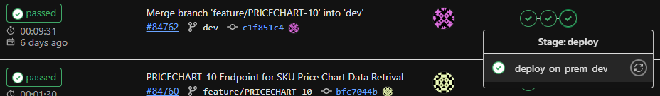

# Index
- [Index](#index)
- [K8S](#k8s)
  - [Concept](#concept)
    - [Node](#node)
    - [Pod](#pod)
    - [Deployment](#deployment)
    - [Updating Deployment](#updating-deployment)
    - [Service](#service)
  - [Command](#command)
  - [Git CI/CD](#git-cicd)
    - [Deployment flow:](#deployment-flow)
    - [Error](#error)

# K8S
Automated container deployment, scaling, and management on multiple machines

## Concept
### Node
Physical machine
```
$ kubectl get nodes
NAME                   STATUS                     ROLES                  AGE    VERSION
cos-v2-dev-ceph01      Ready                      <none>                 48d    v1.23.12
cos-v2-dev-ceph02      Ready                      <none>                 63d    v1.23.12
```

### Pod
ref: https://kubernetes.io/docs/concepts/workloads/pods/

Pods are the smallest **deployable** units of computing that you can create and manage in Kubernetes.
- Can have one or more containers, but usually one Pod has only one container ("one-container-per-Pod")
- Pods are generally **created using workload resources (controllers)** such as Deployment or Job, instead of created directly
- Pods are designed as relatively ephemeral, **disposable** entities. Therefore, DB is not suggested to be created inside a Pod.
- Each Pod runs a single instance of an application. Adding more pods for horizontal scale up is called **replication**. (use `scale` command)

### Deployment
ref: https://kubernetes.io/docs/concepts/workloads/controllers/deployment/

It is used to create a ReplicaSet ( `rs` ) including the Pods.

### Updating Deployment
ref: https://kubernetes.io/docs/concepts/workloads/controllers/deployment/#updating-a-deployment

A Deployment's rollout is triggered if and only if the Deployment's Pod template (that is, `.spec.template`) is changed. It is used each time when updating some new changes in `configmap.yml` and `secret.yml` into the Pods.
- Deployment ensures that only a certain number of Pods are down while they are being updated. By default, it ensures that at least 75% of the desired number of Pods are up (25% max unavailable).
- Deployment also ensures that only a certain number of Pods are created above the desired number of Pods. By default, it ensures that at most 125% of the desired number of Pods are up (25% max surge).
- In case of a deployment with 1 replica, the number of Pods would be between 1 and 2. It first creates a new Pod, then deletes an old Pod.
  ```yml
    strategy:
      rollingUpdate:
        maxSurge: 25%
        maxUnavailable: 25%
      type: RollingUpdate
  ```
  ```
  [root@cos-v2-dev-master01 ~]# k get deployment
  NAME                          READY   UP-TO-DATE   AVAILABLE   AGE
  hktv-pricechart-api           1/1     1            1           34d
  
  [root@cos-v2-dev-master01 ~]# k get rs
  NAME                                     DESIRED   CURRENT   READY   AGE
  hktv-pricechart-api-859595b985           1         1         1       42h
  
  [root@cos-v2-dev-master01 ~]# k get pods
  NAME                                           READY   STATUS        RESTARTS        AGE
  hktv-pricechart-api-859595b985-7ci7o           0/1     Terminating   112 (25h ago)   34h
  hktv-pricechart-api-859595b985-q5tk5           1/1     Running       112 (25h ago)   14s

  ##### After deployment finish #####

  [root@cos-v2-dev-master01 ~]# k get pods
  NAME                                           READY   STATUS    RESTARTS        AGE
  hktv-pricechart-api-859595b985-q5tk5           1/1     Running   112 (25h ago)   1h
  ```


### Service


## Command
```sh
# list out all namespace
kubectl get ns
kubectl get namespace

# change current namespace
kubectl config set-context --current --namespace=hktv-pricechart
kubectl config set-context --current --namespace=hktv-drdp

# see current namespace
kubectl config view --minify -o jsonpath='{..namespace}'

alias k=kubectl


# --------- Note that the following command run in current namespace ----------

kubectl get node        # list out nodes (physical machine)
kubectl get svc         # list out service
kubectl get rs          # list out replica set
kubectl get pod         # list out pods (containers inside nodes)
kubectl get ingress     # list out ingress
kubectl get deployment  # list out deployment
kubectl get configmap   # list out configmap
kubectl get secret      # list out secret

# see the yaml file
kubectl get <resource_type> <resource_name> -o yaml
kubectl get secret <secret_name> -o yaml  # Retrieve a base64 encoded value because of type Opaque

# describe with verbose output
kubectl describe <resource_type> <resource_name>

# apply different .yml file
kubectl apply -f <file_path>

# see pod log
kubectl logs <pod_name>

# scale up/down pod number
kubectl scale deployment/<deployment_name> --replicas=<number>
```

## Git CI/CD

### Deployment flow:
- Check branch to choose different deploy stage
  ```
  rules:
    - if: $CI_COMMIT_BRANCH == "dev"
  ```
- Set environment variable used in later `deployment.yml`.
  ```
  export K8S_DEPLOYMENT_NAMESPACE=$K8S_DEPLOYMENT_NAMESPACE_SIT
  ```
- Update the `yml` file (i.e. `configmap.yml` and `secret.yml`)
  - Note that `service.yml` usually will only be applied at the very beginning of the whole project.
- Replace some formatted string in `deployment.yml` by environment variable. Then, apply `deployment.yml`.
  - Note that `deployment.yml` in prod may be different from dev and staging. For example, the secretName and server cpu/ram spec can be different. Can add a `cp` command to modify the `./manifests/deploy/deployment.yaml`
  ```sh
  sed -i "s/<NAMESPACE>/$K8S_DEPLOYMENT_NAMESPACE/g" ./manifests/deploy/deployment.yaml` 
  ```
- Remember to print the final `deployment.yml` for debug
  ```sh
  cat ./manifests/deploy/deployment.yaml
  ```
  
```yml
# .gitlab-ci.yml
image: docker:latest
stages:
  - unit_test
  - compile_maven
  - docker_image
  - deploy

(... other stages ...)

deploy_on_prem_dev:
  image: gcr.io/google.com/cloudsdktool/cloud-sdk:latest
  stage: deploy
  tags:
    - DEV
  script:
    - echo "Deploying docker image to On-prem Dev K8s"
    # here setup cluster, context, users, etc
    - cat manifests/config/kubeconfig-dev > ${HOME}/config
    - export KUBECONFIG=${HOME}/config
    - export K8S_DEPLOYMENT_NAMESPACE=$K8S_DEPLOYMENT_NAMESPACE_SIT

    - kubectl config set-context --current --namespace=$K8S_DEPLOYMENT_NAMESPACE
    - echo "Current K8s nodes status:"
    - kubectl get nodes
    - echo "Current K8s pods status:"
    - kubectl get pods

    # If not apply, will not update the .yml, so deployment.yml still use the original .yml
    - echo "Applying Configmap to K8s"
    - kubectl apply -f ./manifests/config/dev/configmap.yml
    - echo "Applying Secret to K8s"
    - kubectl apply -f ./manifests/config/dev/secret.yml
```
```yml
# configmap.yml ---------------------------------------------------
apiVersion: v1
kind: ConfigMap
metadata:
  name: hktv-pricechart-api-config
data:
  application.yml: |
    server:
      port: 8080
    (... other properties ...)

# secret.yml ---------------------------------------------------
apiVersion: v1
kind: Secret
metadata:
  name: hktv-pricechart-api-secret
type: Opaque
stringData:
  application.yml: |
    (... other properties ...)

# service.yml ---------------------------------------------------
apiVersion: v1
kind: Service
metadata:
  name: hktv-pricechart-api-svc
spec:
  selector:  ### define apply the connection rule to which Pod ###
    app: hktv-pricechart-api
  ports:
  - name: hpa-svc-port
    port: 8080
    protocol: TCP
    targetPort: 8080
  type: ClusterIP


# deployment.yml ---------------------------------------------------
apiVersion: apps/v1
kind: Deployment
metadata:
  name: <DEPLOY_NAME>  # hktv-pricechart-api
  namespace: <NAMESPACE>  # hktv-pricechart
  labels:
    app: <DEPLOY_NAME>  # hktv-pricechart-api
spec:
  selector:  ### define find which Pod to manage this deployment ###
    matchLabels:
      app: <DEPLOY_NAME>  # hktv-pricechart-api, label of the running Pod
  strategy:
    rollingUpdate:
      maxSurge: 25%
      maxUnavailable: 25%
    type: RollingUpdate
  template:  ### define the new Pod ###
    metadata:
      labels:
        app: <DEPLOY_NAME>  # hktv-pricechart-api, label of the new Pod
    spec:
      containers:  ### create containers for the new Pod ### 
      - name: <DEPLOY_NAME>  # hktv-pricechart-api
        image: <CI_REGISTRY_IMAGE>:<TAGS>
      (... other properties ...)
      volumes:
        - name: config
          configMap:
            name: hktv-pricechart-api-config
            items:
            - key: "application.yml"
              path: "application.yml"
        - name: secret
          secret:
          # Use hktv-pricechart-api-eclipse in PROD
            secretName: hktv-pricechart-api-secret
            items:
            - key: "application.yml"
              path: "application.yml"

```
```yml
# Cont'd .gitlab-ci.yml
    - sed -i "s/<DEPLOY_NAME>/$K8S_DEPLOYMENT_NAME/g" ./manifests/deploy/deployment.yaml # hktv-pricechart-api
    - sed -i "s/<NAMESPACE>/$K8S_DEPLOYMENT_NAMESPACE/g" ./manifests/deploy/deployment.yaml # hktv-pricechart

    # 0c5c009b969b7defa138095d7a27060d1778631c
    - sed -i "s/<TAGS>/$CI_COMMIT_SHA/g" ./manifests/deploy/deployment.yaml

    #  ite-git01.hktv.com.hk:5000/hktv/itad/hktv-price-chart-servers/hktv-pricechart-api
    - sed -i "s/<CI_REGISTRY_IMAGE>/$(echo $CI_REGISTRY_IMAGE | sed 's/\//\\\//g')/g" ./manifests/deploy/deployment.yaml
    - sed -i "s/<JAVA_TOOL_OPTIONS>/$JAVA_TOOL_OPTIONS_SIT/g" ./manifests/deploy/deployment.yaml

    - echo "The following ./manifests/deploy/deployment.yaml will be applied:"
    - cat ./manifests/deploy/deployment.yaml

    - kubectl apply -f ./manifests/deploy/deployment.yaml

    - kubectl get deployments

    #  see the Deployment rollout status
    - kubectl rollout status deployment $K8S_DEPLOYMENT_NAME --timeout=3m
  rules:
    - if: $CI_COMMIT_BRANCH == "dev"
  interruptible: true

deploy_on_prem_staging:
  ...

deploy_on_prem_prod:
  (... the same ...)

    # the only difference here for prod
    - cp /home/manifests/$K8S_DEPLOYMENT_NAME/deployment.yaml ./manifests/deploy/deployment.yaml
    - sed -i "s/<DEPLOY_NAME>/$K8S_DEPLOYMENT_NAME/g" ./manifests/deploy/deployment.yaml
    (... the same ...)
  rules:
    - if: '$CI_COMMIT_REF_NAME =~ /^release.*/ && $CI_PIPELINE_SOURCE == "schedule" || $CI_COMMIT_REF_NAME =~ /^hotfix.*/ && $CI_PIPELINE_SOURCE == "schedule"'
  interruptible: true

.auto_devops: &auto_devops |
  # Auto DevOps variables and functions
  [[ "$TRACE" ]] && set -x
  function setup_docker() {
    if ! docker info &>/dev/null; then
      if [ -z "$DOCKER_HOST" ]; then
        export DOCKER_HOST='tcp://localhost:2375'
      fi
    fi
  }
  function build() {
    docker login -u "$CI_CONTAINER_REG_ACCOUNT" -p "$CI_CONTAINER_REG_PASSWORD" "$CI_REGISTRY"
    if [[ -f Dockerfile ]]; then
      echo "Building Dockerfile-based application..."
      if [[ "$(echo $CI_COMMIT_REF_NAME | cut -d'/' -f1)" = "release" ]]; then
        docker build -t "$CI_REGISTRY_IMAGE:$(echo $CI_COMMIT_REF_NAME | cut -d'/' -f2)" .
      else
        docker build -t "$CI_REGISTRY_IMAGE:$CI_COMMIT_SHA" .
      fi
    fi
    if [[ "$(echo $CI_COMMIT_REF_NAME | cut -d'/' -f1)" = "release" ]]; then
        docker push "$CI_REGISTRY_IMAGE:$(echo $CI_COMMIT_REF_NAME | cut -d'/' -f2)"
    else
        docker push "$CI_REGISTRY_IMAGE:$CI_COMMIT_SHA"
    fi
    echo ""
  }


.msghub: &msghub |
  if [[ "$(echo $CI_COMMIT_REF_NAME | cut -d'/' -f1)" = "release" ]]; then
    _IMGPATH=$CI_REGISTRY_IMAGE:$(echo $CI_COMMIT_REF_NAME | cut -d'/' -f2)
  else
    _IMGPATH=$CI_REGISTRY_IMAGE:$CI_COMMIT_SHA
  fi

  if [ "$CI_JOB_NAME" != "deploy_on_prem_staging" ] && [ "$CI_JOB_NAME" != "deploy_on_prem_prod" ];then exit 0;fi

  BRANCH_NAME="$(echo $CI_COMMIT_REF_NAME | cut -d'/' -f1)"
  if [ "$BRANCH_NAME" == "release" ]; then
    MSGHUB_TEXT_CHANNEL=$MSGHUB_TEXT_CHANNEL_PROD
  elif [ "$BRANCH_NAME" == "staging" ]; then
    MSGHUB_TEXT_CHANNEL=$MSGHUB_TEXT_CHANNEL_STAGING
  else
    exit 0
  fi

  CURRENT_TIME="'$(TZ="Asia/Hong_Kong" date -Is)'";
  MSGHUB_KEY="$(echo $MSGHUB_KEY_BASE64|base64 -d)";

  if [[ $CI_JOB_STATUS == 'success' ]]; then
    echo 'This will only run on success'
    curl -s --data '{ "text": "Deployment success\n'"$CURRENT_TIME"'\nImage:'"$CI_COMMIT_SHA"'/'$_IMGPATH'\nProject:'"$CI_PROJECT_NAME"'","channel": "'"$MSGHUB_TEXT_CHANNEL"'","key": "'"$MSGHUB_KEY"'" }'  \
                            -H "Content-Type: application/json"  \
                            -X POST "${MSGHUB_BASE_URL}"
  else
    echo 'This will only run when job failed or is cancelled'
    curl -s --data '{ "text": "Deployment fail\n'"$CURRENT_TIME"'\nImage:'"$CI_COMMIT_SHA"'/'$_IMGPATH'\nProject:'"$CI_PROJECT_NAME"'","channel": "'"$MSGHUB_TEXT_CHANNEL"'","key": "'"$MSGHUB_KEY"'" }'  \
                            -H "Content-Type: application/json"  \
                            -X POST "${MSGHUB_BASE_URL}"
  fi

before_script:
  - pwd
  - ls -l
  - *auto_devops

after_script:
  - *msghub
```

### Error
```sh
$ kubectl rollout status deployment $K8S_DEPLOYMENT_NAME --timeout=3m
error: deployment "hktv-pricechart-api" exceeded its progress deadline
```